## {#title-slide data-menu-title="Title Slide"}

[Tidy Data]{.custom-title}

[What it is and why it matters]{.custom-subtitle}

[**NCEAS Learning Hub**]{.custom-subtitle2}

---

## {#learning-obj data-menu-title="Learning Objectives"}

[Learning Objectives]{.slide-title}

:::{.body-text}
Learn how to design and create effective data tables by:

- applying **tidy and normalized data** principles,
- following **best practices** to format data tables' content,
- relating tables following **relational data models** principles, and
- understanding how to perform **table joins**.
:::

---

## {#what-is-tidy data-menu-title="What is Tidy Data"}

[What is tidy data?]{.slide-title}

:::{.body-text}
Tidy data is a standardized way of organizing data tables that allows us to manage and analyze data efficiently, because it makes it straightforward to understand the corresponding variable and observation of each value.

The **tidy data principles** are:

1. Every column is a **variable**.
2. Every row is an **observation**.
3. Every cell is a **single value**.
:::

---

## {#tidy-way-of-life data-menu-title="Tidy: A Way of Life"}

[Tidy Data: A way of life]{.slide-title}

:::{.body-text}
- Tidy data is **not** language or tool specific.
- Tidy data is **not** an R thing.
- Tidy data is **not** a `tidyverse` thing.
:::

 

:::{.large-body-text .center-text}
**Tidy Data is a way to organize data that will make life easier for people working with data.**
:::

:::{.body-text .center-text}
*(Allison Horst & Julia Lowndes)*
:::

---

## {#building-blocks data-menu-title="Building Blocks"}

[Values, variables, observations, and entities]{.slide-title}

:::{.body-text}

| Concept | Definition | Example |
|---|---|---|
| **Variable** | A characteristic being measured, counted, or described | car type, salinity, year, height |
| **Observation** | A single data point for which one or more variables are recorded | each plant, if measuring height, species, and location of plants |
| **Value** | The actual record | 3 ft |
| **Entity** | Each *type* of observation | **plants** is one entity; **site** is another |

:::

---

## {#assessing-tidy data-menu-title="Assessing Tidy Principles"}

[Assessing tidy data principles]{.slide-title}

:::{.body-text}
The following is an example of tidy data — it's easy to see all three principles apply.
:::

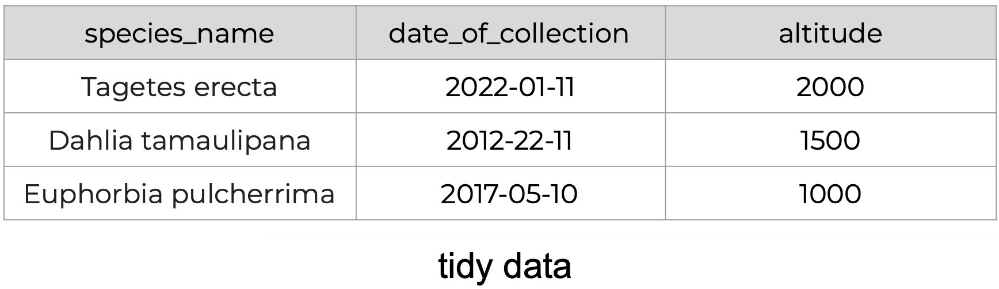{fig-align="center" width="90%"}

---

## {#tidy-variables data-menu-title="Tidy: Variables"}

[Every column is a variable]{.slide-title}

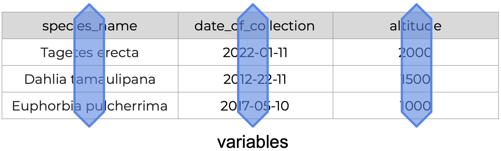{fig-align="center" width="90%"}

---

## {#tidy-observations data-menu-title="Tidy: Observations"}

[Every row is an observation]{.slide-title}

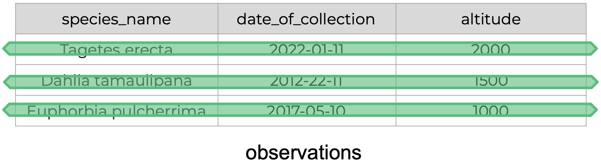{fig-align="center" width="90%"}

---

## {#tidy-values data-menu-title="Tidy: Values"}

[Every cell is a single value]{.slide-title}

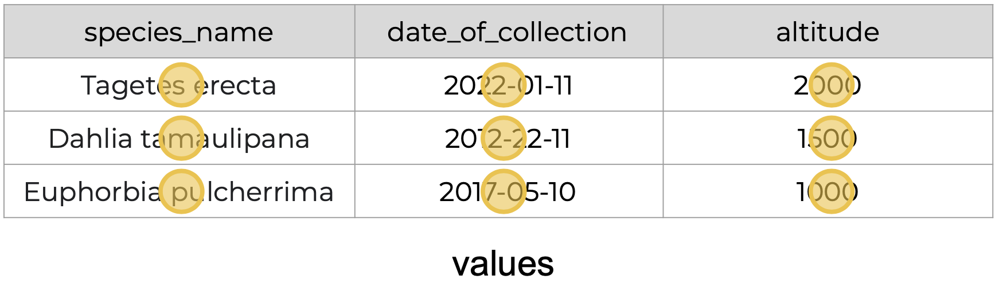{fig-align="center" width="90%"}

---

## {#untidy-intro data-menu-title="Recognizing Untidy Data"}

[Recognizing untidy data]{.slide-title}

:::{.body-text}
Anything that does not follow the three tidy data principles is **untidy data**.

There are *many* ways data can become untidy — some obvious right away, others more subtle.

We'll look at two examples.
:::

---

## {#example1-intro data-menu-title="Example 1"}

[Example 1: A real dataset from NCEAS]{.slide-title}

:::{.body-text}
We have all seen spreadsheets that look like this. Let's look at why it isn't tidy.
:::

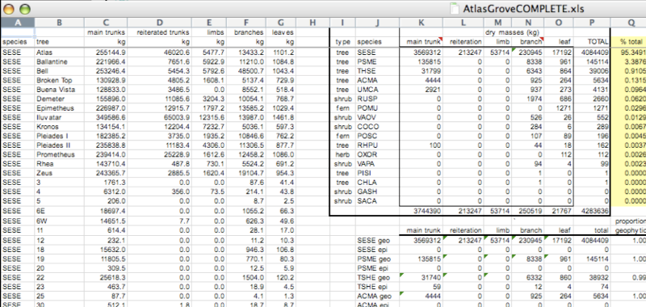{fig-align="center" width="85%"}

---

## {#multiple-tables data-menu-title="Multiple Tables"}

[Problem 1: Multiple tables]{.slide-title}

:::{.body-text}
There are actually **three separate tables** within this one spreadsheet. Our human brains see them — a computer cannot.

**Having multiple tables immediately breaks the tidy data principles.**
:::

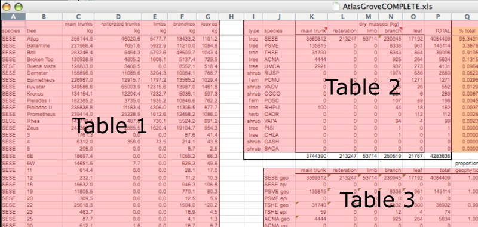{fig-align="center" width="80%"}

---

## {#inconsistent-cols data-menu-title="Inconsistent Columns"}

[Problem 2: Inconsistent columns]{.slide-title}

:::{.body-text}
In tidy data, **each column corresponds to a single variable**. 

A good test: does this column consist of only one unit type?
:::

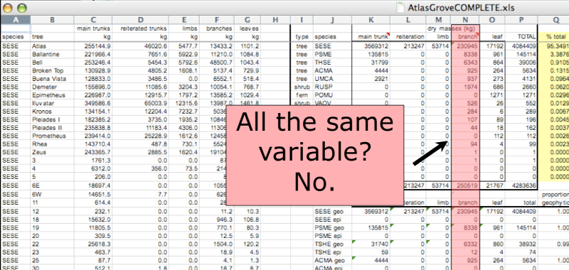{fig-align="center" width="80%"}

---

## {#inconsistent-rows data-menu-title="Inconsistent Rows"}

[Problem 3: Inconsistent rows]{.slide-title}

:::{.body-text}
If you look across a single row and notice there are clearly **multiple observations** packed in, the data is not tidy.
:::

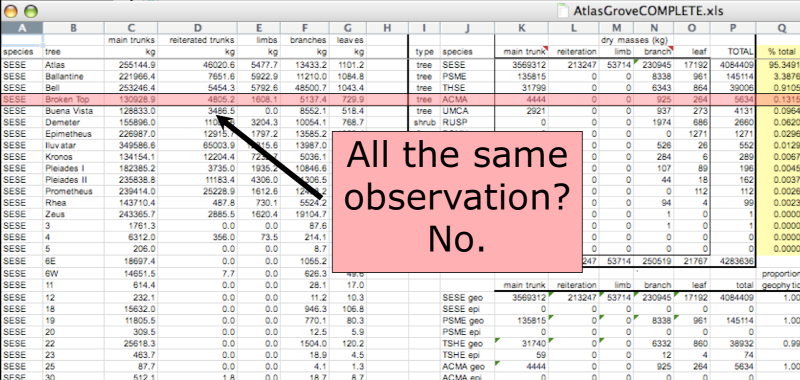{fig-align="center" width="80%"}

---

## {#marginal-stats data-menu-title="Marginal Statistics"}

[Problem 4: Marginal sums and statistics]{.slide-title}

:::{.body-text}
**Marginal sums and statistics are not tidy.** They break principle 1 (a total is not the same variable as the values it summarizes) and principle 2 (a total is not a single observation).
:::

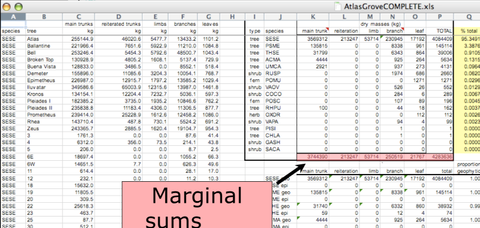{fig-align="center" width="80%"}

---

## {#example2-intro data-menu-title="Example 2"}

[Example 2: A subtler problem]{.slide-title}

:::{.body-text}
One table this time — it looks more reasonable. Columns: *date*, *site*, *name*, *altitude*, *sp1code*, *sp2code*, *sp1height*, *sp2height*.

Take a moment — why is this not tidy?
:::

{fig-align="center" width="85%"}

---

## {#wide-format data-menu-title="Wide Format Problem"}

[Multiple observations per row]{.slide-title}

:::{.body-text}
The entity is a **single observed plant**. But each row contains *two* plant observations. This breaks principle 2: every row is an observation.

This is called **wide format** — observations spread across columns. Adding a new species means adding new columns. The structure changes as data grows.
:::

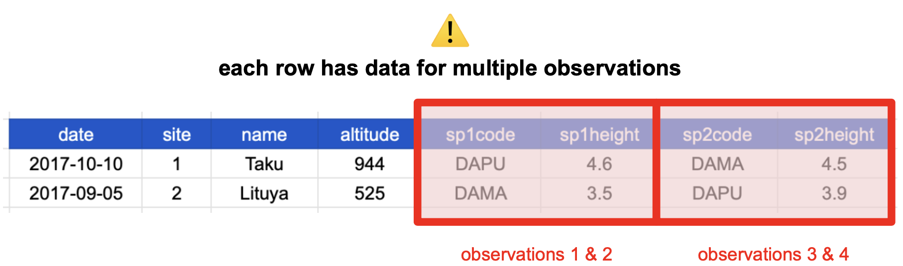{fig-align="center" width="75%"}

---

## {#fixed-tidy data-menu-title="Fixed: Now Tidy"}

[The fix: one row per plant]{.slide-title}

:::{.body-text}
One column for species code, one column for species height. Every row is one plant. The table grows by adding **rows**, not columns.
:::

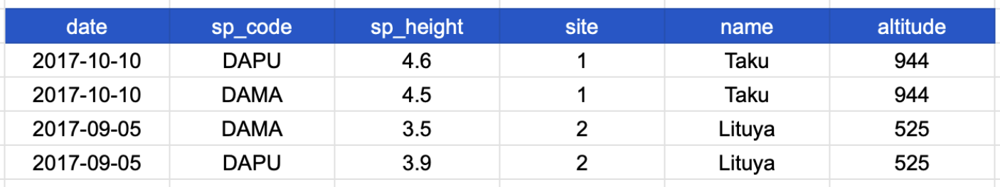{fig-align="center" width="80%"}

:::{.body-text}
But... notice anything repeating in this table? We'll come back to that.
:::

---

## {#why-tidy data-menu-title="Why Tidy Data"}

[Why tidy data?]{.slide-title}

:::{.body-text}
- **Efficiency:** less re-creating the wheel — apply the same tools to different datasets.
- **Collaboration:** easier to work with others using the same tools in the same ways.
- **Reuse:** easier to apply similar techniques across different or new datasets.
- **Generalizability:** tools built for one tidy dataset can be used with many others.
:::

---

## {#r4ds-quote data-menu-title="R4DS Quote"}

[Why tidy data? (cont.)]{.slide-title}

 

:::{.large-body-text}
> "There is a specific advantage to placing variables in columns because it allows R's vectorized nature to shine. Most built-in R functions work with vectors of values. That makes transforming tidy data feel particularly natural."
:::

:::{.body-text .center-text}
— *R for Data Science*, Grolemund & Wickham
:::

---

## {#normalization-def data-menu-title="Data Normalization"}

[Data normalization]{.slide-title}

:::{.body-text}
**Data normalization** removes redundancy to simplify querying, analysis, storage, and maintenance.

In normalized data:

- Each table follows the **tidy data principles**
- We have **separate tables for each type of entity** measured
- Observations (rows) are **all unique**
- Each column represents either an **identifying** or a **measured** variable

**Signal that normalization is needed:** the same values repeating across multiple rows.
:::

---

## {#denormalized data-menu-title="Denormalized Data"}

[Spotting denormalization]{.slide-title}

:::{.body-text}
Look at the last three columns — site name and altitude **repeat** for every plant at that site. Each row has values about more than one entity.
:::

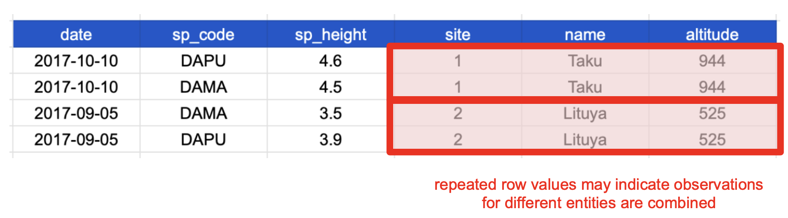{fig-align="center" width="85%"}

---

## {#two-entities data-menu-title="Two Entities"}

[Two entities in one table]{.slide-title}

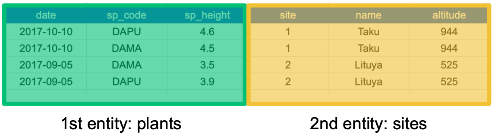{fig-align="center" width="85%"}

:::{.body-text}
- **1st entity:** individual plants found at a site
- **2nd entity:** sites at which the plants were observed
:::

---

## {#normalized data-menu-title="Normalized"}

[The solution: one table per entity]{.slide-title}

:::{.body-text}
One tidy table for each entity, with an identifying variable to link them.
:::

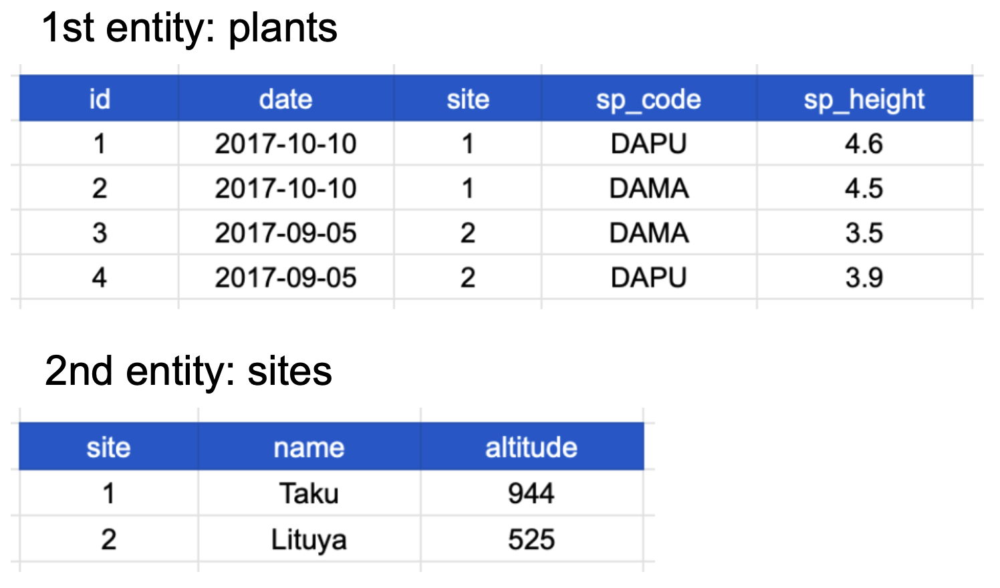{fig-align="center" width="70%"}

:::{.body-text}
Notice each table also satisfies the tidy data principles. But now that they're separate — how do we use them together? That's **Day 2**.
:::

---

## {#day1-wrapup data-menu-title="Day 1 Wrap-Up"}

[What we covered today]{.slide-title}

:::{.body-text}
✅ The **three tidy data principles**

✅ The building blocks: **variables, observations, values, entities**

✅ Recognizing **untidy data** — multiple tables, inconsistent columns/rows, marginal statistics, wide format

✅ **Why tidy data** matters for efficiency, collaboration, and R's vectorized nature

✅ **Normalization** — separate tables for separate entities

**Before Day 2:** look at your own research data. Does it have more than one entity in a single table?
:::
