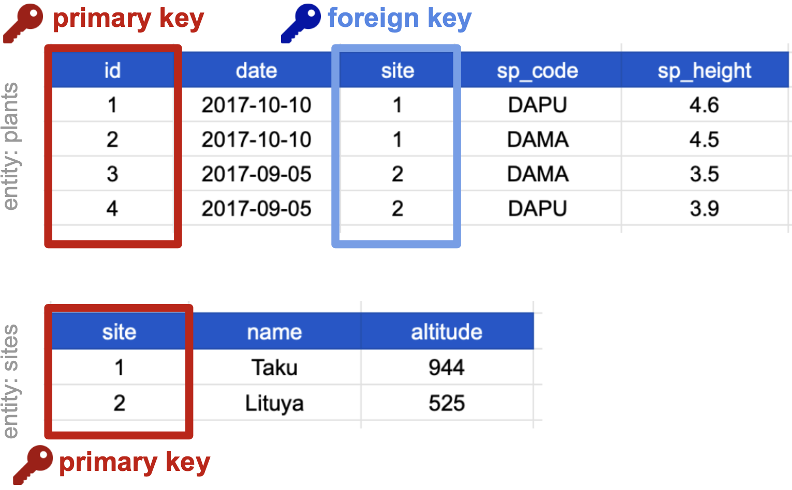
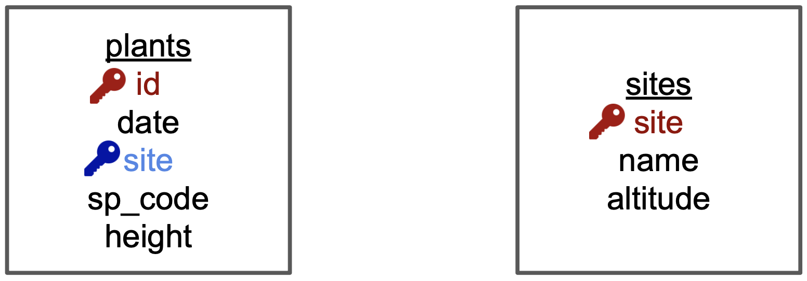
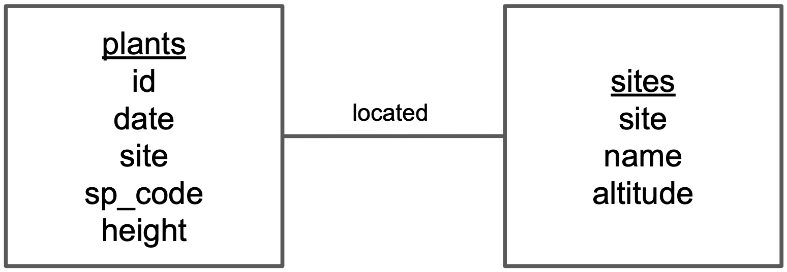

## {#title-slide data-menu-title="Title Slide"}

[Tidy Data]{.custom-title}

[Keys, joins, and relational models]{.custom-subtitle}

[**NCEAS Learning Hub**]{.custom-subtitle2}

---

## {#recap data-menu-title="Day 1 Recap"}

[Quick recap from Day 1]{.slide-title}

:::{.body-text}
**The three tidy data principles:**

1. Every column is a **variable**.
2. Every row is an **observation**.
3. Every cell is a **single value**.

**Normalization** — separate tables for each type of entity measured.

**The open question:** now that our tables are separate, how do we use them together for analysis?
:::

---

## {#normalized-reminder data-menu-title="Where We Left Off"}

[Where we left off]{.slide-title}

:::{.body-text}
We normalized our plants data into two separate tidy tables.
:::

{fig-align="center" width="70%"}

:::{.body-text}
How would we use site altitude as a predictor variable for species composition? **That's what today is about.**
:::

---

## {#relational-quote data-menu-title="Relational Data Quote"}

[Relational data]{.slide-title}

 

:::{.large-body-text}
> "It's rare that a data analysis involves only a single table of data. Typically you have many tables of data, and you must combine them to answer the questions that you're interested in. Collectively, multiple tables of data are called **relational data** because it is the relations, not just the individual datasets, that are important."
:::

:::{.body-text .center-text}
— *R for Data Science*, Chapter 13 Relational Data
:::

---

## {#relational-models data-menu-title="Relational Data Models"}

[What are relational data models?]{.slide-title}

:::{.body-text}
A **relational data model** is a way of encoding links between multiple tables in a database. A database organized following a relational data model is a **relational database**.

Advantages:

- Enabling powerful search and filtering
- Ability to handle large, complex data sets
- Enforcing data integrity
- Decreasing errors from redundant updates

Relational databases (mySQL, MariaDB, Oracle, Microsoft Access) are built on this model — but you don't need a formal database to benefit from these principles in R.
:::

---

## {#keys-intro data-menu-title="Keys"}

[Keys]{.slide-title}

:::{.body-text}
When working with relational data, we need to **join** information from different tables to run analysis. To join tables we need **keys**.

Keys are variables whose values **uniquely identify observations**. For tidy data, a column is a key if it has a **different value in each row**.

Two types of keys:

- **Primary Key** — the chosen key for a table; uniquely identifies each observation in the table.
- **Foreign Key** — a reference to a primary key in another table; used to create links between tables.
:::

---

## {#keys-example data-menu-title="Keys Example"}

[Choosing primary keys]{.slide-title}

:::{.body-text}
**Plants table:** `date`, `site`, and `sp_code` cannot be primary keys — they have repeated values. Both `sp_height` and `id` have unique values in each row. We chose `id` — the decimal values of `sp_height` make it impractical to use for referencing observations.

**Sites table:** all three columns could be keys. We chose `site` — it is the most succinct and links to the plants table.
:::

{fig-align="center" width="85%"}

---

## {#foreign-keys data-menu-title="Foreign Keys"}

[Primary and foreign keys in context]{.slide-title}

:::{.body-text}
The `site` column is the **primary key** of the sites table — it uniquely identifies each row as a unique observation of a site.

In the plants table, the `site` column is a **foreign key** — it references the primary key from the sites table. 

This linkage tells us: the first height measurement for the DAPU observation occurred at the site named Taku.
:::

{fig-align="center" width="75%"}

---

## {#compound-keys data-menu-title="Compound Keys"}

[Compound keys]{.slide-title}

:::{.body-text}
Sometimes a single variable is not a key, but combining it with a second variable gives combined values that uniquely identify rows. This is a:

**Compound Key** — a key made up of more than one variable.

The `site` and `sp_code` columns in the plants table cannot be keys on their own — each has repeated values. But their combined values (1-DAPU, 1-DAMA, 2-DAMA, 2-DAPU) are unique. So `site` and `sp_code` together form a compound key.
:::

{fig-align="center" width="80%"}

---

## {#other-keys data-menu-title="Other Key Types"}

[Other types of keys]{.slide-title}

:::{.body-text}
There are also other types of keys, such as:

- **Natural key** — a key that comes from real-world data (e.g., a species code, a GPS coordinate, a date)
- **Surrogate key** — an artificial key created specifically to serve as an identifier (e.g., an auto-incrementing integer `id`)

Each type of key has advantages and disadvantages.

Read more: [databasestar.com/database-keys](https://www.databasestar.com/database-keys/)
:::

---

## {#joins-intro data-menu-title="Joins Intro"}

[Joining tables]{.slide-title}

:::{.body-text}
Frequently, analysis will require merging separately managed tables back together. There are multiple ways to join the observations in two tables, based on how the rows of one table are merged with the rows of the other.

Start by identifying the **primary key in each table** and how these appear as **foreign keys** in other tables.

When conceptualizing merges, think of two tables — one on the **left** and one on the **right**.
:::

{fig-align="center" width="75%"}

---

## {#inner-join data-menu-title="Inner Join"}

[Inner Join]{.slide-title}

:::{.body-text}
An **INNER JOIN** merges only the subset of rows that have matches in **both** the left table and the right table.
:::

{fig-align="center" width="85%"}

---

## {#left-join data-menu-title="Left Join"}

[Left Join]{.slide-title}

:::{.body-text}
A **LEFT JOIN** takes all of the rows from the left table, and merges on the data from matching rows in the right table. Keys that don't match from the left table are still provided with a missing value (`NA`) from the right table.
:::

{fig-align="center" width="85%"}

---

## {#right-join data-menu-title="Right Join"}

[Right Join]{.slide-title}

:::{.body-text}
A **RIGHT JOIN** is the same as a left join, except that all of the rows from the right table are included with matching data from the left, or a missing value.

Notice that left and right joins can ultimately be the same depending on the positions of the tables.
:::

{fig-align="center" width="85%"}

---

## {#full-join data-menu-title="Full Outer Join"}

[Full Outer Join]{.slide-title}

:::{.body-text}
A **FULL OUTER JOIN** includes all data from all rows in both tables, and includes missing values wherever necessary.
:::

{fig-align="center" width="85%"}

---

## {#join-venn data-menu-title="Joins as Venn Diagrams"}

[Joins as Venn diagrams]{.slide-title}

:::{.body-text}
Sometimes joins are represented as Venn diagrams, showing which parts of the left and right tables are included. This is a useful memory aid — but Venn diagrams miss part of the story related to **where the missing values come from** in each result.
:::

{fig-align="center" width="70%"}

:::{.body-text .center-text}
*Image source: R for Data Science, Wickham & Grolemund*
:::

---

## {#er-intro data-menu-title="E-R Models"}

[Entity-Relationship models]{.slide-title}

:::{.body-text}
An **Entity-Relationship model (E-R model)**, also known as an **E-R diagram**, is a compact diagram that reflects the structure and relationships of the tables in a relational database.

Particularly useful for big databases with many tables and complex relationships.

We'll draw a simplified E-R model using our plants and sites tables — in four steps.
:::

---

## {#er-step1 data-menu-title="E-R Step 1"}

[E-R model: Step 1]{.slide-title}

:::{.body-text}
**Identify the entities in the relational database and add each one in a box.**

In our case, entities are [plants] and [sites] — we are gathering observations about both of these.
:::

{fig-align="center" width="55%"}

---

## {#er-step2 data-menu-title="E-R Step 2"}

[E-R model: Step 2]{.slide-title}

:::{.body-text}
**Add variables for each entity and identify keys.**

Add variables as a list inside each box. Indicate:

- **primary key** in red
- **foreign keys** in blue
:::

{fig-align="center" width="55%"}

---

## {#er-step3 data-menu-title="E-R Step 3"}

[E-R model: Step 3]{.slide-title}

:::{.body-text}
**Add relationships between entities.**

Draw a line between entities that have a relationship. Add a word describing how the entity with the foreign key is related to the other. A plant is *located in* a site → write "located" above the line.
:::

{fig-align="center" width="55%"}

---

## {#er-step4 data-menu-title="E-R Step 4a"}

[E-R model: Step 4 — cardinality]{.slide-title}

:::{.body-text}
**Add cardinality to every relationship.**

"A plant is located in **one** site" → add the symbol for "one" at the end of the line going from [plants] to [sites].
:::

{fig-align="center" width="55%"}

---

## {#er-step5 data-menu-title="E-R Step 4b"}

[E-R model: Step 4 — cardinality (cont.)]{.slide-title}

:::{.body-text}
"A site has **many** plants" → add the symbol for "many" at the end of the line going from [sites] to [plants].

That's it!
:::

{fig-align="center" width="55%"}

---

## {#crowfoot data-menu-title="ERD Crow's Foot"}

[ERD crow's foot]{.slide-title}

:::{.body-text}
The symbols used at the ends of the lines are called **ERD "crow's foot"**. Bookmark this reference.
:::

{fig-align="center" width="80%"}

:::{.body-text .center-text}
Need to produce a publishable E-R model? [Mermaid](https://mermaid.js.org/intro/) is a great option — markdown-based, embeds directly in Quarto.
:::

---

## {#best-practices data-menu-title="Best Practices Summary"}

[Best practices summary]{.slide-title}

:::{.body-text}
**Tidy data principles:**
1. Every column is a variable.  2. Every row is an observation.  3. Every cell is a single value.

**Normalized data:**
- Separate tables for each type of entity measured
- Observations (rows) are all unique
- Each column is either an identifying variable or a measured variable
- Each table follows the tidy data principles

**Relational data models:** primary and foreign keys maintain relationships between separate normalized tables. Choose the primary key based on your understanding of the data and efficiency. Make sure all values in the primary key column are present.

**E-R models** communicate table relationships. **Joins** bring tables back together for analysis.
:::

---

## {#data-management data-menu-title="More on Data Management"}

[More on data management]{.slide-title}

:::{.body-text}
Tidy data is one important step in data management best practices. Extra advice from *['Some Simple Guidelines for Effective Data Management'](https://esajournals.onlinelibrary.wiley.com/doi/full/10.1890/0012-9623-90.2.205)*:

- **Design tables to add rows, not columns**
- **Use a scripted program** (like R!)
- **Non-proprietary file formats** are preferred (e.g. csv, txt)
- **Keep a raw version of data**
- **Use descriptive file and variable names** (without spaces!)
- **Include a header line** in your tabular data files
- **Use plain ASCII text**

In the Cleaning & Wrangling chapter we will cover more best practices for cleaning irregular and missing data and how to implement them using R.
:::

---

## {#wrapup data-menu-title="Wrap-Up"}

[What we covered — both days]{.slide-title}

:::{.body-text}
**Day 1**

✅ Three tidy data principles &nbsp; ✅ Recognizing untidy data &nbsp; ✅ Normalization

**Day 2**

✅ Relational data models &nbsp; ✅ Primary, foreign, and compound keys

✅ Four join types — inner, left, right, full outer &nbsp; ✅ E-R diagrams

✅ Best practices for data management

**Up next:** Cleaning and Wrangling Data — where tidy principles become R code with `pivot_longer()`, `pivot_wider()`, `left_join()`, and more.
:::
