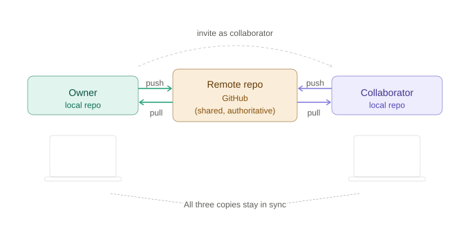
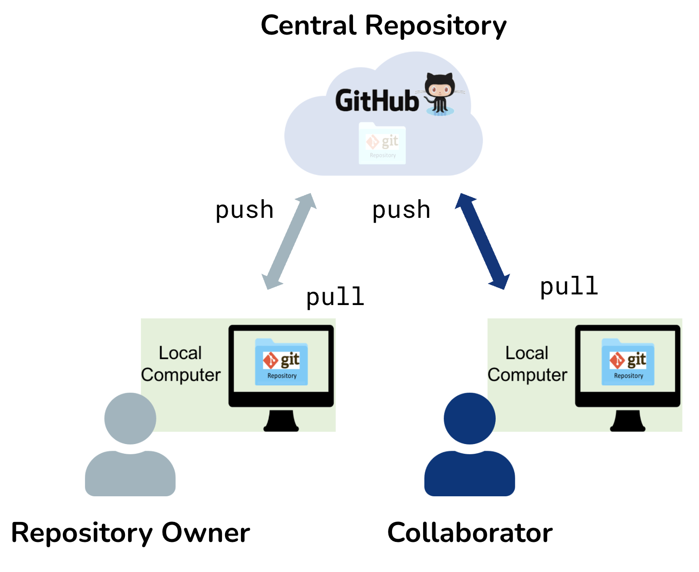
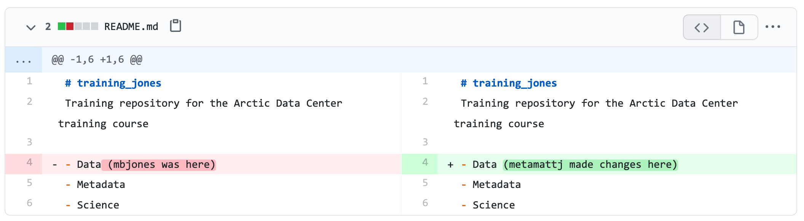
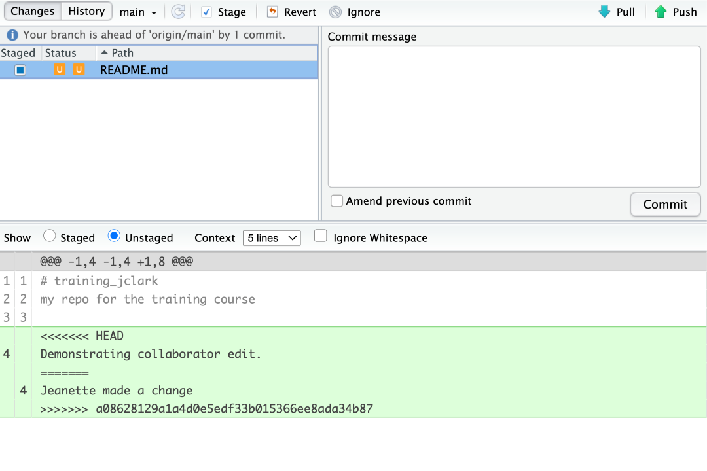

## {#title-slide data-menu-title="Title Slide"}

[Collaborating with Git and GitHub]{.custom-title}

[BIO/CHEM 806 · Week 10]{.custom-subtitle}

<hr class="hr-red">

[**NCEAS Learning Hub**]{.custom-subtitle2}

---

## {#learning-objectives data-menu-title="Learning Objectives"}

[Learning objectives]{.slide-title}

::: {.body-text}
By the end of today you will be able to:

- Explain the roles of **Owner** and **Collaborator** in a shared repository
- Follow the collaboration workflow: `add → commit → pull → push`
- Explain *why* you commit before you pull
- Work with a partner to make and receive changes without conflicts
- Recognize what a merge conflict looks like and how it arises
:::

---

## {#motivation data-menu-title="Motivation"}

[Why collaboration is hard]{.slide-title}

::: {.body-text}
Imagine two people editing the same script:

- Person A cleans the data and saves the file
- Person B — not knowing — also edits the file and saves

**Who is right? What changed? Whose version survives?**
:::

::: {.body-text}
Git solves this — but only if we use it with intention.
:::

---

## {#collab-diagram data-menu-title="Collaboration Diagram"}

[The shared repository model]{.slide-title}

{width=90% fig-align="center"}

---

## {#shared-repo data-menu-title="Shared Repository"}

[The shared repository model]{.slide-title}

::: {.columns}

:::: {.column width="55%"}
{width=100%}
::::

:::: {.column width="45%"}
::: {.body-text}
**Owner** — controls the remote repo on GitHub

**Collaborator** — invited to push and pull

**Remote repo** — the shared, authoritative version

All three copies should stay in sync.
:::
::::

:::

---

## {#roles data-menu-title="Roles"}

[Two roles, one repo]{.slide-title}

::: {.body-text}
**Owner**

- Hosts the repository on GitHub
- Adds collaborators via Settings → Collaborators
- Has full control over the remote

**Collaborator**

- Accepts the email invitation
- Clones the *Owner's* repo (not their own profile)
- Can push changes directly to the shared repo
:::

::: {.body-text}
Today you will practice *both* roles.
:::

---

## {#communication data-menu-title="Communication"}

[The most important step]{.slide-title}

::: {.body-text}
Between nearly every technical step in this workflow, the textbook includes:

> *INTERMEDIATE STEP: Collaborator communicates with Owner.*

This is not padding. **Communication is the workflow.**

The best way to avoid merge conflicts is to tell your collaborator what you are working on before you start.
:::

---

## {#workflow-steps data-menu-title="Workflow Steps"}

[The collaboration workflow]{.slide-title}

::: {.body-text}
**Step 0** Owner adds Collaborator (Settings → Collaborators → Add people)

**Step 1** Collaborator clones the *Owner's* repo

**Step 2** Collaborator edits a file locally

**Step 3** Collaborator: `add → commit → pull → push`

**Step 4** Owner pulls the Collaborator's changes

**Step 5** Owner edits, `add → commit → pull → push`

**Step 6** Collaborator pulls — all three copies are now in sync
:::

---

## {#commit-pull-push data-menu-title="Commit Pull Push"}

[Why commit before you pull?]{.slide-title}

::: {.body-text}
The sequence is always:

::: {.center-text}
**`add → commit → pull → push`**
:::

`git pull` = fetch + **merge**

The merge step will **fail** if you have uncommitted local changes —
Git refuses to risk overwriting your work.

So: commit first, then pull, then push.
:::

---

## {#git-config data-menu-title="Git Config"}

[One configuration step]{.slide-title}

::: {.body-text}
Run this in the **Terminal** (not the R console), inside your repo folder:
:::

```bash
git config pull.rebase false
```

::: {.body-text}
- Suppresses a warning in newer versions of Git
- Sets the default merge strategy for **this repo only** (no `--global`)
- Tells Git: when you pull and there is something to merge, use the standard merge strategy
:::

---

## {#exercise1-setup data-menu-title="Exercise 1 Setup"}

[Exercise 1 — collaborating without conflicts]{.slide-title}

::: {.body-text}
**Setup**

- Get into pairs — decide who is **Owner**, who is **Collaborator**
- Both log in to GitHub
- Owner: use your `{FIRSTNAME}_test` repository

**Owner first:**

Go to your repo → Settings → Collaborators → Add people →
type your partner's GitHub username
:::

---

## {#exercise1-rounds data-menu-title="Exercise 1 Rounds"}

[Exercise 1 — Round 1]{.slide-title}

::: {.body-text}
1. Collaborator clones the Owner's `{FIRSTNAME}_test` repo
2. Collaborator adds a `## Git Workflow` heading to the README
3. Collaborator: `add → commit → pull → push`
4. Owner pulls the changes
5. Owner adds the workflow steps under `## Git Workflow`
6. Owner: `add → commit → pull → push`
7. Collaborator pulls

**Then switch roles and repeat (Round 2)**
:::

---

## {#exercise1-note data-menu-title="Exercise 1 Note"}

[What you are practicing]{.slide-title}

::: {.body-text}
In this exercise both partners are careful **not** to edit the same lines at the same time.

This is the **ideal** case — clean handoffs, no conflicts.

The goal is to make the `add → commit → pull → push` sequence automatic before we introduce friction.
:::

::: {.body-text}
When you are done: look at the commit history on GitHub.
What does it show you?
:::

---

## {#chat-checkin data-menu-title="Check In"}

[Quick check — in the chat]{.slide-title}

::: {.body-text}
In the `add → commit → pull → push` sequence —

**Why do you commit *before* you pull?**

Type your answer in the chat.
:::

---

## {#merge-conflict-intro data-menu-title="Merge Conflict Intro"}

[When things go wrong]{.slide-title}

::: {.body-text}
**Merge conflicts** happen when two collaborators change the **same lines** of the same file — and both commit locally before either pushes.

Git cannot know which version to keep.

It refuses to merge automatically and asks you to decide.
:::

::: {.body-text}
This is not a failure — it is Git doing its job correctly.
:::

---

## {#conflict-diagram data-menu-title="Conflict Diagram"}

[What a merge conflict looks like]{.slide-title}

::: {.columns}

:::: {.column width="50%"}
{width=100%}
::::

:::: {.column width="50%"}
::: {.body-text}
Both `mbjones` and `metamattj` edited **line 1** of the README.

Git sees two versions of the same line with no common ancestor.

The conflict must be resolved manually.
:::
::::

:::

---

## {#conflict-markers data-menu-title="Conflict Markers"}

[Conflict markers in RStudio]{.slide-title}

{width=85%}

::: {.body-text}
- `<<<<<<< HEAD` — your changes
- `=======` — the dividing line
- `>>>>>>>` — your collaborator's changes

Remove the markers. Keep what belongs. Save. Stage. Commit. Push.
:::

---

## {#conflict-workflow data-menu-title="Conflict Workflow"}

[Resolving a conflict — step by step]{.slide-title}

::: {.body-text}
1. Owner and Collaborator both pull — start from a clean slate
2. **Owner** edits line 1, commits — **does not push**
3. **Collaborator** edits the same line, commits — **does not push**
4. Collaborator pushes successfully
5. Owner pushes — gets an error
6. Owner pulls — gets a conflict warning; file shows orange `U` in Git pane
7. Owner edits the file to resolve — removes all conflict markers
8. Owner stages, commits, pushes
9. Collaborator pulls — all copies in sync
:::

---

## {#exercise2 data-menu-title="Exercise 2"}

[Exercise 2 — creating and resolving a conflict]{.slide-title}

::: {.body-text}
With your same partner:

1. Both pull — confirm clean state
2. **Owner** changes the README title → commit, **do not push**
3. **Collaborator** changes the same line → commit, **do not push**
4. Collaborator pushes
5. Owner pushes → error
6. Owner pulls → conflict
7. Owner resolves, stages, commits, pushes
8. Collaborator pulls
9. Both view commit history

**Switch roles — repeat**
:::

---

## {#best-practices data-menu-title="Best Practices"}

[Preventing conflicts]{.slide-title}

::: {.body-text}
**`Pull → Edit → Save → Add → Commit → Pull → Push`**

- Always start your session with a pull
- Pull immediately after you commit, before you push
- Commit often in small chunks
- Communicate: tell your collaborator what you are working on
- Make sure both partners understand the workflow before you start
:::

{width=40%}

---

## {#key-takeaways-mon data-menu-title="Key Takeaways Monday"}

[Three things to remember]{.slide-title}

::: {.body-text}
**1.** The remote repository is the truth.
Always pull before you push — your local copy may be behind.

**2.** Commit before you pull.
`git pull` includes a merge, which fails on uncommitted changes.

**3.** Communication is not optional.
The tools help, but they do not replace telling your collaborator what you are doing.
:::

---

## {#exit-ticket-mon data-menu-title="Exit Ticket Monday"}

[Exit ticket]{.slide-title}

::: {.body-text}
In Canvas:

**Write pseudocode describing how two people safely modify
the same analysis without overwriting each other.**

Include the communication steps.
:::

::: {.body-text}
Not Git commands — the *logic* of the workflow.
What has to happen, in what order, and why?
:::
