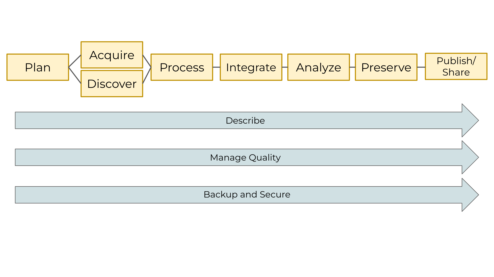
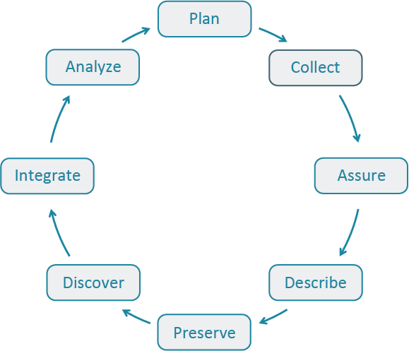
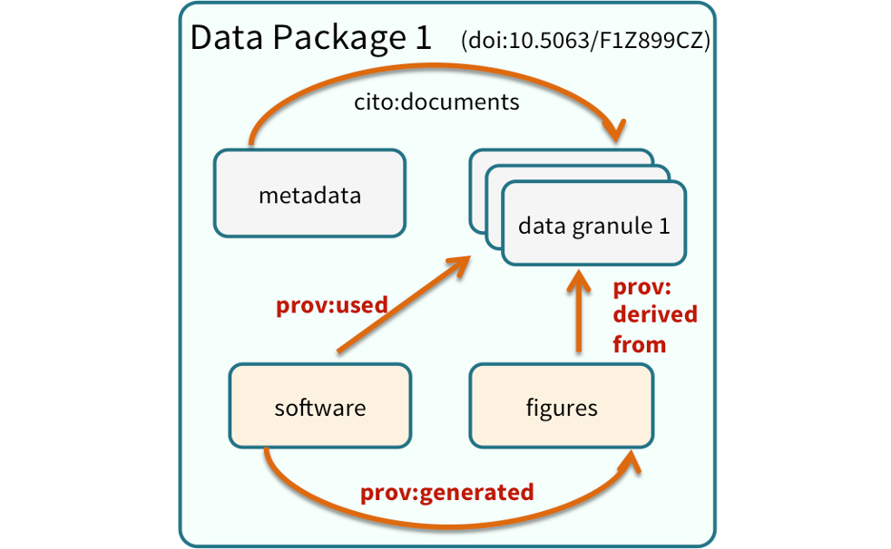

# Lecture 1 {#lecture-1-title data-menu-title="— LECTURE 1 —"}

[Data Stewardship, the Life Cycle, and Metadata]{.custom-title}

[Week 12, Lecture 1 · Monday]{.custom-subtitle}

::: custom-subtitle2
**BIO/CHEM 806** · Gretchen LeBuhn  Textbook: s14 sections 1–5
:::

------------------------------------------------------------------------

##  {#opening-question data-menu-title="Opening question"}

[Learning Objectives]{.slide-title}

::: body-text
Learning objectives

• Explain what data management is and why it matters for graduate research

• Describe the Data Life Cycle and identify which stage their thesis data is currently in

• Name the three cross-cutting elements that apply at every stage

• Apply the nine metadata questions to their own thesis data and identify gaps

• Describe what goes into bibliographic, discovery, and interpretation metadata

• Understand what a data dictionary is and begin drafting one
:::

------------------------------------------------------------------------

##  {#what-is-dm data-menu-title="What is data management"}

[What is data management?]{.slide-title}

::: body-text
> *"Data management is the process of handling, organizing, documenting, and preserving data used in a research project."*
>
> — NCEAS Learning Hub, s14

Data management is not a bureaucratic hurdle.

It is **respect** — for the effort you put into collecting your data, for the funding that supported it, and for the science that comes after you.
:::

------------------------------------------------------------------------

##  {#benefits-researcher data-menu-title="Benefits - researcher"}

[Why manage your data?]{.slide-title}

::::::: columns
:::: {.column width="50%"}
**As a researcher**

::: body-text
- Stay organized — find your files
- Track processes for reproducibility
- Better version control
- More efficient quality control
- Avoid data loss
- Format data for re-use
- **Gain credibility through sharing**
:::
::::

:::: {.column width="50%"}
**For science**

::: body-text
- Data is expensive to collect
- Maximize effective use and value
- Facilitate data sharing
- Ensure long-term accessibility
- Enable re-use in future synthesis
:::
::::
:::::::

------------------------------------------------------------------------

##  {#benefits-thesis data-menu-title="Benefits - your thesis"}

[What this means for your thesis]{.slide-title}

::: body-text
Your thesis data has value **beyond your thesis.**

A synthesis researcher ten years from now might want it — to combine with other datasets, to validate a model, to ask a question you haven't thought of yet.

The question is whether they will be able to **find, understand, and use it.**

That depends entirely on decisions you make now.
:::

------------------------------------------------------------------------

##  {#lifecycle-intro data-menu-title="Data Life Cycle intro"}

[The Data Life Cycle]{.slide-title}

::: body-text
The Data Life Cycle gives an overview of the meaningful steps data goes through in a research project — from planning to archival.

It is a **visual tool** that helps scientists plan and anticipate data needs for a specific project.

*Open the textbook to section 3.*
:::

::: caption-text
Source: Faundeen et al. 2013, USGS & DataONE — s14 section 3
:::

------------------------------------------------------------------------

##  {#lifecycle-usgs data-menu-title="Life Cycle - USGS wheel"}

[The Data Life Cycle]{.slide-title}

::::::: columns
:::: {.column width="55%"}
{width="100%"}

::: caption-text
Source: Adapted from Faundeen et al. 2013, USGS & DataONE
:::
::::

:::: {.column width="45%"}
::: body-text
**Primary stages** — each with a tool:

- Plan → Data Management Plan
- Acquire & Discover
- Process → Clean & Wrangle
- Integrate
- Analyze
- Preserve → Repositories
- Publish & Share → DOIs
:::
::::
:::::::

------------------------------------------------------------------------

##  {#lifecycle-dataone data-menu-title="Life Cycle - DataONE wheel"}

[The Data Life Cycle]{.slide-title}

::::::: columns
:::: {.column width="55%"}
{width="100%"}

::: caption-text
Source: DataONE Data Life Cycle
:::
::::

:::: {.column width="45%"}
::: body-text
The DataONE wheel makes explicit: this is a **cycle**, not a checklist.

You go around it again with every new project.

**Where is your thesis data right now?**
:::
::::
:::::::

------------------------------------------------------------------------

##  {#lifecycle-stages data-menu-title="Stages walkthrough"}

[Stages of the Data Life Cycle]{.slide-title}

::: body-text
| Stage                  | What happens                | Tool                 |
|------------------------|-----------------------------|----------------------|
| **Plan**               | Map data needs, build a DMP | Data Management Plan |
| **Acquire & Discover** | Collect or find data        | Document provenance  |
| **Process**            | Clean, wrangle, transform   | tidyverse pipelines  |
| **Integrate**          | Combine multiple sources    | Document joins       |
| **Analyze**            | Visualize, model, test      | Quarto documents     |
| **Preserve**           | Store for long-term access  | Repositories         |
| **Publish & Share**    | Make data discoverable      | DOIs and citations   |
:::

------------------------------------------------------------------------

##  {#process-callback data-menu-title="Process stage callout"}

[Process — sound familiar?]{.slide-title}

::: body-text
The textbook names **"Cleaning and Wrangling data skills"** as the tool at the Process stage.

That is exactly what we built in Weeks 5–7:

- **Week 5:** Tidy data principles
- **Week 6:** dplyr wrangling pipelines
- **Week 7:** Joins — combining data from multiple sources

Your Quarto documents from those weeks are **data processing documentation.**
:::

------------------------------------------------------------------------

##  {#chat-prompt-1 data-menu-title="Chat prompt - life cycle stage"}

[💬 Chat prompt]{.slide-title}

:::: page-center
::: body-text
**Which stage of the Data Life Cycle is your thesis data in right now?**

Take 60 seconds. Type it in the chat.
:::
::::

------------------------------------------------------------------------

##  {#crosscutting-intro data-menu-title="Cross-cutting intro"}

[Cross-cutting elements]{.slide-title}

::: body-text
Three elements run **through every stage**, constantly, throughout the entire life of a project.

They are not steps — they are ongoing practices.
:::

 

::::::::: columns
:::: {.column width="33%"}
::: center-text
**📝 Describe**  Metadata and documentation
:::
::::

:::: {.column width="33%"}
::: center-text
**✅ Manage Quality**  QA/QC procedures
:::
::::

:::: {.column width="33%"}
::: center-text
**💾 Backup and Secure**  Short-term preservation
:::
::::
:::::::::

------------------------------------------------------------------------

##  {#describe data-menu-title="Cross-cutting - Describe"}

[Cross-cutting: Describe]{.slide-title}

::: body-text
> *"Metadata, or data about data, is key to data sharing and reuse."*
>
> — s14 section 3.2

**Describe** means documenting the why, who, what, when, where, and how of your data at every stage.

Documentation includes: code comments, data models, workflows, README files, and formal metadata records.

**Your Quarto document answers many of these questions by existing.**
:::

------------------------------------------------------------------------

##  {#manage-quality data-menu-title="Cross-cutting - Quality"}

[Cross-cutting: Manage Quality]{.slide-title}

::: body-text
QA/QC procedures ensure data looks how you expect it to look.

**Field biology examples:**

- Range checks on counts or GPS coordinates
- Duplicate observation detection
- Verification against field notes

**Chemistry examples:**

- Instrument calibration records
- Replicate measurements
- Standard curve verification

QA/QC runs **throughout** — not just at the end.
:::

------------------------------------------------------------------------

##  {#backup data-menu-title="Cross-cutting - Backup"}

[Cross-cutting: Backup and Secure]{.slide-title}

::: body-text
Plan to preserve data in the short term against software failure, human error, or disaster.

The textbook is specific — this applies to **all of it:**

- Raw data and processed data
- Your original science plan and DMP
- Analysis scripts and Quarto documents
- Published products and metadata

**GitHub is a backup for code and small files — but it is not an archival location.** More on Wednesday.
:::

------------------------------------------------------------------------

##  {#metadata-framing data-menu-title="Metadata framing"}

[Introduction to metadata]{.slide-title}

::: body-text
> *"Imagine that you're writing your metadata for a typical researcher — who might even be you — 30+ years from now. What will they need to understand what's inside your data files?"*
>
> — s14 section 5

The goal: enough information to **understand**, **interpret**, and **reuse** the data.

That is the bar.
:::

------------------------------------------------------------------------

##  {#nine-questions data-menu-title="Nine metadata questions"}

[The nine metadata questions]{.slide-title}

::: body-text
*s14 section 5.1 — Overall Guidelines*

1.  What was **measured**?
2.  **Who** measured it?
3.  **When** was it measured?
4.  **Where** was it measured?
5.  **How** was it measured?
6.  How is the **data structured**?
7.  **Why** was the data collected?
8.  Who should get **credit** — researcher AND funding agency?
9.  How can this data be **reused** — what is the license?
:::

------------------------------------------------------------------------

##  {#nine-questions-thesis data-menu-title="Nine questions - your data"}

[Nine questions for your thesis]{.slide-title}

::: body-text
Every piece of metadata you write answers one or more of these questions.

If you cannot answer all nine for your thesis data, you have a **gap that needs to be filled.**

The rest of today: **exactly what goes in each answer** — using the textbook's three guideline categories.
:::

------------------------------------------------------------------------

##  {#chat-prompt-2 data-menu-title="Chat prompt - metadata gap"}

[💬 Chat prompt]{.slide-title}

:::: page-center
::: body-text
**Which of the nine metadata questions could you NOT currently answer for your thesis data?**

Type it in the chat.
:::
::::

------------------------------------------------------------------------

##  {#metadata-guidelines-intro data-menu-title="Metadata guidelines intro"}

[Metadata best practices]{.slide-title}

::: body-text
The textbook organizes metadata guidelines into three categories.

*Open to sections 5.2 through 5.4.*
:::

 

::::::::: columns
:::: {.column width="33%"}
::: center-text
**📚 Bibliographic**  s14 section 5.2  *helps data get cited correctly*
:::
::::

:::: {.column width="33%"}
::: center-text
**🔍 Discovery**  s14 section 5.3  *helps data be found*
:::
::::

:::: {.column width="33%"}
::: center-text
**🔬 Interpretation**  s14 section 5.4  *helps data be used correctly*
:::
::::
:::::::::

------------------------------------------------------------------------

##  {#bibliographic data-menu-title="Bibliographic guidelines"}

[Bibliographic guidelines]{.slide-title}

::: body-text
*s14 section 5.2 — what helps your data get cited correctly*

- **Global identifier** — a DOI (digital object identifier)
- **Descriptive title** — topic, geographic location, dates, scale
- **Abstract** — brief overview of contents and purpose
- **Funding information** — award number and sponsor
- **People and organizations** — creator, contact, contributors

**Compare:**

❌ *"Bee data 2024"*

✅ *"Urban pollinator community composition and floral resource availability, San Francisco Bay Area residential gardens, May–August 2024"*
:::

------------------------------------------------------------------------

##  {#discovery data-menu-title="Discovery guidelines"}

[Discovery guidelines]{.slide-title}

::: body-text
*s14 section 5.3 — what helps your data be found*

- **Geospatial coverage** — field and lab sampling locations, place names, precise coordinates
- **Temporal coverage** — when measurements were made, what time period they apply to
- **Taxonomic coverage** — species measured, taxonomy standards followed
- **Contextual information** — anything else needed to place the data

This is what gets indexed by repository search systems and returned in searches.
:::

------------------------------------------------------------------------

##  {#interpretation data-menu-title="Interpretation guidelines"}

[Interpretation guidelines]{.slide-title}

::: body-text
*s14 section 5.4 — what allows someone to use your data correctly*

- **Collection methods** — full experimental and project design
- **Processing methods** — field and lab sample processing steps
- **QC procedures** — all quality control steps applied
- **Provenance** — how data was acquired and transformed
- **Hardware and software** — make, model, and version of instruments and software used
:::

------------------------------------------------------------------------

##  {#data-dictionary data-menu-title="Data dictionary"}

[Data structure and contents]{.slide-title}

::: body-text
*s14 section 5.5*

> *"Everything needs a description: the data model, the data objects, and the variables all need to be described so that there is no room for misinterpretation."*

**For every variable:**

| Column | Units | Description | Example | Missing |
|----|----|----|----|----|
| `temp_c` | °C | Air temperature at 1.5 m | 18.4 | NA |
| `bee_count` | individuals | Bee visits per 15-min observation | 7 | NA |
| `site_type` | — | Garden type: urban / suburban / rural | urban | — |
:::

------------------------------------------------------------------------

##  {#semantic data-menu-title="Semantic annotation"}

[Why vocabulary matters]{.slide-title}

:::: body-text
Search a repository for `"carbon dioxide flux"` — datasets that call it `"CO2 flux"` may not appear in your results.

**Correct semantic annotation** makes your data interoperable — findable by machines, not just readable by humans.

This is the difference between data that gets reused and data that disappears.

::: callout-tip
### Your data

What are the key variables in your thesis dataset? Are you using standard terminology that others in your field would search for?
:::
::::

------------------------------------------------------------------------

##  {#rights-attribution data-menu-title="Rights and attribution"}

[Rights and attribution]{.slide-title}

:::: body-text
*s14 section 5.6 — the last piece of a complete metadata record*

- **Citation format** — how to credit the dataset
- **Attribution expectations** — what you expect of re-users
- **Reuse rights** — who may use the data and for what purpose
- **License** — the legal terms governing reuse

**The most common open license:**

::: important-text-bg
**CC BY 4.0** — anyone may use, share, and adapt your data for any purpose, provided they give appropriate credit. If you are unsure, start here.
:::
::::

------------------------------------------------------------------------

##  {#edi-demo data-menu-title="EDI demo"}

[🖥️ Live demo: a real metadata record]{.slide-title}

::: body-text
Let's look at a complete, well-documented metadata record.

**Dataset:** Sacramento–San Joaquin Delta Socioecological Monitoring Data (edi.587.1)

We will examine:

- The **abstract** — bibliographic guideline
- The **attribute table** — data dictionary
- **Geographic and temporal coverage** — discovery guidelines
- The **methods section** — interpretation guidelines

[edirepository.org](https://edirepository.org)
:::

------------------------------------------------------------------------

##  {#lecture1-wrapup data-menu-title="Lecture 1 wrap-up"}

[Before Wednesday]{.slide-title}

::: body-text
**Today:** life cycle → cross-cutting elements → nine metadata questions → all three guideline categories

**Read before Wednesday:** textbook section 4 (DMPs and the Ten Rules)

**Come prepared with a specific dataset in mind** — a specific file or set of files from your thesis. Know its format, where it lives, and roughly how large it is.

**Wednesday:** DMPs, repositories, Zenodo, FAIR/CARE — and a 10-minute working session where you answer the nine questions for that dataset.
:::

------------------------------------------------------------------------

# Lecture 2 {#lecture-2-title data-menu-title="— LECTURE 2 —"}

[DMPs, Repositories, FAIR/CARE, and Your Data]{.custom-title}

[Week 12, Lecture 2 · Wednesday]{.custom-subtitle}

::: custom-subtitle2
**BIO/CHEM 806** · Gretchen LeBuhn  Textbook: s14 sections 4–7
:::

------------------------------------------------------------------------

##  {#lecture2-opening data-menu-title="Lecture 2 opening"}

[Today]{.slide-title}

::: body-text
**Monday:** life cycle → cross-cutting elements → nine metadata questions → all three guideline categories (bibliographic, discovery, interpretation)

**Today:** the other half — *how to plan* and *where to put your data*

- Data Management Plans — the ten rules, DMPTool live demo
- Repositories — GitHub vs. Zenodo, DOIs, data packages
- FAIR and CARE principles
- **Working session** — answer the nine questions for your own data, right now

**By the end of today** you will have a metadata document for your thesis dataset.
:::

------------------------------------------------------------------------

##  {#dmp-what data-menu-title="What is a DMP"}

[What is a Data Management Plan?]{.slide-title}

::: body-text
> *"A document that describes how you will use your data during a research project, as well as what you will do with your data long after the project ends."*
>
> — s14 section 4

A DMP is a **living document** — updated as research plans change.

It is both a blueprint for how you manage your data *and* a set of guidelines for you and your team on policies, roles, and responsibilities.
:::

------------------------------------------------------------------------

##  {#dmp-why data-menu-title="Why write a DMP"}

[Why write a DMP as a grad student?]{.slide-title}

::: body-text
**Funders require them** NSF, NIH, and most federal agencies now mandate a DMP with any proposal.

**It forces good decisions early** Most researchers don't think through storage, sharing, and preservation until something goes wrong.

**It signals professionalism** A student who arrives with a DMP for their thesis data is operating at a professional level.
:::

------------------------------------------------------------------------

##  {#dmp-how data-menu-title="How to plan"}

[How to plan well]{.slide-title}

::: body-text
*s14 section 4 — four principles*

- **Plan early** — information gets lost over time; think about data needs as you start your project

- **Plan in collaboration** — engage your advisor and lab mates; diverse perspectives make your plan more resilient

- **Make revision part of the process** — no plan survives contact with data collection intact; revising is professional practice, not failure

- **Include a tidy data and ethics lens** — tidy data principles apply to how you structure raw files from the start
:::

------------------------------------------------------------------------

##  {#ten-rules-intro data-menu-title="Ten rules intro"}

[Ten Simple Rules for a Good DMP]{.slide-title}

::: body-text
*Michener 2015 — s14 section 4.1*

A well-thought-out DMP means you are more likely to:

- Stay organized
- Work efficiently
- Truly share data
- Engage your team
- Meet funder requirements

Let's walk through all ten — anchored to your thesis.
:::

------------------------------------------------------------------------

##  {#rules-1-2 data-menu-title="Rules 1-2"}

[Rules 1–2]{.slide-title}

::: body-text
**1. Determine your organization or sponsor requirements**

Each funding agency has specific expectations. [DMPTool.org](https://dmptool.org) provides templates for all major US funders. Bookmark it.

 

**2. Identify the datasets for your project**

Consider: **type** (text, spatial, tabular, images) · **source** (where does it live, is it proprietary?) · **volume** (how much?) · **format** (CSV, XLSX, shapefiles, instrument output files)
:::

------------------------------------------------------------------------

##  {#rules-3-4 data-menu-title="Rules 3-4"}

[Rules 3–4]{.slide-title}

::: body-text
**3. Define how the data will be organized**

We built this in Week 2: project folder structure, raw data never edited in place, processed versions in separate folders. Now formalize it as a DMP element.

 

**4. Explain how the data will be documented**

What metadata standard will you follow? What tools? For ecological data: **EML** (Ecological Metadata Language) via EDI's **ezEML**. For chemistry: Dublin Core and domain-specific standards.
:::

------------------------------------------------------------------------

##  {#rules-5-6 data-menu-title="Rules 5-6"}

[Rules 5–6]{.slide-title}

::: body-text
**5. Describe how data quality will be assured**

Write down your QA/QC procedures. Field biology: range checks, duplicate detection, field note verification. Chemistry: calibration logs, replicate measurements, standard curves.

*If you cannot describe your QA/QC, you may not be doing it consistently.*

 

**6. Have a storage strategy — short and long term**

Short term: institutional server, Box, Google Drive, GitHub for small files. Long term: a **dedicated data repository** with a persistent identifier. This is where most researchers fall short.
:::

------------------------------------------------------------------------

##  {#rules-7-8 data-menu-title="Rules 7-8"}

[Rules 7–8]{.slide-title}

::: body-text
**7. Define the data policies**

Access, licensing, and ethical conditions. Can anyone use it? Are there restrictions — human subjects protections, Indigenous data sovereignty, proprietary instrument constraints?

 

**8. What data products will be made available and how?**

The textbook encourages **open data practices**. Options: publishing in an open repository, submitting as a journal supplement, writing a data paper. At minimum: deposit with a DOI alongside your thesis.
:::

------------------------------------------------------------------------

##  {#rules-9-10 data-menu-title="Rules 9-10"}

[Rules 9–10]{.slide-title}

::: body-text
**9. Assign roles and responsibilities**

Who collects data? Who does QC? Who creates metadata? Who submits to the repository? Even as a sole researcher, writing this down makes you accountable to yourself.

 

**10. Prepare a realistic budget**

Data management takes **time** — and sometimes money. Account for the hours it will take to write metadata, deposit data, and document your workflow. It is not zero.
:::

------------------------------------------------------------------------

##  {#dmptool-demo data-menu-title="DMPTool demo"}

[🖥️ Live demo: DMPTool.org]{.slide-title}

::: body-text
Let's create a shell DMP together.

**Project:** *Urban pollinator habitat and floral resource availability in San Francisco gardens*

We will fill in elements 2, 3, and 6 together. Follow along on your own device.

[dmptool.org](https://dmptool.org)
:::

------------------------------------------------------------------------

##  {#metadata-bridge data-menu-title="Metadata → repositories bridge"}

[From metadata to mechanics]{.slide-title}

::: body-text
**Monday:** you built the complete metadata framework.
:::

::::::::: columns
:::: {.column width="33%"}
::: center-text
**📚 Bibliographic**  *get cited correctly*    Title · DOI · Abstract Funding · People
:::
::::

:::: {.column width="33%"}
::: center-text
**🔍 Discovery**  *be found*    Location · Time Taxonomy · Context
:::
::::

:::: {.column width="33%"}
::: center-text
**🔬 Interpretation**  *be used correctly*    Methods · QC Provenance · Software
:::
::::
:::::::::

 

::: body-text
**Today:** *where does all this metadata live, and how does your data become citable and preserved?*
:::

------------------------------------------------------------------------

##  {#repos-intro data-menu-title="Repositories intro"}

[Data preservation and sharing]{.slide-title}

::: body-text
> *"We define a data package as a scientifically useful collection of data and metadata that a researcher wants to preserve."*
>
> — s14 section 6.1

A data package contains:

- One or more **data files**
- **Software files** (scripts, code)
- **Other scientific products** (figures, protocols)
- A **descriptive metadata document**

All tied together — and assigned a **DOI.**
:::

------------------------------------------------------------------------

##  {#data-package-graphic data-menu-title="Data package graphic"}

[Data packages]{.slide-title}

::::::: columns
:::: {.column width="55%"}
{width="100%"}

::: caption-text
Source: s14 section 6.1
:::
::::

:::: {.column width="45%"}
::: body-text
Many repositories assign a **unique identifier** to every version of every file — similar to Git commit hashes.

The package gets a **DOI** that is publicly citable.

Individual files get **globally unique identifiers.**

Any specific version of any file can be precisely referenced.
:::
::::
:::::::

------------------------------------------------------------------------

##  {#github-not-archival data-menu-title="GitHub not archival"}

[GitHub is not an archival location]{.slide-title}

::: body-text
The textbook says this explicitly — *s14 section 6.2.*

GitHub is powerful for version control and collaboration. We will keep using it.

**But:**

- It is a commercial service
- Files can be deleted; repositories can be made private
- It does not guarantee perpetual access
- It does not assign DOIs
- It is not built for long-term scientific preservation
:::

::: important-text-bg
**The workflow:** GitHub for active code and small data → data repository for final, preserved, citable data.
:::

------------------------------------------------------------------------

##  {#repos-options data-menu-title="Repository options"}

[Dedicated data repositories]{.slide-title}

::: body-text
*s14 section 6.2 — repositories built for data (and code)*

Dedicated repositories are:

- **Rich in metadata** — structured, searchable
- **Archival in their mission** — long-term preservation commitment
- **Certified** — CoreTrustSeal or equivalent

**Options for your thesis:**

| Repository | Best for                    | URL                    |
|------------|-----------------------------|------------------------|
| **Zenodo** | Any field, code + data      | zenodo.org             |
| **EDI**    | Ecological field data (EML) | edirepository.org      |
| **Dryad**  | Biology, medicine           | datadryad.org          |
| **KNB**    | Environmental data          | knb.ecoinformatics.org |
:::

------------------------------------------------------------------------

##  {#zenodo data-menu-title="Zenodo"}

[Zenodo — the right starting point]{.slide-title}

::::::: columns
:::: {.column width="60%"}
::: body-text
**Zenodo** is run by CERN. It is free, open, and accepts research data from any field.

When you deposit a dataset, Zenodo **automatically assigns a DOI.**

That DOI is **persistent** — maintained by the international DOI Foundation, not by any single organization.
:::
::::

:::: {.column width="40%"}
::: body-text
**What this means for your thesis:**

- Data is citable in your methods section
- Other researchers can build on it
- You can list it on your CV
- Journals increasingly require it
:::
::::
:::::::

------------------------------------------------------------------------

##  {#zenodo-github data-menu-title="Zenodo GitHub integration"}

[Zenodo + GitHub integration]{.slide-title}

::: body-text
Connect your GitHub repository to Zenodo.

Every time you create a **release** on GitHub, Zenodo automatically:

1.  Archives a snapshot of the repository
2.  Mints a new DOI for that version

Your code and data become **versioned and citable simultaneously.**
:::

 

::: center-text
`Active development in GitHub` → `Create a release` → `Zenodo archives snapshot` → `DOI minted` → `Cite in thesis methods + CV`
:::

------------------------------------------------------------------------

##  {#fair-intro data-menu-title="FAIR intro"}

[The FAIR principles]{.slide-title}

::: body-text
*s14 section 7.1*

FAIR was developed to guide data management and stewardship. Your data should be:
:::

::::::: columns
:::: {.column width="50%"}
::: body-text
**F — Findable** Data and metadata have a persistent identifier and are rich enough to be indexed.

**A — Accessible** Data can be retrieved using open, free protocols. Even if data is restricted, metadata remains accessible.
:::
::::

:::: {.column width="50%"}
::: body-text
**I — Interoperable** Data uses formal, broadly applicable vocabularies so it can be integrated with other datasets.

**R — Reusable** Data is richly described with accurate attributes and a clear, accessible license.
:::
::::
:::::::

------------------------------------------------------------------------

##  {#fair-connection data-menu-title="FAIR connection"}

[Everything connects to FAIR]{.slide-title}

::: body-text
| Practice                                    | FAIR property             |
|---------------------------------------------|---------------------------|
| Descriptive title, abstract, keywords       | **Findable**              |
| Repository with a DOI                       | **Findable + Accessible** |
| Standard metadata format (EML, Dublin Core) | **Interoperable**         |
| Data dictionary with units and coded values | **Reusable**              |
| Clear license (CC BY 4.0)                   | **Reusable**              |
| Zenodo deposit with GitHub integration      | **All four**              |
:::

------------------------------------------------------------------------

##  {#care-intro data-menu-title="CARE principles"}

[The CARE principles]{.slide-title}

::: body-text
*s14 section 7.2 — developed for Indigenous and community data*

CARE addresses limitations of FAIR when data involves human communities.
:::

::::::: columns
:::: {.column width="50%"}
::: body-text
**C — Collective Benefit** Data ecosystems should enable Indigenous peoples and communities to benefit from the data.

**A — Authority to Control** Indigenous peoples' rights and interests in their data must be recognized and their authority empowered.
:::
::::

:::: {.column width="50%"}
::: body-text
**R — Responsibility** Those working with Indigenous data have a responsibility to share how it supports self-determination.

**E — Ethics** Indigenous peoples' rights and wellbeing should be the primary concern at all life cycle stages.
:::
::::
:::::::

------------------------------------------------------------------------

##  {#care-thesis data-menu-title="CARE and your data"}

[CARE and your thesis data]{.slide-title}

::: body-text
CARE matters if your data:

- Comes from community science programs (eBird, iNaturalist, community water monitoring)
- Was collected on Indigenous lands
- Incorporates traditional ecological knowledge
- Involves community health or wellbeing

**Questions to ask:**

- Who owns this data?
- Who controls how it is used?
- Who benefits from its reuse?
:::

------------------------------------------------------------------------

##  {#chat-prompt-care data-menu-title="Chat prompt - CARE"}

[💬 Chat prompt]{.slide-title}

:::: page-center
::: body-text
**Does your thesis data involve communities or places with specific data sovereignty considerations?**

Yes or no — and one sentence why.
:::
::::

------------------------------------------------------------------------

##  {#working-session data-menu-title="Working session"}

[⏱️ Working session — 10 minutes]{.slide-title}

::: body-text
Open a blank document. Answer the nine metadata questions for your thesis dataset.

1.  What was **measured**?
2.  **Who** measured it?
3.  **When** was it measured?
4.  **Where** was it measured?
5.  **How** was it measured?
6.  How is the **data structured**? *(list your key variables + units)*
7.  **Why** was the data collected?
8.  Who should get **credit**?
9.  How can this data be **reused**? *(write a license statement)*

*If you cannot answer one — write a dash. That gap is information.*
:::

------------------------------------------------------------------------

##  {#working-session-save data-menu-title="Save your work"}

[Keep this document]{.slide-title}

::: body-text
What you just wrote is the seed of:

- Your **Zenodo deposit** metadata form
- Your **thesis methods section** — the data description paragraph
- Your **data dictionary** — start expanding it from question 6
- Your **DMP** — questions 2, 3, 7, 8, 9 map directly to DMP elements
- **Exit ticket this week**

Save it to your thesis project folder. Put it under version control. Come back to it.
:::

------------------------------------------------------------------------

##  {#lecture2-wrapup data-menu-title="Lecture 2 wrap-up"}

[This week's action list]{.slide-title}

::: body-text
**Right now — before next Monday:**

1.  Create a free account at [zenodo.org](https://zenodo.org)

2.  (optional) Connect Zenodo to your GitHub account

3.  Explore the deposit interface — see what information it asks for

**Next:** Spatial data — read textbook s15 sections 1–5 before Monday.
:::

------------------------------------------------------------------------

##  {#resources data-menu-title="Resources"}

[Key resources]{.slide-title}

::::::: columns
:::: {.column width="50%"}
::: body-text
**Tools**

- [DMPTool.org](https://dmptool.org) — DMP templates
- [zenodo.org](https://zenodo.org) — data repository + DOIs
- [edirepository.org](https://edirepository.org) — ecological data (EML/ezEML)
- [search.dataone.org](https://search.dataone.org) — federated search
- [re3data.org](https://re3data.org) — find a repository by field
:::
::::

:::: {.column width="50%"}
::: body-text
**Textbook sections**

- s14 §2 — Introduction + benefits
- s14 §3 — Data Life Cycle
- s14 §4 — DMPs + Ten Rules
- s14 §5.1–5.4 — Metadata guidelines
- s14 §6 — Repositories + data packages
- s14 §7 — FAIR and CARE
:::
::::
:::::::
