## {#title-slide data-menu-title="Title Slide"}

[Git & GitHub]{.custom-title}

[Version control for reproducible science]{.custom-subtitle}

<hr class="hr-red">

[**NCEAS Learning Hub**]{.custom-subtitle2}

---

## {#learning-obj data-menu-title="Learning Objectives"}

[Learning Objectives]{.slide-title}

:::{.body-text}
By the end of this session, you will be able to:

- Apply the principles of Git to **track and manage changes** in a project
- Understand how **local working files, Git, and GitHub** work together
- Use the Git workflow: **pull → stage → commit → push**
- Create and configure a **Git repository** on GitHub
- **Clone** a repository and work with Git locally in RStudio
:::

---

## {#version-control-problem data-menu-title="Version Control Problem"}

[The problem with filenames]{.slide-title}

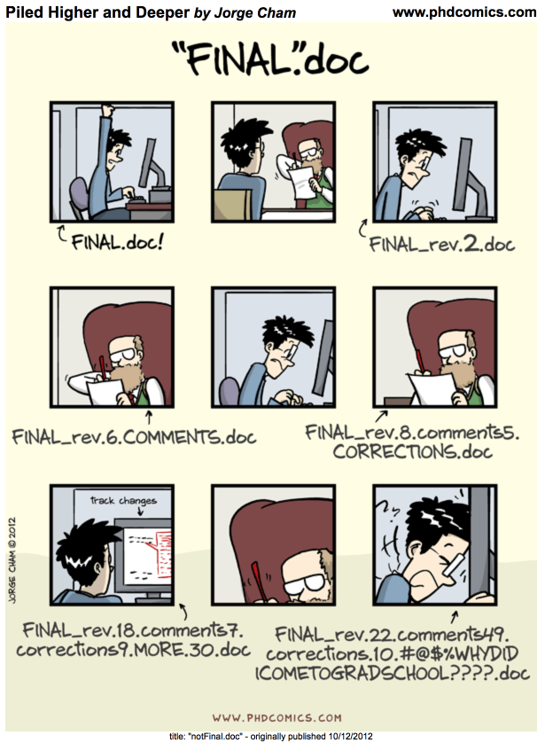{fig-align="center" width="65%"}

---

## {#version-control-why data-menu-title="Why Version Control"}

[Why version control?]{.slide-title}

:::{.body-text}
Every file in the scientific process **changes**. Manuscripts are edited. Figures get revised. Code gets fixed when bugs are discovered — sometimes those fixes lead to more bugs.

Version control provides an **organized and transparent** way to track changes in code and files.

Benefits:

- **Maintain a history** of project development while keeping your workspace clean
- **Facilitate collaboration** and transparency when working on teams
- **Explore bugs or new features** without disrupting your team's work
:::

---

## {#motivating-ex-1 data-menu-title="Motivating Example 1"}

[A motivating example]{.slide-title}

:::{.body-text}
You're working on an analysis in R and you've got it into a state you're pretty happy with. We'll call this **version 1**.
:::

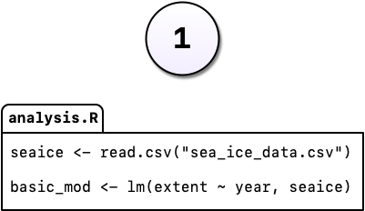{fig-align="center" width="70%"}

---

## {#motivating-ex-2 data-menu-title="Motivating Example 2"}

[A motivating example]{.slide-title}

:::{.body-text}
The next day, you have an email from your boss: *"Hey, you know what this model needs?"*
:::

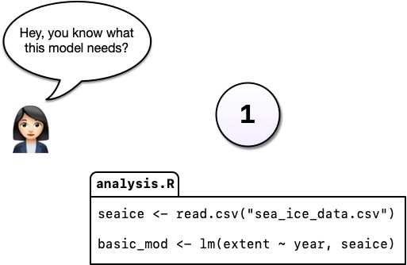{fig-align="center"}

---

## {#motivating-ex-3 data-menu-title="Motivating Example 3"}

[A motivating example]{.slide-title}

:::{.body-text}
You add it to the model — but you're worried about losing the old version. So you **comment out** the old code and add a warning.
:::

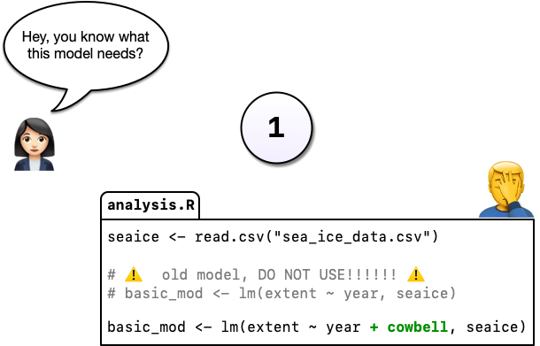{fig-align="center" width="75%"}

:::{.body-text}
Commenting out code you don't want to lose is common — but it's really hard to understand *why* you did it when you come back later.
:::

---

## {#motivating-ex-4 data-menu-title="Motivating Example 4"}

[A better way: commit the change]{.slide-title}

:::{.body-text}
Instead of commenting out old code, we can **change the code in place** and tell Git to commit our change. Now we have two distinct versions — and we can always see what the previous version looked like.
:::

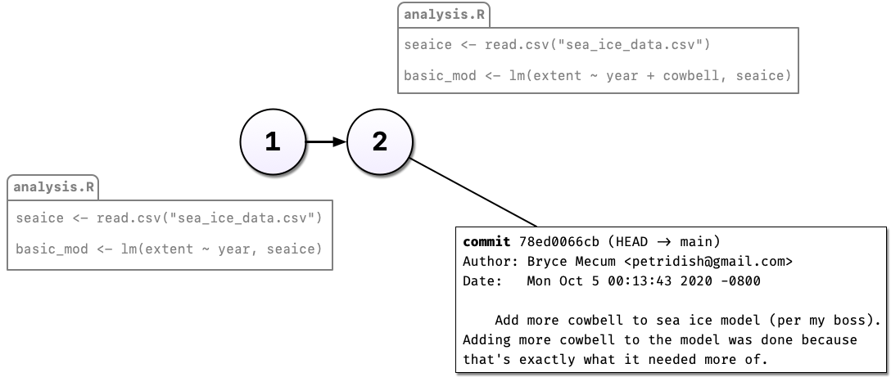{fig-align="center" width="80%"}

:::{.body-text}
Git also tracks **who**, **when**, and **where** the change was made.
:::

---

## {#motivating-ex-5 data-menu-title="Motivating Example 5"}

[Experimenting without fear]{.slide-title}

:::{.body-text}
After committing a third version, a colleague has an idea: *"What if you used machine learning instead?"*
:::

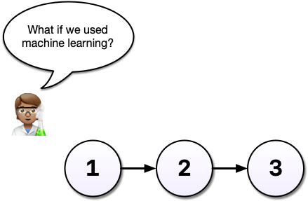{fig-align="center" width="75%"}

:::{.body-text}
Without Git, you'd copy `analysis.R` to `analysis-ml.R` — and now shared code has to be updated in two places.
:::

---

## {#motivating-ex-6 data-menu-title="Branches"}

[Enter: branches]{.slide-title}

:::{.body-text}
With Git, you can start a **branch**. Branches let you confidently experiment — all while leaving the old code intact and recoverable.
:::

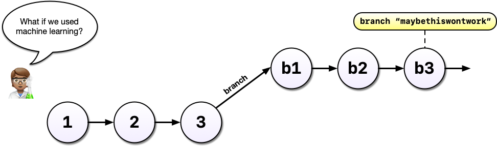{fig-align="center" width="80%"}

---

## {#motivating-ex-7 data-menu-title="Parallel Development"}

[Working in parallel]{.slide-title}

:::{.body-text}
With Git and branches, we can continue developing our **main analysis** at the same time as experimental branches.
:::

::: {.columns}
:::: {.column width="50%"}
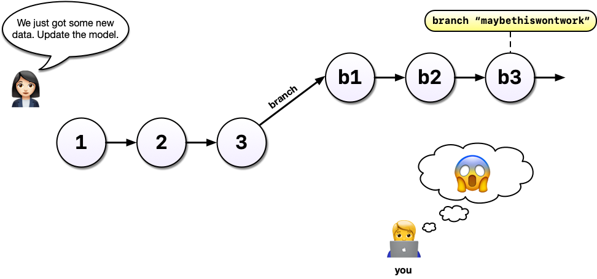{width="100%"}
::::
:::: {.column width="50%"}
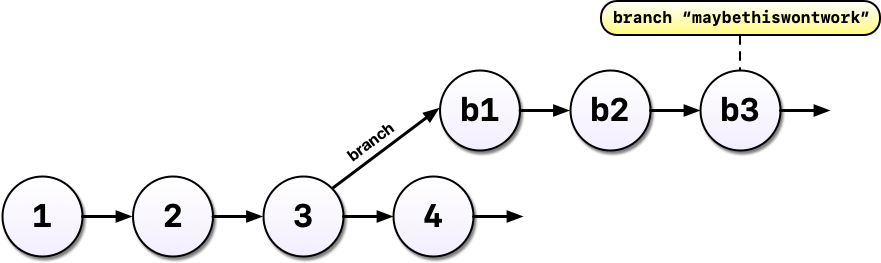{width="100%"}
::::
:::

---

## {#motivating-ex-summary data-menu-title="Git Workflow Summary"}

[What Git gives you]{.slide-title}

:::{.body-text}
- **Eliminate** cryptic filenames and comments to track your work
- Provide **detailed descriptions** of changes through commit messages
- Work on multiple **branches** simultaneously and optionally merge them
- **Access and even execute older versions** of your code
- Have **multiple people working concurrently**, with the ability to merge everyone's changes together
:::

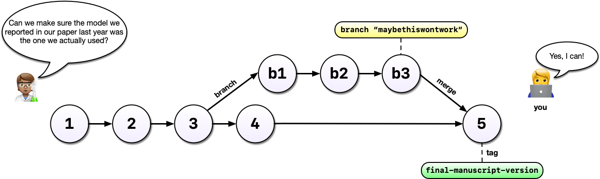{fig-align="center" width="55%"}

---

## {#git-vs-github data-menu-title="Git vs GitHub"}

[What exactly are Git and GitHub?]{.slide-title}

::: {.columns}
:::: {.column width="50%"}
**Git** — version control software

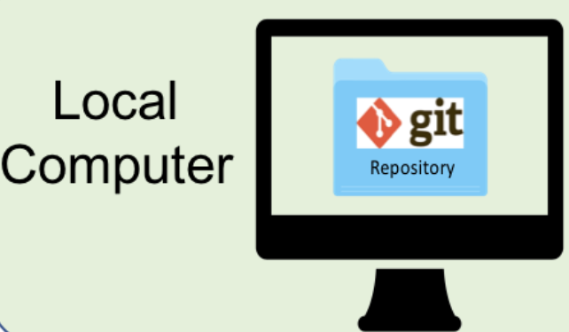{width="80%"}

:::{.body-text}
- Open-source, **runs locally** on your computer
- Tracks file changes and project history
- Works via command line or RStudio's Git tab
- Does not require a network connection
:::
::::
:::: {.column width="50%"}
**GitHub** — online platform for Git

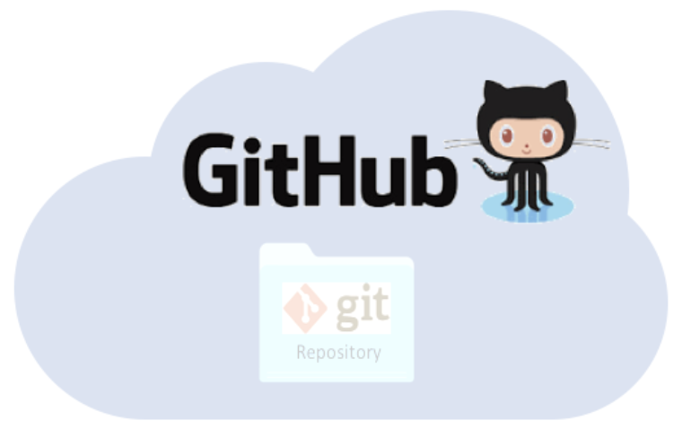{width="80%"}

:::{.body-text}
- **Cloud hosting** for Git repositories
- Web interface, issue tracking, collaboration tools
- Pull requests, code review, project management
- Social features: follow, star, discover code
:::
::::
:::

---

## {#git-github-analogy data-menu-title="Analogy"}

[Git vs. GitHub]{.slide-title}

<br>

:::{.body-text .center-text}
**Git** is the engine.

**GitHub** is the garage where you park, share, and collaborate on your car.
:::

<br>

:::{.body-text}
- Most Git operations happen **locally** — you don't need the internet
- GitHub is where you **back up**, **share**, and **collaborate**
- You can use Git without GitHub; GitHub requires Git
:::

---

## {#git-repo data-menu-title="What is a Git Repo?"}

[Normal folder vs. Git repository]{.slide-title}

:::{.body-text}
Let's say you create a folder `myFolder/` with two files: `myData.csv` and `myAnalysis.R`.

Right now, those files are **not version-controlled**. If you break something, there's no going back.

When you **initialize** a Git repository, a hidden `.git/` folder is created inside. That `.git/` folder *is* the repository — it stores every snapshot you've ever committed.
:::

:::{.callout-warning}
If you delete `.git/`, you delete your entire project history.
:::

---

## {#git-repo-diagram data-menu-title="Git Repo Diagram"}

[The Git repository]{.slide-title}

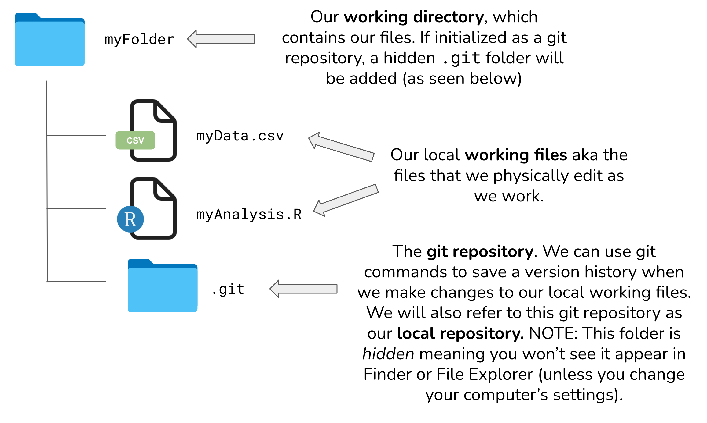{fig-align="center" width="85%"}

---

## {#git-workflow data-menu-title="Git Workflow"}

[The Git workflow]{.slide-title}

:::{.body-text}
**Locally** — creating snapshots:

1. **Make changes** to a file in your working directory
2. **Stage** the file: `git add myAnalysis.R` (or `git add .` for all)
3. **Commit** the file: `git commit -m "describe your change"`

**Syncing with GitHub:**

4. **Push** local commits to GitHub: `git push`
5. **Pull** changes from GitHub: `git pull`
:::

:::{.callout-tip}
Always **pull before you push** — especially when collaborating!
:::

---

## {#allison-horst data-menu-title="Workflow Illustration"}

[Visualizing the workflow]{.slide-title}

{
  fig-align="center"
  style="max-height:55vh; width:auto;"
}
---

## {#github-repo-look data-menu-title="GitHub Repository"}

[What a GitHub repository looks like]{.slide-title}

:::{.body-text}
File listing, last modified dates, who made the most recent changes — all visible at a glance.
:::

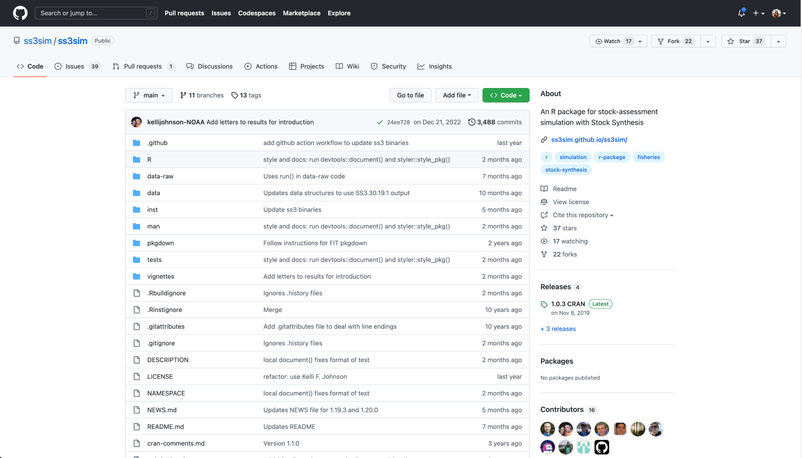{fig-align="center" width="85%"}

---

## {#github-commits data-menu-title="Commit History"}

[Inspecting the commit history]{.slide-title}

:::{.body-text}
Drill into **commits** and see the full history of every change ever made to the project.
:::

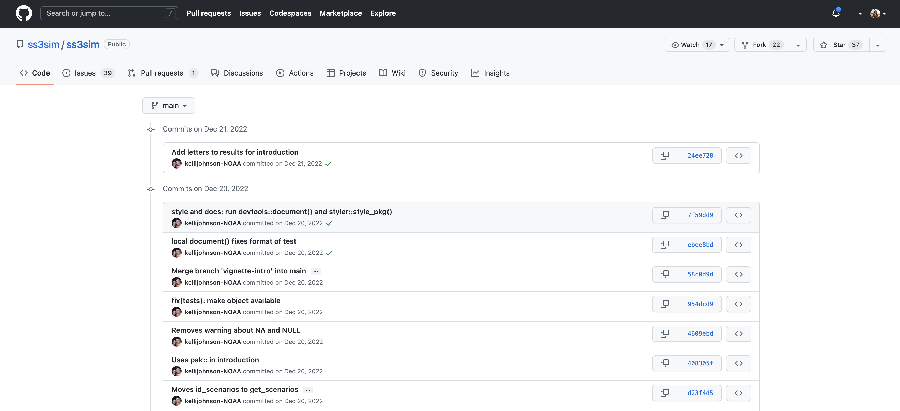{fig-align="center" width="85%"}

---

## {#github-diff data-menu-title="Diff View"}

[Seeing exactly what changed]{.slide-title}

:::{.body-text}
Drill into any single commit to see **line-by-line** changes: additions in green, deletions in red.
:::

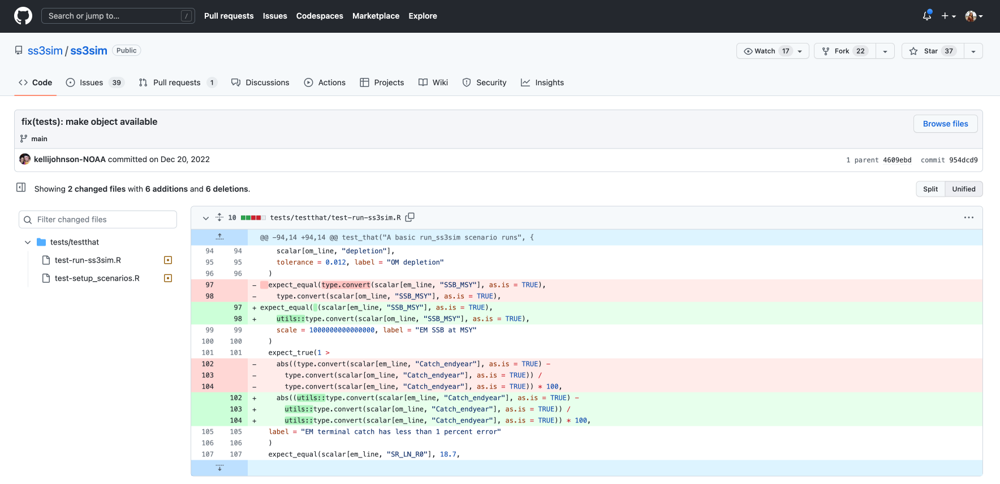{fig-align="center" width="85%"}

:::{.body-text}
*This is what `FINAL_v3_please_please.R` can never give you.*
:::

---

## {#git-vocab data-menu-title="Git Vocabulary"}

[Git vocabulary: the essentials]{.slide-title}

| Term | Command | What it does |
|---|---|---|
| Stage | `git add [file]` | Mark file(s) for next commit |
| Commit | `git commit -m "msg"` | Record a snapshot with a message |
| Pull | `git pull` | Fetch + merge changes from remote |
| Push | `git push` | Send local commits to GitHub |
| Status | `git status` | See what's staged/unstaged |
| Clone | `git clone [url]` | Copy a remote repo locally |

:::{.body-text}
Bookmark the full vocabulary tables in the chapter — including advanced commands like `branch`, `merge`, `checkout`, and `log`.
:::

---

## {#commit-messages data-menu-title="Commit Messages"}

[Writing good commit messages]{.slide-title}

:::{.body-text}
- **Be descriptive and concise** — convey the purpose in a few words
- **Use imperative tense** — "Add analysis" not "Added analysis"  
- **Keep subject line under 50 characters**
- **Focus on the "what" and "why"**, not just what you clicked
:::

:::{.callout-tip}
### Examples

❌ `Updates`  
❌ `Fixed stuff`  
✅ `Fix mean calculation to exclude NA values`  
✅ `Add soil pH summary to exploratory analysis`
:::

---

## {#exercise1 data-menu-title="Exercise 1"}

[Exercise 1: Create a remote repository]{.slide-title}

:::{.callout-note}
### Setup

1. Log in to [GitHub](https://github.com/)
2. Click **New repository**
3. Name it `{FIRSTNAME}_test`
4. Add a short description
5. Check the box to add a `README.md`
6. Add a `.gitignore` file using the **R** template
7. Set the License to **Apache 2.0**
:::

:::{.body-text}
Then: navigate to `README.md`, click the **pencil icon**, add a level-2 header called "Purpose" with a few bullet points, and commit the change.
:::

---

## {#exercise1-result data-menu-title="Exercise 1 Result"}

[Your first repository]{.slide-title}

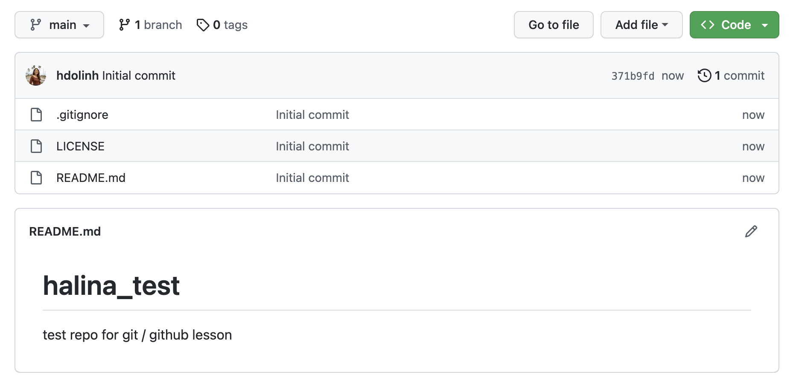{fig-align="center" width="85%"}

---

## {#exercise1-edit data-menu-title="Edit on GitHub"}

[Editing directly on GitHub]{.slide-title}

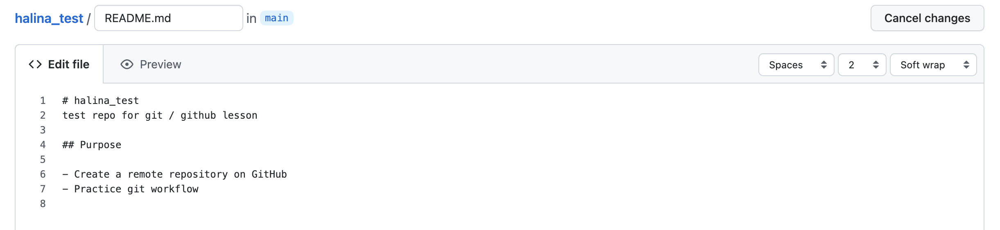{fig-align="center" width="85%"}

---

## {#exercise1-commit data-menu-title="First Commit"}

[Your first versioned commit]{.slide-title}

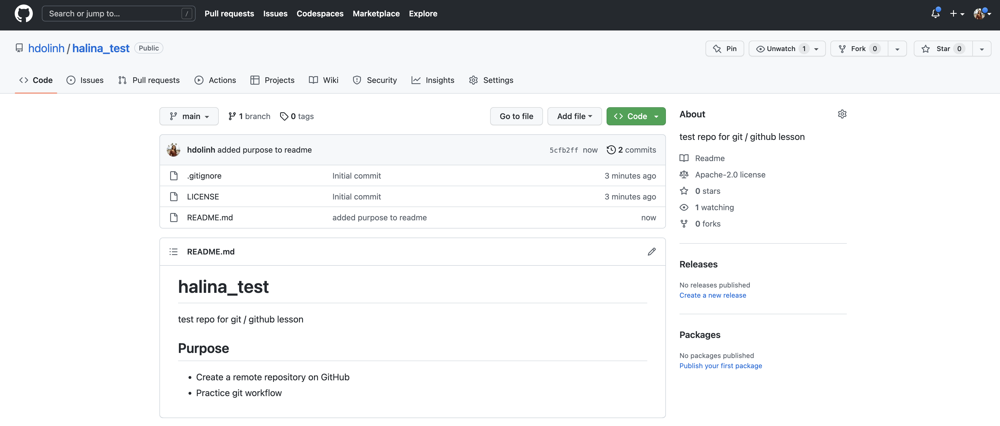{fig-align="center" width="85%"}

:::{.body-text}
The landing page shows all files, when each was last edited, and the **commit message** for each file's most recent change — this is why descriptive commit messages matter!
:::

---

## {#exercise2 data-menu-title="Exercise 2"}

[Exercise 2: Clone your repository]{.slide-title}

:::{.body-text}
The copy on GitHub is the **origin repository**. Now we bring it down to your local machine.
:::

:::{.callout-note}
### Setup

1. Click the green **Code** button on your GitHub repo
2. Copy the URL
3. In RStudio: **File → New Project → Version Control**
4. Paste the URL → press **Tab** to auto-fill the directory name
5. Click **Create Project**
:::

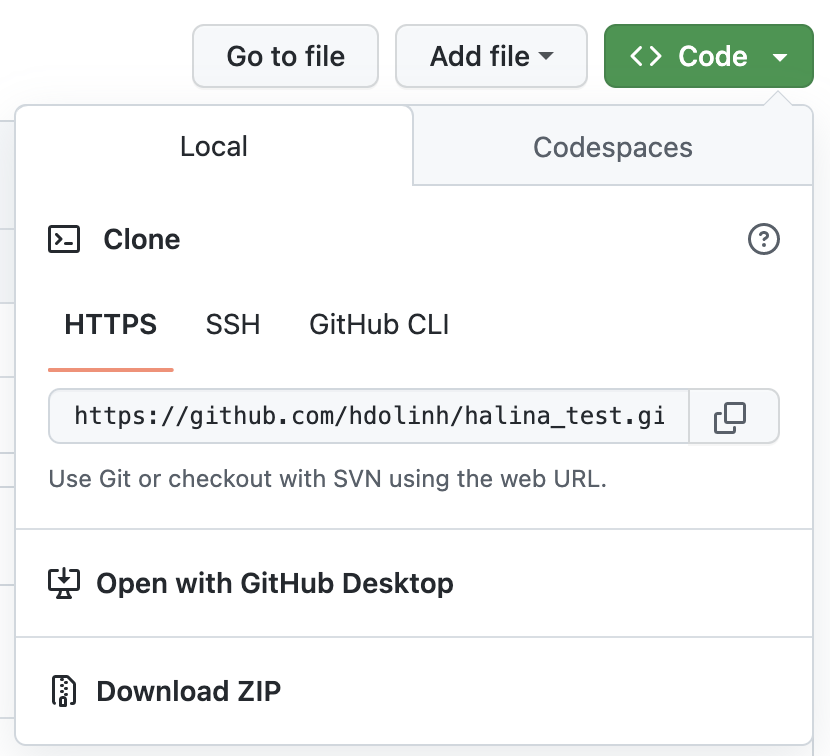{fig-align="center" width="55%"}

---

## {#exercise2-rstudio data-menu-title="RStudio Git Tab"}

[RStudio with Git]{.slide-title}

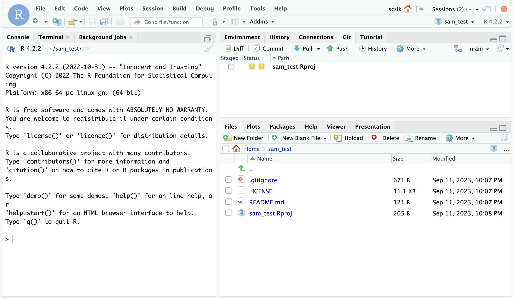{fig-align="center" width="85%"}

:::{.body-text}
You'll see a **Git tab** in RStudio — this is your version control panel.  
`??` means a file is untracked (Git doesn't know about it yet).
:::

---

## {#exercise2-workflow data-menu-title="The Full Workflow"}

[Practice the full workflow]{.slide-title}

:::{.body-text}
Make a change to your `README.md` in RStudio, then:
:::

::: {.columns}
:::: {.column width="50%"}
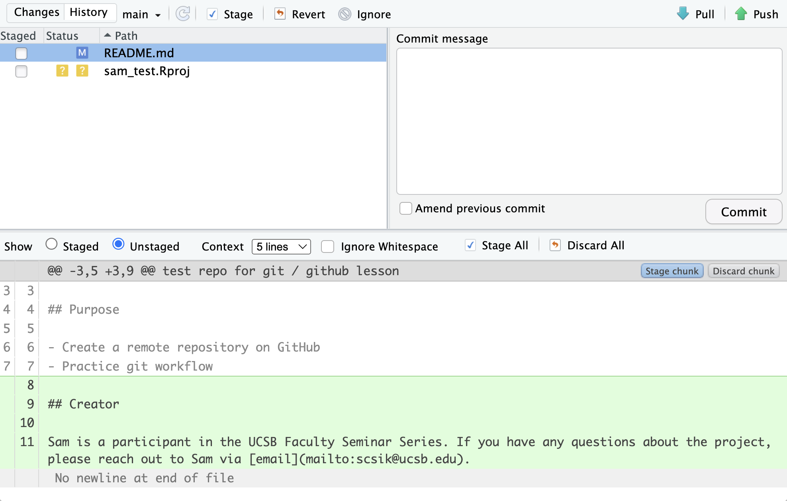{width="100%"}
::::
:::: {.column width="50%"}
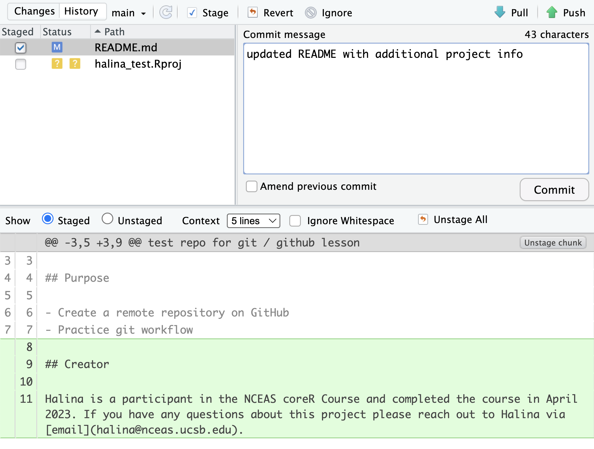{width="100%"}
::::
:::

:::{.body-text}
1. **Stage** — check the box next to the file
2. **Commit** — write a descriptive message
3. **Pull** — always before pushing!
4. **Push** — send to GitHub
:::

---

## {#exercise2-history data-menu-title="Commit History RStudio"}

[Inspecting history in RStudio]{.slide-title}

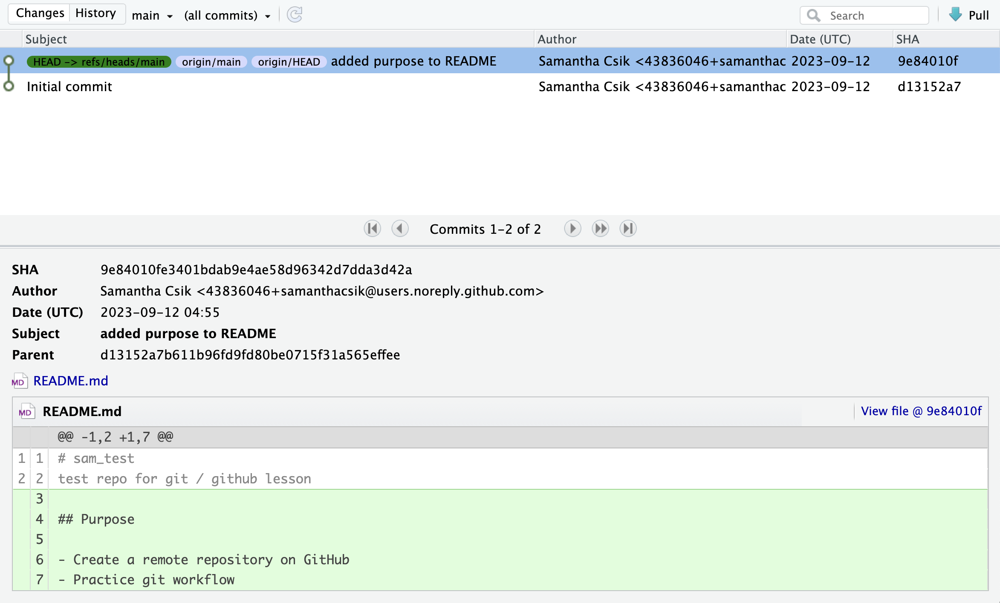{fig-align="center" width="85%"}

:::{.body-text}
Click **History** in the Git tab to see every commit — identical to what you'd see on GitHub.
:::

---

## {#merge-method data-menu-title="Merge Method"}

[One configuration step]{.slide-title}

:::{.body-text}
To suppress a Git warning about pull strategy, run this once in the **Terminal** pane (not the Console):
:::

```bash
git config pull.rebase false
```

:::{.body-text}
This tells Git to use the default merge strategy when pulling. You'll only need to do this once per repository.
:::

---

## {#wrap-up data-menu-title="Wrap Up"}

[What you can now do]{.slide-title}

:::{.body-text}
- Explain the difference between **Git** (local) and **GitHub** (remote)
- Understand how the **`.git/` folder** stores your project history
- Use the **Stage → Commit → Pull → Push** workflow
- Create a repository on GitHub and **clone** it to RStudio
- Write **descriptive commit messages** that make your history meaningful
:::

<br>

:::{.body-text .center-text}
*Next week: Exercise 3 — setting up Git on an existing project*
:::

---

## {#resources data-menu-title="Resources"}

[Go further with Git]{.slide-title}

:::{.body-text}
- **[Happy Git and GitHub for the useR](https://happygitwithr.com/)** — Jenny Bryan; the gold standard for R users
- **[git documentation](https://git-scm.com/docs)** — comprehensive command reference
- **Git vocabulary tables** — Essential and Advanced command tables in the course chapter
- **GitHub Docs** — [docs.github.com](https://docs.github.com)
:::

<br>

:::{.body-text .center-text}
The chapter's "Go further with Git" section has additional exercises and resources.
:::
