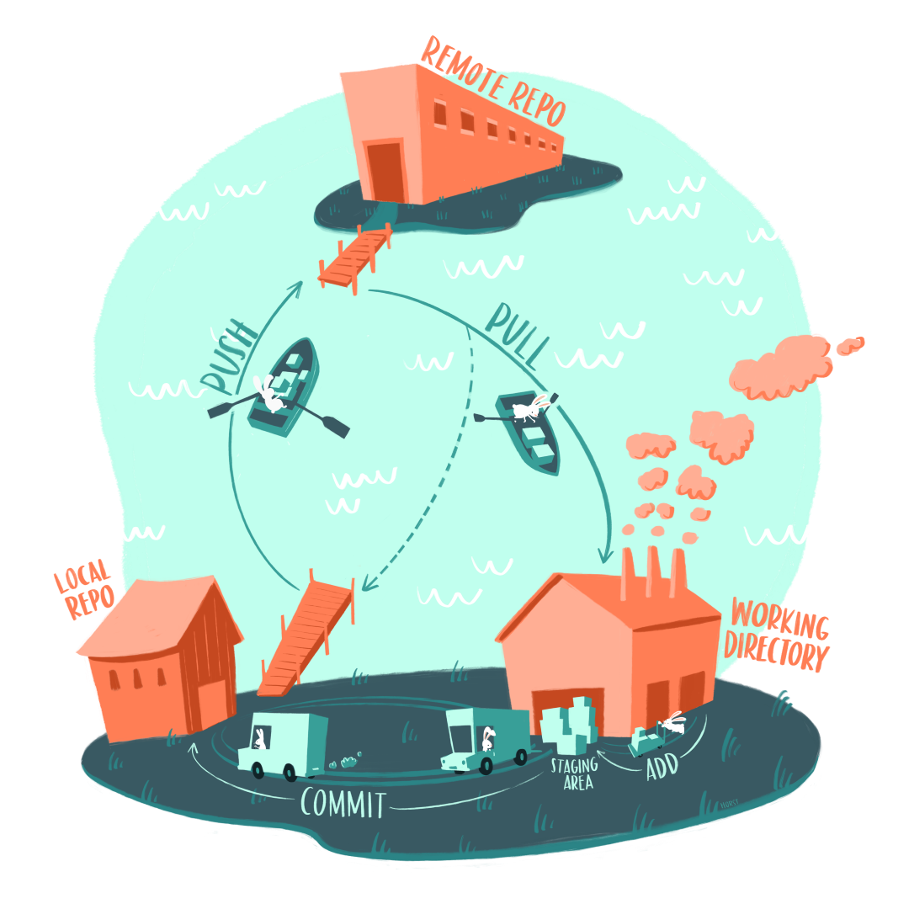
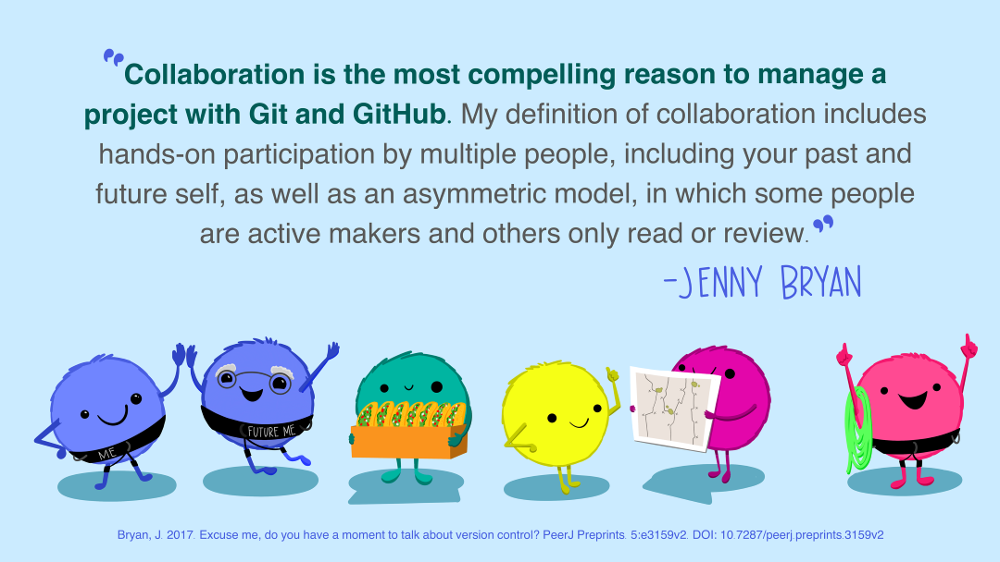

## {#title-slide data-menu-title="Title Slide"} 

[Git, GitHub, and the Scientific Audit Trail]{.custom-title}

[Week 4, Day 2]{.custom-subtitle}

<hr class="hr-red">

[**BIO/CHEM 806**]{.custom-subtitle2}

---

## {#welcome data-menu-title="Welcome"}

[Welcome to Week 4, Day 2]{.slide-title}

:::{.body-text}
**Today:** Git and GitHub as scientific tools

Not just for programmers!

**Version control = audit trail for science**
:::

---

## {#recap data-menu-title="Recap"}

[Monday Recap]{.slide-title}

:::{.body-text}
**Monday:** Why reproducibility fails

- Ambiguity in workflows
- Undocumented decisions
- No audit trail of changes

**Today:** Git and GitHub solve these problems

**Version control provides:**
- Complete history of changes
- Who changed what, when, why
- Ability to undo mistakes
- Scientific accountability
:::

---

## {#git-vs-github data-menu-title="Git vs GitHub"}

[Git vs. GitHub]{.slide-title}

:::{.body-text}
**Git** = Version control software  
Runs on your computer  
Tracks changes to files

**GitHub** = Website/hosting service  
Stores repositories online  
Enables collaboration

**Analogy:**  
Git = Word's "Track Changes"  
GitHub = Google Drive (but for code)
:::

---

## {#why-scientists data-menu-title="Why Scientists"}

[Why Scientists Need Version Control]{.slide-title}

:::{.body-text}
**Without Git:**
- `analysis_v1.R`, `analysis_v2.R`, `analysis_final.R`, `analysis_FINAL_ACTUALLY.R`
- What changed between versions?
- Why did you make that change?
- Which version did you use for the paper?

**With Git:**
- One file: `analysis.R`
- Complete history of all changes
- Commit messages explain why
- Can tag specific versions
:::

---

## {#workflow-intro data-menu-title="Workflow Introduction"}

[The Git Workflow]{.slide-title}

{width=85% fig-align="center"}

---

## {#workflow-explained data-menu-title="Workflow Explained"}

[Understanding the Workflow]{.slide-title}

{width=60% fig-align="center"}

:::{.body-text}
**The bunnies show us:**

**Local Repo** (your computer) ← → **Remote Repo** (GitHub)

**Push** = Send your changes to GitHub  
**Pull** = Get changes from GitHub

**Bunnies in rowboats = Git doing the work!**
:::

---

## {#local-workflow data-menu-title="Local Workflow"}

[Working Locally: Stage and Commit]{.slide-title}

:::{.body-text}
**Three areas:**

1. **Working Directory** — where you edit files
2. **Staging Area** — files you're about to commit
3. **Local Repository** — committed changes

**Workflow:**
1. Edit files
2. **Stage** changes you want to save (`git add`)
3. **Commit** with message (`git commit -m "Fixed bug"`)
:::

---

## {#commit-messages data-menu-title="Commit Messages"}

[Writing Good Commit Messages]{.slide-title}

:::{.body-text}
**Bad commit messages:**
- "fixed stuff"
- "update"
- "changes"

**Good commit messages:**
- "Removed outliers < -50°C from temperature data"
- "Added EPA water quality standards to comparison"
- "Fixed bug in species name standardization"

**Why?** You'll read these 6 months from now!
:::

---

## {#remote-workflow data-menu-title="Remote Workflow"}

[Syncing with GitHub: Push and Pull]{.slide-title}

:::{.body-text}
**After committing locally:**

**Push** = Upload your commits to GitHub
```bash
git push
```

**Before you start work:**

**Pull** = Download changes from GitHub
```bash
git pull
```

**Always pull before you push!**
:::

---

## {#collaboration-intro data-menu-title="Collaboration Intro"}

[Git Enables Scientific Collaboration]{.slide-title}

{width=75% fig-align="center"}

---

## {#collaboration-explained data-menu-title="Collaboration Explained"}

[How Collaboration Works]{.slide-title}

{width=55% fig-align="center"}

:::{.body-text}
**Jenny Bryan (RStudio):** "Git/GitHub is like agreeing that we will all use Microsoft Word..."

**With Git:**
- Multiple people edit same project
- Changes tracked individually
- Can work simultaneously
- Merge changes smoothly
:::

---

## {#collaboration-workflow data-menu-title="Collaboration Workflow"}

[Collaborative Workflow]{.slide-title}

:::{.body-text}
**Owner:**
1. Creates repository on GitHub
2. Adds collaborator
3. Pushes/pulls changes

**Collaborator:**
1. Clones repository
2. Makes changes locally
3. Commits changes
4. Pushes to GitHub

**Both:**
- Pull frequently to get each other's changes
- Communicate about who's working on what
:::

---

## {#conflicts data-menu-title="Conflicts"}

[Merge Conflicts (And Why They're OK)]{.slide-title}

:::{.body-text}
**What's a merge conflict?**

Two people edit the same line of code differently

**Example:**
- You: Change temperature cutoff to -45°C
- Partner: Change temperature cutoff to -55°C
- Git doesn't know which to keep!

**Solution:**
1. Git marks the conflict in the file
2. You decide which version to keep
3. Commit the resolved version

**Conflicts = communication opportunity!**
:::

---

## {#gui-vs-cli data-menu-title="GUI vs CLI"}

[Two Ways to Use Git]{.slide-title}

:::{.body-text}
**Command Line Interface (CLI):**
```bash
git status
git add analysis.R
git commit -m "Updated analysis"
git push
```

**Graphical User Interface (GUI):**
- RStudio Git pane (click buttons!)
- GitHub Desktop
- GitKraken

**Both do the same thing!**  
We'll show you both approaches.
:::

---

## {#rstudio-git data-menu-title="RStudio Git"}

[Git in RStudio (GUI)]{.slide-title}

:::{.body-text}
**RStudio has built-in Git support!**

**Git pane shows:**
- Modified files (yellow M)
- New files (green A)
- Deleted files (red D)

**Workflow:**
1. Check boxes to **stage** files
2. Click **Commit** button
3. Write message
4. Click **Push** button

**That's it!**
:::

---

## {#cli-basics data-menu-title="CLI Basics"}

[Git on Command Line]{.slide-title}

:::{.body-text}
**Essential commands:**

```bash
git status              # What changed?
git add filename.R      # Stage a file
git add .               # Stage all files
git commit -m "message" # Commit with message
git push                # Send to GitHub
git pull                # Get from GitHub
```

**Why learn CLI?**
- More powerful
- Works everywhere
- Better for troubleshooting
:::

---

## {#best-practices data-menu-title="Best Practices"}

[Git Best Practices for Scientists]{.slide-title}

:::{.body-text}
**DO:**
✅ Commit often (small, logical changes)  
✅ Write clear commit messages  
✅ Pull before you start work  
✅ Push at end of work session  
✅ Use `.gitignore` for large data files

**DON'T:**
❌ Commit huge changes all at once  
❌ Use vague messages ("update")  
❌ Forget to pull before pushing  
❌ Commit passwords or API keys  
❌ Commit 100MB data files
:::

---

## {#gitignore data-menu-title="Gitignore"}

[Using `.gitignore`]{.slide-title}

:::{.body-text}
**What is `.gitignore`?**

File that tells Git what NOT to track

**Common entries:**
```
# Large data files
data/raw/big_dataset.csv

# Temporary files
*.tmp
*~

# System files
.DS_Store
Thumbs.db

# API keys
.env
secrets.R
```

**Why?** Keep repositories small and secure
:::

---

## {#tags data-menu-title="Tags"}

[Tagging Important Versions]{.slide-title}

:::{.body-text}
**What are tags?**

Named snapshots of your repository

**Use tags for:**
- Paper submission: `v1.0-submitted`
- Revisions: `v1.1-revision1`
- Final publication: `v2.0-published`
- Presentations: `esa-conference-2024`

**Why?** Always know exactly what code produced published results

```bash
git tag v1.0-published
git push --tags
```
:::

---

## {#audit-trail data-menu-title="Audit Trail"}

[Git as Scientific Audit Trail]{.slide-title}

:::{.body-text}
**Git provides:**

📝 **Complete history** — Every change documented

👤 **Attribution** — Who made each change

📅 **Timestamps** — When changes were made

💬 **Rationale** — Why (via commit messages)

🏷️ **Milestones** — Tags mark important versions

**This is what reviewers and funders want to see!**
:::

---

## {#github-features data-menu-title="GitHub Features"}

[GitHub Beyond Storage]{.slide-title}

:::{.body-text}
**GitHub offers:**

**Issues** — Track bugs, tasks, ideas

**Projects** — Organize work (like Trello)

**README** — Project documentation (already doing this!)

**GitHub Pages** — Host websites

**Releases** — Package specific versions

**DOI integration** — via Zenodo

**Makes your science findable and citable!**
:::

---

## {#breakout data-menu-title="Breakout Activity"}

[Understanding Conflicts - 10 minutes]{.slide-title}

:::{.body-text}
**Scenario:** You and your lab partner both edited `analysis.R`

**You changed line 45:**
```r
temperature_cutoff <- -45  # More conservative threshold
```

**Partner changed line 45:**
```r
temperature_cutoff <- -55  # Based on sensor specs
```

**In your group:**
1. Why did Git create a conflict?
2. How would you resolve it?
3. What should you communicate to your partner?

**Discuss in breakout rooms →**
:::

---

## {#homework data-menu-title="Homework"}

[Before Monday]{.slide-title}

:::{.body-text}
**This week's activity:** Git collaboration exercise

**Your task:**
1. Clone shared repository (instructions on Canvas)
2. Make changes to assigned file
3. Commit with good message
4. Push to GitHub
5. Pull partner's changes
6. Resolve any conflicts

**Practice both GUI (RStudio) and CLI**

**Submit:** Screenshot of your commit history
:::

---

## {#exit-ticket data-menu-title="Exit Ticket"}

[Exit Ticket (Canvas) - 2-3 minutes]{.slide-title}

:::{.body-text}
**Complete before you leave:**

1. **Explain:** What's the difference between Git and GitHub? (2-3 sentences)

2. **Workflow:** Put these in order:
   - Push
   - Edit file
   - Pull
   - Commit
   - Stage

3. **Scenario:** You're writing a paper. What Git tag would you create when you submit to the journal? Why?

**Submit in Canvas →**
:::

---

## {#summary data-menu-title="Summary"}

[Key Concepts]{.slide-title}

:::{.body-text}
1. **Git = version control** tracking all changes

2. **GitHub = online hosting** enabling collaboration

3. **Push/Pull** sync local and remote repositories

4. **Commits** are snapshots with messages

5. **Tags** mark important versions

6. **Version control = scientific audit trail**

**Next week:** Start combining everything — Quarto + projects + Git!

**See you Monday!**
:::
