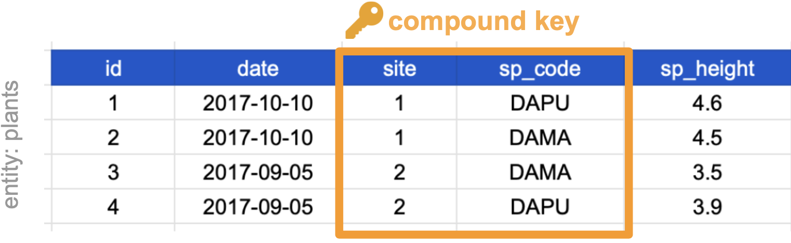
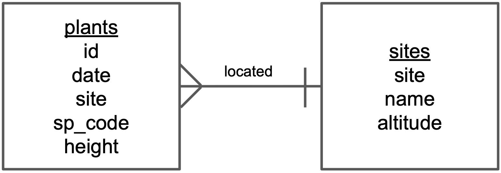
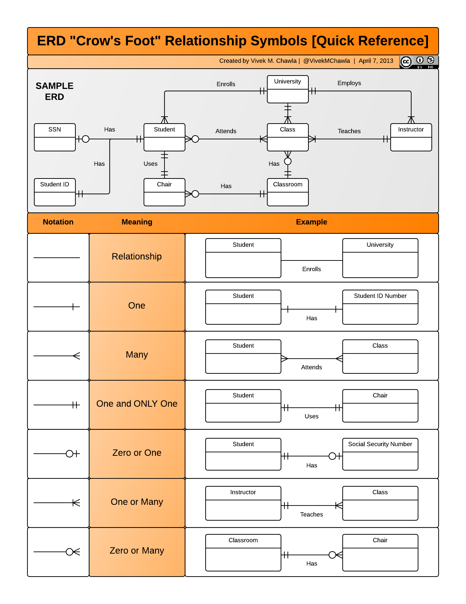

##  {#title-slide data-menu-title="Title Slide"}

[Keys and Relational Thinking]{.custom-title}

[Week 5, Day 2]{.custom-subtitle}

<hr class="hr-red">

[**BIO/CHEM 806**]{.custom-subtitle2}

------------------------------------------------------------------------

##  {#welcome data-menu-title="Welcome"}

[Welcome Back!]{.slide-title}

::: body-text
**Monday:** Tidy data principles

**Today:** How tables relate to each other

**The question:** If normalized data splits information across tables, how do we put it back together?

**The answer:** Keys
:::

------------------------------------------------------------------------

##  {#recap data-menu-title="Recap"}

[Monday Recap]{.slide-title}

::: body-text
**Three principles of tidy data:**
1. Each column is a variable
2. Each row is an observation
3. Each cell is a single value

**Normalization:** Separate tables for different entities

**The tension:** We separated plant and site data... now what?

**Today's solution:** Relational data models
:::

------------------------------------------------------------------------

##  {#why-separate data-menu-title="Why Separate"}

[Why We Separate Tables]{.slide-title}

::: body-text
**Recall:** Denormalized data repeats information

```
id  species  height  site  site_name     altitude
1   ACRU     120     A     Oak Grove     250
2   PIST     85      A     Oak Grove     250
3   QURU     98      A     Oak Grove     250
```

**Problem:** "Oak Grove" and "250" repeated unnecessarily

**If site name changes:** Must update multiple rows (error-prone!)
:::

------------------------------------------------------------------------

##  {#normalized-reminder data-menu-title="Normalized Reminder"}

[Normalized Data (From Monday)]{.slide-title}

{width="75%" fig-align="center"}

::: body-text
**Two tables, no redundancy**

**But how do we know which plant came from which site?**

**Answer:** Keys
:::

------------------------------------------------------------------------

##  {#relational-data data-menu-title="Relational Data"}

[What Is Relational Data?]{.slide-title}

::: body-text
> "It's rare that a data analysis involves only a single table of data. Typically you have many tables of data, and you must combine them to answer the questions that you're interested in. Collectively, multiple tables of data are called relational data because it is the **relations**, not just the individual datasets, that are important."  
> — R for Data Science

**Key insight:** The *connections between* tables matter as much as the tables themselves
:::

------------------------------------------------------------------------

##  {#keys-intro data-menu-title="Keys Introduction"}

[What Are Keys?]{.slide-title}

::: body-text
**Key:** A variable whose values uniquely identify observations

**In tidy data:** A column where each row has a unique value

**Purpose:** Create links between tables

**Example:** `site_id` connects the plants table to the sites table

**Keys are how we maintain relationships when data is normalized**
:::

------------------------------------------------------------------------

##  {#key-types data-menu-title="Key Types"}

[Two Types of Keys]{.slide-title}

::: body-text
**Primary Key:**  
- The CHOSEN unique identifier for a table
- One per table
- Uniquely identifies each row in THIS table
- Example: `plant_id` in the plants table

**Foreign Key:**  
- References a primary key in ANOTHER table
- Creates the link between tables
- Example: `site_id` in the plants table (references sites table)

**A column can be both:** Primary key in one table, foreign key in another
:::

------------------------------------------------------------------------

##  {#example-keys data-menu-title="Example Keys"}

[Example: Identifying Keys]{.slide-title}

{width="60%" fig-align="center"}

::: body-text
**Plants table:**
- Primary key: `id` (unique for each plant)
- Foreign key: `site` (links to sites table)

**Sites table:**
- Primary key: `site` (unique for each site)
- No foreign keys
:::

------------------------------------------------------------------------

##  {#choosing-primary data-menu-title="Choosing Primary"}

[Choosing a Primary Key]{.slide-title}

::: body-text
**Which column could be a primary key?**

Must have unique values in each row

**Plants table candidates:**
- `date`? ❌ Multiple plants measured same day
- `site`? ❌ Multiple plants per site
- `sp_code`? ❌ Multiple individuals of same species
- `sp_height`? ❌ Two plants could have same height
- `id`? ✅ Created specifically to be unique

**Often you need to CREATE a primary key**
:::

------------------------------------------------------------------------

##  {#compound-keys data-menu-title="Compound Keys"}

[Compound Keys]{.slide-title}

::: body-text
**Sometimes:** No single column is unique

**Solution:** Combine multiple columns

**Example:**
```
site  date        species
A     2024-01-15  ACRU      <- combination is unique
A     2024-01-15  PIST      <- combination is unique
A     2024-01-16  ACRU      <- combination is unique
```

**Compound key:** `site` + `date` + `species` together

**This is VERY common in ecological data**
:::

------------------------------------------------------------------------

##  {#compound-example data-menu-title="Compound Example"}

[Compound Key Example]{.slide-title}

{width="70%" fig-align="center"}

::: body-text
**Neither `site` nor `sp_code` alone is unique**

**Together they are:** Each site-species combination appears once

**This is perfectly valid and very common!**
:::

------------------------------------------------------------------------

##  {#key-types-deep data-menu-title="Key Types Deep"}

[Other Key Types]{.slide-title}

::: body-text
**Natural Key:** Already exists in your data  
- Example: `species_code`, `site_id` from field labels

**Surrogate Key:** Created specifically as an identifier  
- Example: Auto-incrementing `id` column (1, 2, 3, ...)

**Each has trade-offs:**
- Natural keys: Meaningful but can change
- Surrogate keys: Stable but meaningless alone

**Best practice:** Choose based on your data and needs
:::

------------------------------------------------------------------------

##  {#relational-models data-menu-title="Relational Models"}

[Relational Data Models]{.slide-title}

::: body-text
**Relational data model:** A formal way to describe how tables connect

**Benefits:**
- Powerful searching and filtering
- Handle large, complex datasets
- Enforce data integrity (consistency)
- Reduce errors from redundant updates

**Used by:** Databases (MySQL, PostgreSQL), but useful even in R!

**You're already using this:** Every time you have multiple CSV files
:::

------------------------------------------------------------------------

##  {#er-intro data-menu-title="ER Introduction"}

[Entity-Relationship Diagrams]{.slide-title}

::: body-text
**Entity-Relationship (E-R) diagram:** Visual representation of table structure and relationships

**Useful for:**
- Planning data collection
- Documenting complex databases
- Communicating data structure to collaborators

**We'll build a simple one together**
:::

------------------------------------------------------------------------

##  {#er-step1 data-menu-title="ER Step 1"}

[Building an E-R Diagram: Step 1]{.slide-title}

::: body-text
**Step 1: Identify entities (tables)**

Draw a box for each:

```
┌─────────┐         ┌─────────┐
│ plants  │         │  sites  │
└─────────┘         └─────────┘
```

**Entity = Table = Type of thing you're measuring**
:::

------------------------------------------------------------------------

##  {#er-step2 data-menu-title="ER Step 2"}

[Building an E-R Diagram: Step 2]{.slide-title}

::: body-text
**Step 2: List variables (columns)**

```
┌─────────────┐      ┌──────────────┐
│   plants    │      │    sites     │
├─────────────┤      ├──────────────┤
│ id          │      │ site         │
│ date        │      │ name         │
│ site        │      │ altitude     │
│ sp_code     │      │              │
│ sp_height   │      │              │
└─────────────┘      └──────────────┘
```
:::

------------------------------------------------------------------------

##  {#er-step3 data-menu-title="ER Step 3"}

[Building an E-R Diagram: Step 3]{.slide-title}

::: body-text
**Step 3: Mark primary and foreign keys**

```
┌─────────────┐      ┌──────────────┐
│   plants    │      │    sites     │
├─────────────┤      ├──────────────┤
│ PK: id      │      │ PK: site     │
│ date        │      │ name         │
│ FK: site ───┼──────┤ altitude     │
│ sp_code     │      │              │
│ sp_height   │      │              │
└─────────────┘      └──────────────┘
```

PK = Primary Key, FK = Foreign Key
:::

------------------------------------------------------------------------

##  {#er-step4 data-menu-title="ER Step 4"}

[Building an E-R Diagram: Step 4]{.slide-title}

{width="50%" fig-align="center"}

::: body-text
**Step 4: Add relationship descriptions**

"A site has many plants"  
"A plant belongs to one site"

**The symbols show cardinality:** One-to-many relationship
:::

------------------------------------------------------------------------

##  {#cardinality data-menu-title="Cardinality"}

[ERD Crow's Foot Notation]{.slide-title}

{width="70%" fig-align="center"}

::: body-text
**These symbols describe HOW MANY:**
- One and only one
- Zero or one
- One or many
- Zero or many
:::

------------------------------------------------------------------------

##  {#why-er data-menu-title="Why ER"}

[Why Bother with E-R Diagrams?]{.slide-title}

::: body-text
**For simple projects:** Probably overkill

**For complex projects:**
- Clear communication tool
- Planning data structure before collection
- Documentation for future you
- Collaboration with database developers

**Example use case:** Planning a multi-year study with many data types

**Think of it as:** Pseudocode for your data structure
:::

------------------------------------------------------------------------

##  {#keys-assumptions data-menu-title="Keys as Assumptions"}

[Keys as Scientific Assumptions]{.slide-title}

::: body-text
**Choosing a key is a scientific decision!**

**Example:** Using `site` + `date` + `species` as compound key assumes:
- Only one measurement per species per site per date
- Re-measuring same species at same site = different date

**If you measured twice in one day:**  
Your key isn't unique anymore!

**This is why we CHECK keys** (we'll learn how in R)
:::

------------------------------------------------------------------------

##  {#checking-keys data-menu-title="Checking Keys"}

[Pseudocode: Checking a Key]{.slide-title}

::: body-text
**To verify a column is a valid key:**

```
1. Count the total number of rows
2. Count the number of unique values in the proposed key column
3. If counts match → valid key
4. If counts don't match → not unique, can't be key
```

**Next week:** We'll write actual R code to do this

**Today:** Just understanding the concept
:::

------------------------------------------------------------------------

##  {#key-failures data-menu-title="Key Failures"}

[When Keys Fail]{.slide-title}

::: body-text
**Common key problems:**

1. **Duplicates:** Same ID appears twice (data entry error)
2. **Missing values:** NA in key column (can't link!)
3. **Typos:** "Site_A" vs "SiteA" (aren't recognized as same)
4. **Compound key partial match:** Only some parts match

**All of these break relationships between tables**

**We'll learn to detect and fix these in Weeks 6-7**
:::

------------------------------------------------------------------------

##  {#thinking-exercise data-menu-title="Thinking Exercise"}

[Thinking Exercise: Survey Data]{.slide-title}

::: body-text
**You're designing a bird survey database:**

**Table 1: Observations**  
- Which bird species
- How many individuals  
- Date and time
- Location

**Table 2: Sites**
- Site characteristics
- Habitat type

**Table 3: Observers**
- Who did the survey
- Experience level

**Question:** What keys connect these tables?
:::

------------------------------------------------------------------------

##  {#thinking-answer data-menu-title="Thinking Answer"}

[Thinking Exercise: Answer]{.slide-title}

::: body-text
**Observations table:**
- Primary key: `observation_id` (or compound: `site_id` + `date` + `species`)
- Foreign keys: `site_id`, `observer_id`

**Sites table:**
- Primary key: `site_id`

**Observers table:**
- Primary key: `observer_id`

**The keys create the web of relationships**
:::

------------------------------------------------------------------------

##  {#incomplete-puzzle data-menu-title="Incomplete Puzzle"}

[The Incomplete Puzzle]{.slide-title}

::: body-text
**We've learned:**
- How to structure individual tables (tidy data)
- How to identify different entities (normalization)
- How to link tables (keys)

**What we HAVEN'T learned:**
- How to actually combine tables in R

**That's Week 7: Joins**

**For now:** Focus on recognizing keys in your data
:::

------------------------------------------------------------------------

##  {#best-practices data-menu-title="Best Practices"}

[Keys Best Practices]{.slide-title}

::: body-text
**When choosing primary keys:**
- Make them meaningful if possible
- Keep them stable (don't change values)
- Ensure they're always present (no NAs)
- Document your choice

**When using foreign keys:**
- Match the primary key exactly (type, format)
- Check for typos and inconsistencies
- Verify all foreign key values exist in the referenced table

**Remember:** Keys are the glue holding relational data together
:::

------------------------------------------------------------------------

##  {#looking-ahead data-menu-title="Looking Ahead"}

[Looking Ahead]{.slide-title}

::: body-text
**Week 6:** Data wrangling
- Cleaning messy data
- Transforming wide to long (and back)
- Filtering, selecting, creating new variables
- Actually IMPLEMENTING tidy principles in R

**Week 7:** Joins
- Left join, right join, inner join, full join
- Combining tables using keys
- Detecting and handling join problems

**Today's concepts are foundation for both**
:::

------------------------------------------------------------------------

##  {#activity-preview data-menu-title="Activity Preview"}

[Today's Activity]{.slide-title}

::: body-text
**Hands-on practice:**
1. Identify tidy vs. untidy data
2. Recognize variables, observations, and entities
3. Identify primary and foreign keys
4. Draw simple E-R diagrams

**Materials:** Handouts with real (messy!) data examples

**Working in pairs**

**Goal:** Build intuition before writing code
:::

------------------------------------------------------------------------

##  {#connections data-menu-title="Connections"}

[Connections to Scientific Practice]{.slide-title}

::: body-text
**You already do this in the lab:**

**Lab notebook entries:**
- Sample ID (key)
- Links to protocol version
- Equipment used
- References to other samples

**Field data sheets:**
- Plot ID
- Links to site information
- Researcher code

**Keys = Citations for data**

They let you reference without repeating
:::

------------------------------------------------------------------------

##  {#exit-ticket data-menu-title="Exit Ticket"}

[Exit Ticket]{.slide-title}

::: body-text
**Write pseudocode that checks whether a column can serve as a unique key**

Should include:
- How to count total rows
- How to count unique values
- How to compare the counts
- What to conclude from the comparison

**Submit on Canvas**

**Next week:** Building wrangling pipelines in R!
:::
