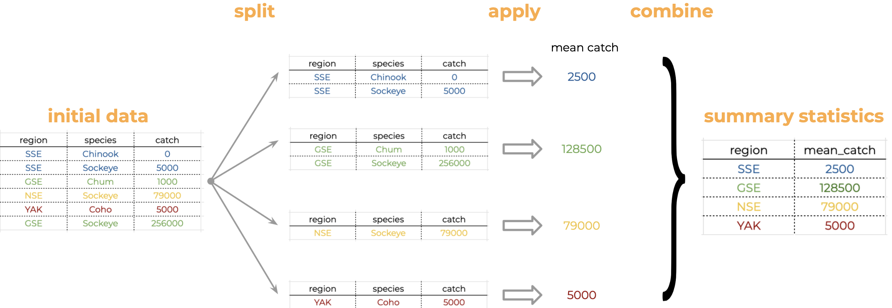

##  {#title-slide data-menu-title="Title Slide"}

[Wrangling as Analysis]{.custom-title}

[Week 6, Day 1]{.custom-subtitle}

<hr class="hr-red">

[**BIO/CHEM 806**]{.custom-subtitle2}

------------------------------------------------------------------------

##  {#welcome data-menu-title="Welcome"}

[Welcome to Week 6!]{.slide-title}

::: body-text
**This week:** Data wrangling in R

**Today:** Wrangling as analytical reasoning

**Why this matters:** Data wrangling isn't just cleaning—it's the first stage of analysis where decisions shape results

**80% of data science is wrangling**  
*And that's okay!*
:::

------------------------------------------------------------------------

##  {#recap data-menu-title="Recap"}

[Where We've Been]{.slide-title}

::: body-text
**Week 5:** Tidy data concepts
- Variables, observations, values
- Normalization
- Keys and relationships

**Today:** Actually transforming data in R

**Tools:** `dplyr` and `tidyr` packages

**Philosophy:** Readable code that documents decisions
:::

------------------------------------------------------------------------

##  {#wrangling-definition data-menu-title="Wrangling Definition"}

[What Is Data Wrangling?]{.slide-title}

::: body-text
**Data wrangling** = Transforming raw data into analysis-ready data

**Includes:**
- Filtering to relevant observations
- Selecting needed variables
- Creating new calculated variables
- Reshaping structure (wide ↔ long)
- Handling missing values
- Fixing data entry errors

**NOT just cleaning:** Every wrangling step is an analytical decision
:::

------------------------------------------------------------------------

##  {#wrangling-analysis data-menu-title="Wrangling as Analysis"}

[Wrangling IS Analysis]{.slide-title}

::: body-text
**Traditional view:** Wrangling is prep work before "real" analysis

**Reality:** Wrangling decisions affect conclusions

**Example decisions:**
- Keep or remove outliers? → Affects means
- How to categorize continuous variable? → Affects groups
- Which observations to filter? → Affects scope of inference
- How to handle NAs? → Affects sample size

**Each decision must be documented and justified**
:::

------------------------------------------------------------------------

##  {#pipeline-concept data-menu-title="Pipeline Concept"}

[Pipelines as Readable Narratives]{.slide-title}

::: body-text
**Pipeline** = Sequence of data transformations

**Written with pipe operator:** `%>%` (or `|>`)

**Reads like instructions:**
```r
data %>%
  filter(year >= 2020) %>%           # Step 1
  select(site, species, count) %>%   # Step 2  
  mutate(log_count = log(count))     # Step 3
```

**Each line = one decision**

**The code tells the story of your reasoning**
:::

------------------------------------------------------------------------

##  {#why-pipes data-menu-title="Why Pipes"}

[Why Use Pipes?]{.slide-title}

::: columns
::: {.column width="48%"}
**Without pipes:**
```r
data1 <- filter(data, year >= 2020)
data2 <- select(data1, site, species)
data3 <- mutate(data2, log_count = log(count))
```

Need intermediate objects  
Hard to read sequence
:::

::: {.column width="48%"}
**With pipes:**
```r
data %>%
  filter(year >= 2020) %>%
  select(site, species, count) %>%
  mutate(log_count = log(count))
```

Clean, linear flow  
Clear sequence of operations
:::
:::

::: body-text
**Pipe = "then"**  
Take data, THEN filter, THEN select, THEN mutate
:::

------------------------------------------------------------------------

##  {#pipe-operator data-menu-title="Pipe Operator"}

[The Pipe Operator `%>%`]{.slide-title}

::: body-text
**Comes from:** `magrittr` package (loaded with `dplyr`)

**What it does:** Passes result from left side to first argument of right side

```r
x %>% f()        # Same as: f(x)
x %>% f(y)       # Same as: f(x, y)
x %>% f() %>% g() # Same as: g(f(x))
```

**Keyboard shortcut:**  
- Windows: `Ctrl + Shift + M`
- Mac: `Cmd + Shift + M`

**New alternative:** Base R pipe `|>` (R 4.1+)
:::

------------------------------------------------------------------------

##  {#dplyr-verbs data-menu-title="dplyr Verbs"}

[The Five Key `dplyr` Verbs]{.slide-title}

::: body-text
**1. `filter()`** — Keep rows matching a condition  
**2. `select()`** — Keep or drop columns  
**3. `mutate()`** — Create or modify columns  
**4. `summarize()`** — Calculate summary statistics  
**5. `group_by()`** — Group data for grouped operations

**All work the same way:**
- First argument: data frame
- Return: modified data frame
- Work seamlessly with pipes

**We'll see each in detail**
:::

------------------------------------------------------------------------

##  {#filter-concept data-menu-title="Filter Concept"}

[Filtering Rows]{.slide-title}

::: body-text
**`filter()` keeps rows that meet conditions**

**Conceptual pseudocode:**
```
FOR each row:
  IF condition is TRUE:
    keep row
  ELSE:
    drop row
```

**Analytical decision:** Which observations are relevant to my question?
:::

------------------------------------------------------------------------

##  {#filter-example data-menu-title="Filter Example"}

[Filter Example]{.slide-title}

::: code-text
```r
# Keep only observations from 2024
birds %>%
  filter(year == 2024)

# Keep only robins and sparrows  
birds %>%
  filter(species %in% c("ROBI", "HOSP"))

# Multiple conditions (AND)
birds %>%
  filter(year >= 2020, count > 10)

# OR condition
birds %>%
  filter(species == "ROBI" | species == "HOSP")
```
:::

::: body-text
**Note:** `==` for equality, `%in%` for matching a set
:::

------------------------------------------------------------------------

##  {#filter-reasoning data-menu-title="Filter Reasoning"}

[Filter as Analytical Reasoning]{.slide-title}

::: body-text
**Every filter is a scope decision**

**Examples:**

*Filter to years ≥ 2020:*  
→ Question answered only about recent period

*Filter to count > 0:*  
→ Analyzing presence data, not absence

*Filter to complete.cases():*  
→ Listwise deletion of missing values

**Document why you're filtering!**  
Add comments explaining the reasoning
:::

------------------------------------------------------------------------

##  {#select-concept data-menu-title="Select Concept"}

[Selecting Columns]{.slide-title}

::: body-text
**`select()` keeps or drops columns**

**Conceptual pseudocode:**
```
Create new dataframe with only specified columns
```

**Analytical decision:** Which variables are needed for this analysis?

**Benefits:**
- Cleaner workspace
- Easier to inspect
- Faster operations (especially with big data)
:::

------------------------------------------------------------------------

##  {#select-example data-menu-title="Select Example"}

[Select Example]{.slide-title}

::: code-text
```r
# Keep specific columns
birds %>%
  select(site, species, count)

# Drop columns
birds %>%
  select(-observer, -notes)

# Select range
birds %>%
  select(site:count)  # All columns from site to count

# Select by pattern
birds %>%
  select(starts_with("site"))
```
:::

------------------------------------------------------------------------

##  {#mutate-concept data-menu-title="Mutate Concept"}

[Creating New Variables]{.slide-title}

::: body-text
**`mutate()` creates or modifies columns**

**Conceptual pseudocode:**
```
FOR each row:
  calculate new value using existing columns
  add to new column (or replace existing)
```

**Most common use:** Creating derived variables

**Examples:**
- Log-transform counts
- Calculate ratios
- Standardize values
- Create categories from continuous data
:::

------------------------------------------------------------------------

##  {#mutate-example data-menu-title="Mutate Example"}

[Mutate Example]{.slide-title}

::: code-text
```r
# Create single new column
birds %>%
  mutate(log_count = log(count + 1))

# Create multiple columns at once
birds %>%
  mutate(
    log_count = log(count + 1),
    year_centered = year - 2020,
    is_common = count > 10
  )

# Modify existing column
birds %>%
  mutate(species = tolower(species))
```
:::

------------------------------------------------------------------------

##  {#mutate-if-else data-menu-title="Mutate if_else"}

[Conditional Mutations with `if_else()`]{.slide-title}

::: code-text
```r
# Create categories
birds %>%
  mutate(
    abundance_category = if_else(
      condition = count > 10,
      true = "common",
      false = "rare"
    )
  )

# More complex conditions
birds %>%
  mutate(
    season = if_else(
      month %in% c(12, 1, 2), 
      "winter",
      if_else(month %in% c(3, 4, 5), "spring", "other")
    )
  )
```
:::

::: body-text
**`if_else()` is vectorized:** Operates on whole column at once
:::

------------------------------------------------------------------------

##  {#mutate-decisions data-menu-title="Mutate Decisions"}

[Mutate as Analytical Decisions]{.slide-title}

::: body-text
**Creating categories:**
- Where to set thresholds? (e.g., count > 10)
- How many categories?

**Transformations:**
- Linear or log scale?
- Why log(count + 1) and not just log(count)?

**Derived variables:**
- What formula to use?
- How to handle edge cases?

**Document these choices in comments!**
:::

------------------------------------------------------------------------

##  {#group-summarize data-menu-title="Group and Summarize"}

[Grouping and Summarizing]{.slide-title}

::: body-text
**Split-Apply-Combine strategy:**

1. **Split** data into groups
2. **Apply** a function to each group
3. **Combine** results back into one table

**In R:**
```r
data %>%
  group_by(grouping_variable) %>%
  summarize(summary_statistic = function(variable))
```

**This is extremely common in data analysis**
:::

------------------------------------------------------------------------

##  {#split-apply-combine data-menu-title="Split Apply Combine"}

[Split-Apply-Combine Illustrated]{.slide-title}

{width="70%" fig-align="center"}

::: body-text
**Visual workflow:**
1. Group all observations by region (split)
2. Calculate mean within each group (apply)
3. Combine into summary table (combine)
:::

------------------------------------------------------------------------

##  {#group-by-example data-menu-title="Group By Example"}

[Group By Example]{.slide-title}

::: code-text
```r
# Mean count by species
birds %>%
  group_by(species) %>%
  summarize(mean_count = mean(count))

# Multiple grouping variables
birds %>%
  group_by(site, year) %>%
  summarize(
    total_count = sum(count),
    n_species = n_distinct(species)
  )

# Group by bins
birds %>%
  group_by(year_bin = cut(year, breaks = 5)) %>%
  summarize(mean_count = mean(count))
```
:::

------------------------------------------------------------------------

##  {#summarize-functions data-menu-title="Summarize Functions"}

[Common Summarize Functions]{.slide-title}

::: body-text
**Summary statistics:**
- `mean()`, `median()`, `sd()`, `var()`
- `min()`, `max()`, `quantile()`

**Counts:**
- `n()` — number of rows
- `n_distinct()` — number of unique values
- `sum()` — sum of values

**All take `na.rm = TRUE` to handle missing values**

```r
summarize(mean_height = mean(height, na.rm = TRUE))
```
:::

------------------------------------------------------------------------

##  {#group-reasoning data-menu-title="Group Reasoning"}

[Grouping as Analytical Reasoning]{.slide-title}

::: body-text
**Grouping determines scope of comparison**

**Group by site:**  
→ Compare across sites (spatial variation)

**Group by year:**  
→ Compare across time (temporal trends)

**Group by site AND year:**  
→ Site-specific trends

**This is your research question made explicit**

**Different groupings = different questions answered**
:::

------------------------------------------------------------------------

##  {#count-shortcut data-menu-title="Count Shortcut"}

[Shortcut: `count()`]{.slide-title}

::: body-text
**Very common pattern:**
```r
data %>%
  group_by(variable) %>%
  summarize(n = n())
```

**Shortcut with `count()`:**
```r
data %>%
  count(variable)
```

**Both give same result**

**`count()` is faster to type for simple frequency tables**
:::

------------------------------------------------------------------------

##  {#pipeline-readability data-menu-title="Pipeline Readability"}

[Making Pipelines Readable]{.slide-title}

::: body-text
**Good practices:**

1. **One operation per line**
2. **Indent continuation lines**
3. **Add comments for WHY, not WHAT**
4. **Break very long pipelines into steps**
5. **Use meaningful intermediate names**

**Example:**
```r
# Calculate species richness by site for recent years
richness_by_site <- birds %>%
  filter(year >= 2020) %>%              # Recent data only
  group_by(site, year) %>%
  summarize(n_species = n_distinct(species)) %>%
  ungroup()
```
:::

------------------------------------------------------------------------

##  {#pipeline-example data-menu-title="Pipeline Example"}

[Complete Pipeline Example]{.slide-title}

::: code-text
```r
# Research question: 
# What's the mean abundance of common species at each site?

common_species_abundance <- birds %>%
  # Define "common" as observed in 3+ years
  group_by(species) %>%
  filter(n_distinct(year) >= 3) %>%
  ungroup() %>%
  # Calculate site-level means
  group_by(site, species) %>%
  summarize(
    mean_count = mean(count, na.rm = TRUE),
    n_surveys = n()
  ) %>%
  # Only keep species with 5+ surveys per site
  filter(n_surveys >= 5)
```
:::

::: body-text
**Every step is documented and justified**
:::

------------------------------------------------------------------------

##  {#decisions-visible data-menu-title="Decisions Visible"}

[Making Decisions Visible]{.slide-title}

::: body-text
**Bad pipeline:**
```r
birds %>%
  filter(year >= 2020, count > 0) %>%
  group_by(site) %>%
  summarize(mean_count = mean(count))
```

**Good pipeline:**
```r
# Research question: Recent site-level abundance trends
birds %>%
  # Focus on recent monitoring period (protocol change in 2020)
  filter(year >= 2020) %>%
  # Remove zeros (analyzing presence data only)
  filter(count > 0) %>%
  # Calculate site means
  group_by(site) %>%
  summarize(mean_count = mean(count, na.rm = TRUE))
```

**Comments explain the WHY**
:::

------------------------------------------------------------------------

##  {#na-handling data-menu-title="NA Handling"}

[Handling Missing Values]{.slide-title}

::: body-text
**Missing values (NA) break many operations**

**Options:**

1. **Remove NAs:** `na.rm = TRUE` in summary functions
2. **Filter complete cases:** `filter(!is.na(variable))`
3. **Replace NAs:** `mutate(x = replace_na(x, 0))`

**Analytical decision:** How to handle missingness?

**Different approaches have different implications**

**Document your choice!**
:::

------------------------------------------------------------------------

##  {#defensive-coding data-menu-title="Defensive Coding"}

[Defensive Coding]{.slide-title}

::: body-text
**Defensive coding** = Writing code that catches errors

**Example: Column name changes**

**Fragile:**
```r
# Relies on column order (breaks if order changes)
data[, 4]
```

**Robust:**
```r
# Uses column name
data$species
# or
select(data, species)
```

**Lesson:** Don't rely on column positions or row numbers
:::

------------------------------------------------------------------------

##  {#thinking-exercise data-menu-title="Thinking Exercise"}

[Thinking Exercise]{.slide-title}

::: body-text
**You have bird count data with columns:**  
`site`, `year`, `month`, `species`, `count`, `observer`

**Research question:**  
*"Has average species richness per site increased over time?"*

**What wrangling steps do you need?**

Think through the pipeline before advancing
:::

------------------------------------------------------------------------

##  {#thinking-answer data-menu-title="Thinking Answer"}

[Thinking Exercise: Answer]{.slide-title}

::: code-text
```r
richness_trend <- birds %>%
  # Calculate richness per site per year
  group_by(site, year) %>%
  summarize(richness = n_distinct(species)) %>%
  ungroup() %>%
  # Average across sites for each year
  group_by(year) %>%
  summarize(mean_richness = mean(richness))
```
:::

::: body-text
**Key decisions:**
- What's one "observation" for richness? (Site-year)
- Average across sites or analyze each site separately?
- Include zeros or only detections?
:::

------------------------------------------------------------------------

##  {#wednesday-preview data-menu-title="Wednesday Preview"}

[Wednesday Preview: Reshaping]{.slide-title}

::: body-text
**Today:** Core wrangling verbs

**Wednesday:** Reshaping data structure
- Wide ↔ long transformations
- `pivot_longer()` and `pivot_wider()`
- When and why to reshape
- Consequences of reshaping decisions

**These transformations fundamentally change what you can analyze**
:::

------------------------------------------------------------------------

##  {#real-world data-menu-title="Real World"}

[Real-World Wrangling]{.slide-title}

::: body-text
**In real projects:**
- Wrangling is 60-80% of the work
- You'll iterate: wrangle → analyze → realize you need different wrangling
- Document as you go (comments!)
- Save intermediate cleaned datasets
- Use version control (Git)

**It's messy, iterative, and normal**

**The pipeline IS the documentation of your reasoning**
:::

------------------------------------------------------------------------

##  {#exit-ticket data-menu-title="Exit Ticket"}

[Exit Ticket]{.slide-title}

::: body-text
**Write pseudocode for a pipeline that:**
1. Filters data to relevant observations
2. Creates a new variable
3. Calculates summary statistics by group

**Include:**
- Comments explaining WHY each step
- What the new variable represents
- What question the summary answers

**Submit on Canvas**

**See you Wednesday for reshaping!**
:::
