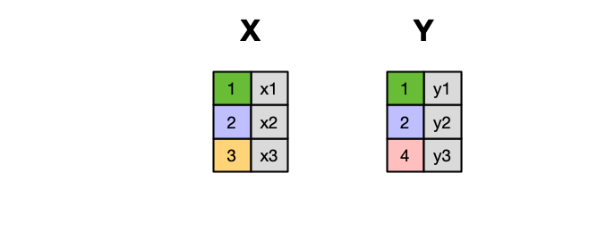
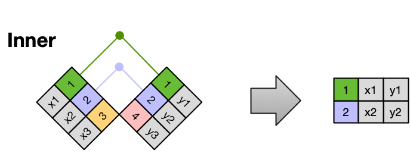
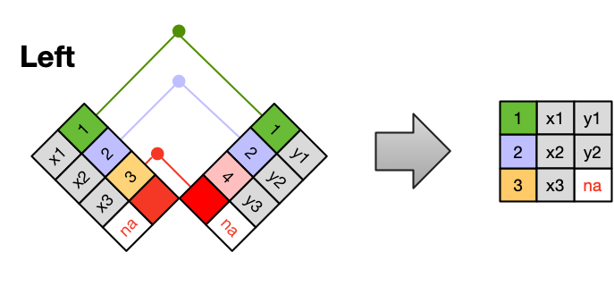
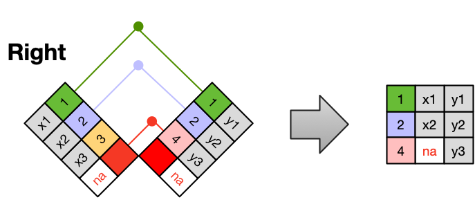
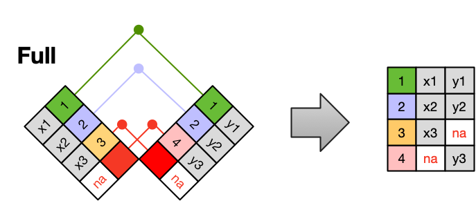

##  {#title-slide data-menu-title="Title Slide"}

[Relational Data in Practice]{.custom-title}

[Week 7, Day 1]{.custom-subtitle}

<hr class="hr-red">

[**BIO/CHEM 806**]{.custom-subtitle2}

------------------------------------------------------------------------

##  {#welcome data-menu-title="Welcome"}

[Welcome to Week 7!]{.slide-title}

::: body-text
**This week:** Combining data from multiple tables

**Today:** Joins as statements about relationships

**Why this matters:** Real data is almost always spread across multiple tables

**The payoff:** Everything from Weeks 5-6 comes together
:::

------------------------------------------------------------------------

##  {#recap data-menu-title="Recap"}

[Where We've Been]{.slide-title}

::: body-text
**Week 5:**  
- Tidy data principles
- Normalization (separate tables for different entities)
- Keys (primary and foreign)

**Week 6:**  
- Wrangling within tables
- Reshaping data

**Today:**  
**Connecting tables together using keys**
:::

------------------------------------------------------------------------

##  {#the-problem data-menu-title="The Problem"}

[The Separated Data Problem]{.slide-title}

::: body-text
**Remember Week 5:**  
We separated plants and sites into different tables to avoid redundancy

**But now we have a problem:**  
How do we analyze plant height in relation to site altitude?

**The data we need is in DIFFERENT tables**

**Solution:** Joins
:::

------------------------------------------------------------------------

##  {#reminder-normalized data-menu-title="Reminder Normalized"}

[Reminder: Normalized Data]{.slide-title}

{width="75%" fig-align="center"}

::: body-text
**Plants table:** Individual measurements  
**Sites table:** Site characteristics

**Connected by:** `site` column (the key)

**Today:** How to merge them back together
:::

------------------------------------------------------------------------

##  {#what-are-joins data-menu-title="What Are Joins"}

[What Are Joins?]{.slide-title}

::: body-text
**Join** = Combining rows from two tables based on matching values in key columns

**Not just pasting tables together!**  
Intelligent merging based on relationships

**The key question:** Which rows from table A match which rows from table B?

**In SQL:** `JOIN`  
**In R:** `left_join()`, `right_join()`, `inner_join()`, `full_join()`
:::

------------------------------------------------------------------------

##  {#join-as-statement data-menu-title="Join as Statement"}

[Joins as Statements About Relationships]{.slide-title}

::: body-text
**A join is not a technical operation**  
**It's a statement about how your data relates**

**Examples:**
- "Each plant observation belongs to exactly one site"
- "Sites may have zero or many observations"
- "Every observation must have a matching site"

**Different joins enforce different assumptions**

**Choose based on your data structure, not convenience**
:::

------------------------------------------------------------------------

##  {#types-intro data-menu-title="Types Introduction"}

[Four Main Types of Joins]{.slide-title}

::: body-text
We'll learn four join types:

1. **`inner_join()`** — Only matching rows
2. **`left_join()`** — All left, match right
3. **`right_join()`** — All right, match left
4. **`full_join()`** — Everything

**Each answers a different question about your data**

**We'll see each in detail**
:::

------------------------------------------------------------------------

##  {#visual-intro data-menu-title="Visual Introduction"}

[Visualizing Joins]{.slide-title}

{width="70%" fig-align="center"}

::: body-text
**Mental model:**  
Two tables, left and right

**The join determines:**  
Which rows from each make it into the result
:::

------------------------------------------------------------------------

##  {#inner-join data-menu-title="Inner Join"}

[Inner Join: Only Matches]{.slide-title}

{width="65%" fig-align="center"}

::: body-text
**`inner_join()`** keeps only rows that have matches in BOTH tables

**Example:**  
Plants table + Sites table → Only plants at sites we have info for

**You lose:**  
- Plants at unknown sites
- Sites with no plants observed
:::

------------------------------------------------------------------------

##  {#inner-example data-menu-title="Inner Example"}

[Inner Join Example]{.slide-title}

::: code-text
```r
# Plants table
plants
#   id  site  species  height
#   1   A     oak      120
#   2   B     maple    85
#   3   C     oak      142

# Sites table
sites
#   site  altitude  habitat
#   A     250       forest
#   B     180       meadow
#   # Note: No site C!

# Inner join
plants %>%
  inner_join(sites, by = "site")
#   id  site  species  height  altitude  habitat
#   1   A     oak      120     250       forest
#   2   B     maple    85      180       meadow
#   # Plant 3 dropped — no matching site!
```
:::

------------------------------------------------------------------------

##  {#inner-when data-menu-title="Inner When"}

[When to Use Inner Join]{.slide-title}

::: body-text
**Use `inner_join()` when:**
- Both tables must have matching information
- You want to exclude non-matching rows
- Analysis requires complete information from both tables

**Example use cases:**
- Experimental data + treatment assignments (need both)
- Observations + required metadata
- Samples + processing results (need both to analyze)

**Warning:** Can silently drop data if keys don't match!
:::

------------------------------------------------------------------------

##  {#left-join data-menu-title="Left Join"}

[Left Join: Keep All Left]{.slide-title}

{width="65%" fig-align="center"}

::: body-text
**`left_join()`** keeps ALL rows from left table, adds matching info from right

**Non-matching right rows:** Dropped  
**Non-matching left rows:** Kept (with NAs for right columns)
:::

------------------------------------------------------------------------

##  {#left-example data-menu-title="Left Example"}

[Left Join Example]{.slide-title}

::: code-text
```r
# Same tables as before
plants
#   id  site  species  height
#   1   A     oak      120
#   2   B     maple    85
#   3   C     oak      142

sites
#   site  altitude  habitat
#   A     250       forest
#   B     180       meadow

# Left join
plants %>%
  left_join(sites, by = "site")
#   id  site  species  height  altitude  habitat
#   1   A     oak      120     250       forest
#   2   B     maple    85      180       meadow
#   3   C     oak      142     NA        NA
#   # Plant 3 kept, but site info is NA
```
:::

------------------------------------------------------------------------

##  {#left-when data-menu-title="Left When"}

[When to Use Left Join]{.slide-title}

::: body-text
**Use `left_join()` when:**
- Left table is your primary data
- Right table has supplementary information
- You don't want to lose any left table rows

**Most common join type in practice!**

**Example use cases:**
- Observations (left) + metadata (right)
- All samples (left) + available measurements (right)
- Survey responses (left) + demographic lookup (right)
:::

------------------------------------------------------------------------

##  {#right-join data-menu-title="Right Join"}

[Right Join: Mirror of Left]{.slide-title}

{width="65%" fig-align="center"}

::: body-text
**`right_join()`** keeps ALL rows from right table

**Exactly the same as left join with tables swapped**

```r
# These are equivalent:
A %>% left_join(B)
B %>% right_join(A)
```

**In practice:** Just use left join with tables in right order
:::

------------------------------------------------------------------------

##  {#full-join data-menu-title="Full Join"}

[Full Join: Keep Everything]{.slide-title}

{width="65%" fig-align="center"}

::: body-text
**`full_join()`** keeps ALL rows from BOTH tables

**Nothing is lost**  
**Lots of NAs** where rows don't match
:::

------------------------------------------------------------------------

##  {#full-example data-menu-title="Full Example"}

[Full Join Example]{.slide-title}

::: code-text
```r
# Same tables
plants
#   id  site  species  height
#   1   A     oak      120
#   2   C     oak      142

sites
#   site  altitude  habitat
#   A     250       forest
#   B     180       meadow

# Full join
plants %>%
  full_join(sites, by = "site")
#   id  site  species  height  altitude  habitat
#   1   A     oak      120     250       forest
#   2   C     oak      142     NA        NA
#   NA  B     NA       NA      180       meadow
#   # Everything kept!
#   # Plant C has no site info (NA)
#   # Site B has no plants (NA)
```
:::

------------------------------------------------------------------------

##  {#full-when data-menu-title="Full When"}

[When to Use Full Join]{.slide-title}

::: body-text
**Use `full_join()` when:**
- You want to see all data from both tables
- Checking for mismatches
- Comprehensive reporting
- Uncertain about data completeness

**Example use cases:**
- Diagnostic: "Do all observations have metadata?"
- Comprehensive inventories
- Data quality checks

**Warning:** Can create LOTS of NAs — understand your data structure!
:::

------------------------------------------------------------------------

##  {#venn-diagrams data-menu-title="Venn Diagrams"}

[Joins as Venn Diagrams]{.slide-title}

{width="70%" fig-align="center"}

::: body-text
**Useful visualization, but incomplete**

Missing: WHERE do the NAs come from?

**Still helpful for choosing join type**
:::

------------------------------------------------------------------------

##  {#syntax data-menu-title="Syntax"}

[Join Syntax]{.slide-title}

::: code-text
```r
# Basic syntax
left_table %>%
  left_join(right_table, by = "key_column")

# Multiple key columns
left_table %>%
  left_join(right_table, by = c("col1", "col2"))

# Different column names
left_table %>%
  left_join(right_table, by = c("left_id" = "right_id"))

# Without pipe (less common)
left_join(left_table, right_table, by = "key")
```
:::

::: body-text
**The `by =` argument specifies the key(s)**
:::

------------------------------------------------------------------------

##  {#by-argument data-menu-title="By Argument"}

[Understanding the `by` Argument]{.slide-title}

::: body-text
**`by = "site"`**  
Column named "site" in both tables

**`by = c("site", "year")`**  
Compound key: both columns must match

**`by = c("left_col" = "right_col")`**  
Different names in each table

**If you omit `by =`:**  
R will join on ALL columns with same names (dangerous!)

**Always specify `by =` explicitly**
:::

------------------------------------------------------------------------

##  {#join-checking data-menu-title="Join Checking"}

[Checking Join Results]{.slide-title}

::: body-text
**After every join, check:**

**1. Row count:**
```r
nrow(original_left)
nrow(joined_data)
# Should you have more, fewer, or same rows?
```

**2. Unexpected NAs:**
```r
summary(joined_data)
# Are there NAs where you didn't expect them?
```

**3. Duplicated rows:**
```r
joined_data %>% count() %>% filter(n > 1)
# Did rows get duplicated unexpectedly?
```
:::

------------------------------------------------------------------------

##  {#row-duplication data-menu-title="Row Duplication"}

[Warning: Row Duplication]{.slide-title}

::: body-text
**Joins can multiply rows!**

**If right table has multiple matches:**
```r
# Left table
#   id  site
#   1   A
#   2   B

# Right table (multiple rows per site)
#   site  survey_date
#   A     2024-01-15
#   A     2024-02-15
#   B     2024-01-15

# Result: 3 rows!
#   id  site  survey_date
#   1   A     2024-01-15
#   1   A     2024-02-15  # ID 1 duplicated!
#   2   B     2024-01-15
```

**This might be correct OR an error!**
:::

------------------------------------------------------------------------

##  {#one-to-many data-menu-title="One to Many"}

[One-to-Many Relationships]{.slide-title}

::: body-text
**One-to-one:** Each left row matches at most one right row  
→ No row duplication

**One-to-many:** Each left row can match multiple right rows  
→ Left rows duplicated

**Many-to-many:** Multiple matches in both directions  
→ Lots of duplication (usually a mistake!)

**Know your relationship structure before joining**

**Use E-R diagrams from Week 5 to plan**
:::

------------------------------------------------------------------------

##  {#join-problems data-menu-title="Join Problems"}

[Common Join Problems]{.slide-title}

::: body-text
**1. Typos in keys:**
```r
# "Site_A" ≠ "SiteA"
# "site-1" ≠ "site_1"
```

**2. Missing values in key column:**
```r
# NA in key → won't match anything
```

**3. Wrong key column:**
```r
# Joined on wrong ID column
```

**4. Unexpected duplicates:**
```r
# Right table has duplicate keys
```

**Wednesday:** How to detect and fix these!
:::

------------------------------------------------------------------------

##  {#thinking-exercise data-menu-title="Thinking Exercise"}

[Thinking Exercise]{.slide-title}

::: body-text
**You have:**
- **Bird observations** (site, date, species, count)
- **Site characteristics** (site, habitat, area)

**You want to analyze:** Count ~ habitat

**Questions:**
1. Which table is "left"?
2. Which join type?
3. What could go wrong?

**Think before advancing**
:::

------------------------------------------------------------------------

##  {#thinking-answer data-menu-title="Thinking Answer"}

[Thinking Exercise: Answer]{.slide-title}

::: body-text
**1. Which is "left"?**  
Bird observations (your primary data)

**2. Which join?**  
`left_join()` — keep all observations, add site info

```r
birds %>%
  left_join(sites, by = "site")
```

**3. What could go wrong?**
- Observations at sites not in site table → NAs for habitat/area
- Typos in site codes → failed matches
- Multiple observations per site → expected (one-to-many)
:::

------------------------------------------------------------------------

##  {#real-workflow data-menu-title="Real Workflow"}

[Real-World Join Workflow]{.slide-title}

::: body-text
**1. Plan:**
- Draw E-R diagram
- Identify key columns
- Determine relationship type (one-to-many?)

**2. Prepare:**
- Check for typos in keys
- Verify key column types match
- Check for NAs in keys

**3. Join:**
- Start with `left_join()` usually
- Specify `by =` explicitly

**4. Validate:**
- Check row counts
- Look for unexpected NAs
- Verify no unexpected duplication
:::

------------------------------------------------------------------------

##  {#multiple-joins data-menu-title="Multiple Joins"}

[Joining Multiple Tables]{.slide-title}

::: code-text
```r
# You can chain joins!
birds %>%
  left_join(sites, by = "site") %>%
  left_join(observers, by = "observer") %>%
  left_join(species_info, by = "species")

# Each join adds more columns
# Order usually doesn't matter
# But check intermediate results if debugging
```
:::

::: body-text
**Real analyses often join 3-5 tables**

**Take it step by step, validate each join**
:::

------------------------------------------------------------------------

##  {#anti-join data-menu-title="Anti Join"}

[Bonus: Filtering Joins]{.slide-title}

::: body-text
**Filtering joins** don't add columns, just filter rows

**`semi_join()`** — Keep left rows that HAVE a match
```r
# Which birds were observed at monitored sites?
birds %>% semi_join(monitored_sites, by = "site")
```

**`anti_join()`** — Keep left rows that DON'T have a match
```r
# Which birds were observed at unknown sites?
birds %>% anti_join(sites, by = "site")
```

**Useful for diagnostics!**
:::

------------------------------------------------------------------------

##  {#looking-ahead data-menu-title="Looking Ahead"}

[Wednesday Preview]{.slide-title}

::: body-text
**Today:** What joins are and when to use them

**Wednesday:** Diagnosing and fixing join failures
- Detecting mismatched keys
- Checking for duplicates
- Validating join results
- Handling join errors

**Activity Wednesday:** Hands-on joining with real data

**You'll practice all four join types**
:::

------------------------------------------------------------------------

##  {#joins-enable data-menu-title="Joins Enable"}

[What Joins Enable]{.slide-title}

::: body-text
**With joins, you can:**
- Analyze measurements against environmental variables
- Connect observations to metadata
- Build complete datasets from separate sources
- Maintain normalized databases without losing analysis power

**This is the final piece:**  
Tidy data + normalization + keys + joins = full data wrangling

**Now you can work with complex, real-world data structures**
:::

------------------------------------------------------------------------

##  {#exit-ticket data-menu-title="Exit Ticket"}

[Exit Ticket]{.slide-title}

::: body-text
**Write pseudocode that joins two tables and checks for unexpected row duplication**

Should include:
- How to count rows before join
- How to perform the join
- How to count rows after join
- How to detect if rows were duplicated
- What to conclude from the comparison

**Submit on Canvas**

**See you Wednesday for join troubleshooting!**
:::
