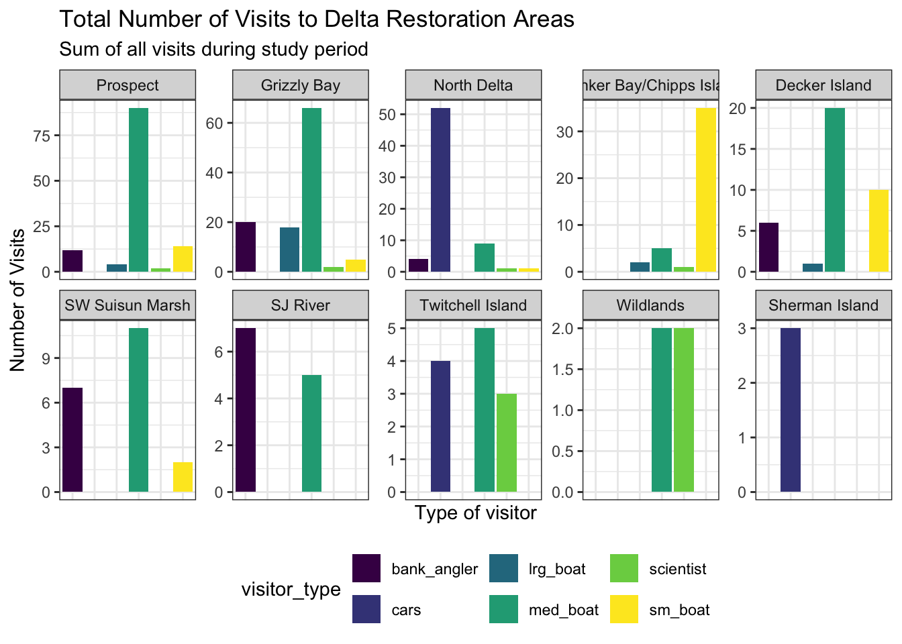

##  {.center}

::: custom-title
Beyond Static Figures
:::

::: custom-subtitle
Interactive Tables and Maps
:::

::: custom-subtitle2
BIO/CHEM 806 · Data Visualization — Lecture 2
:::

<hr>

------------------------------------------------------------------------

## Where We Are

::: body-text
**Last lecture + activity:** ggplot2 — the grammar of graphics, building
and customizing static plots, publication-ready figures.

**Today:** Two more tools from the same s11 chapter that go in a
different direction — not better-looking static figures, but
**interactive** ones.

**In two weeks:** Geospatial vector analysis with `sf` — coordinate
reference systems, spatial joins, and mapping with real spatial objects.

Today's leaflet maps are a bridge: same coordinate columns you already
have, rendered interactively. The `sf` unit will go deeper into what
those coordinates actually represent.
:::

------------------------------------------------------------------------

## Learning Objectives

::: body-text
By the end of today you will be able to:

-   Explain when an interactive visualization is the right tool — and
    when ggplot2 is still the answer
-   Use `dplyr::distinct()` to prepare a one-row-per-site table
-   Build a searchable, sortable table with `DT::datatable()`
-   Build an interactive map with `leaflet` using markers, popups, and
    provider tile base maps
-   Recognize where these tools fit in a thesis workflow
:::

------------------------------------------------------------------------

## The Same Dataset, Two Ways to Show It

::: body-text
You already made this with ggplot2:

{width="50%"
fig-align="center"}

That's the right tool for a thesis figure — static, precise,
publishable.

But imagine your advisor asks: *"Which sites are actually in the estuary
versus the freshwater reaches? Can you show me on a map?"*

For those questions, interactive tools are better.
:::

------------------------------------------------------------------------

## Two Packages, Two Problems Solved

| Package | Problem it solves | Output |
|----|----|----|
| `DT` | Readers can't search or sort a static table | Searchable HTML widget |
| `leaflet` | A static map can't be zoomed or queried | Interactive HTML map |

::: fragment
Both packages are already loaded in your setup chunk from the textbook:

```{{r}}
library(DT)
library(leaflet)
```

And both widgets live inside a rendered Quarto document — which means
they publish directly to GitHub Pages.
:::

------------------------------------------------------------------------

## Part 1: Interactive Tables with DT {.slide-title}

<hr>

------------------------------------------------------------------------

## What `head()` Cannot Do

When you render a table in Quarto, it is frozen:

```{{r}}
head(locations)
```

```         
# A tibble: 6 × 3
  restore_loc     latitude longitude
  <chr>              <dbl>     <dbl>
1 Decker Island       38.1     -122.
2 SW Suisun Marsh     38.2     -122.
```

::: fragment
For 10 sites this is inconvenient. For 40+ sampling locations in your
thesis, it becomes a real problem for anyone reviewing your methods.
:::

------------------------------------------------------------------------

## Getting One Row Per Site with `distinct()`

The data you've been working with has **many rows per site** (one per
visit, per visitor type, per date). Before displaying or mapping
locations, deduplicate:

```{{r}}
locations <- visits_long %>%
    distinct(restore_loc, .keep_all = TRUE) %>%
    select(restore_loc, latitude, longitude)
```

::: fragment
`.keep_all = TRUE` keeps all columns while returning just the first row
for each unique `restore_loc` value.

Without it, you only get the `restore_loc` column back — no coordinates
to map.
:::

------------------------------------------------------------------------

## `DT::datatable()` — One Line

```{{r}}
datatable(locations)
```

::: fragment
That's the whole call. You get:

-   **Search box** — full-text across all columns
-   **Sortable headers** — click any column to sort
-   **Pagination** — configurable rows per page
-   Download-ready: readers can export to CSV directly
:::

------------------------------------------------------------------------

## Customizing the Table

```{{r}}
datatable(
  locations,
  options = list(
    pageLength = 5,
    dom = 'ftp'    # filter box, table, pagination — no extras
  ),
  colnames = c("Restoration Site", "Latitude", "Longitude"),
  caption = "Sampling locations, Sacramento–San Joaquin Delta."
)
```

::: fragment
💬 **Chat:** Think about a table in your thesis or a paper you've read.
What would have been easier to find if the table had been searchable?
:::

------------------------------------------------------------------------

## Part 2: Interactive Maps with leaflet {.slide-title}

<hr>

------------------------------------------------------------------------

## Your Data Already Has Coordinates

Look at `visits_long`:

```         
  restore_loc     latitude  longitude  date        visitor_type  quantity
  Decker Island   38.105    -121.706   2017-07-07  sm_boat       0
  SW Suisun Marsh 38.192    -121.912   2017-07-07  med_boat      3
```

::: fragment
Those `latitude` and `longitude` columns have been sitting in your data
frame since Week 1. You've been treating them as metadata.

Today you'll treat them as **plottable variables** — specifically, as
the coordinates for an interactive map.
:::

------------------------------------------------------------------------

## The leaflet Grammar

Unlike ggplot2 (which uses `+`), leaflet uses **pipes**:

```{{r}}
leaflet(locations) %>%
    addTiles() %>%
    addMarkers(
        lng = ~ longitude,
        lat = ~ latitude,
        popup = ~ restore_loc
    )
```

::: fragment
The `~` tells leaflet to look for these values **in the data frame** you
passed to `leaflet()` — the same logic as `aes()` in ggplot2.

`addTiles()` adds the base map (OpenStreetMap by default).
`addMarkers()` plots your data on top of it.
:::

------------------------------------------------------------------------

## The Three-Layer Structure

Every leaflet map follows this pattern:

```         
leaflet(data)           # 1. Bind your data to the map canvas
  %>% addTiles()        # 2. Add a base map (the background)
  %>% addMarkers()      # 3. Plot your data on top
```

::: fragment
You can swap out any layer independently:

-   Change the **data** without changing the base map
-   Change the **base map** without changing the markers
-   Change the **marker type** without changing either

This is the same layering logic as ggplot2's `+` grammar — just with
pipes instead.
:::

------------------------------------------------------------------------

## Choosing a Base Map

`addTiles()` defaults to OpenStreetMap. For scientific fieldwork data,
two alternatives are especially useful:

```{{r}}
# Topographic — shows terrain, elevation, watershed features
leaflet(locations) %>%
    addProviderTiles(providers$Esri.WorldTopoMap) %>%
    addCircleMarkers(lng = ~longitude, lat = ~latitude,
                     popup = ~restore_loc)
```

::: fragment
```{{r}}
# Satellite imagery — shows habitat, land cover, water bodies
leaflet(locations) %>%
    addProviderTiles(providers$Esri.WorldImagery) %>%
    addCircleMarkers(lng = ~longitude, lat = ~latitude,
                     popup = ~restore_loc)
```
:::

------------------------------------------------------------------------

## Layering Two Tile Sets

You can stack imagery beneath labels for readability:

```{{r}}
leaflet(locations) %>%
    addProviderTiles(providers$Esri.WorldImagery) %>%
    addProviderTiles(providers$CartoDB.PositronOnlyLabels) %>%
    addCircleMarkers(
        lng = ~ longitude,
        lat = ~ latitude,
        popup = ~ restore_loc,
        radius = 5,
        fillColor = "salmon",
        fillOpacity = 1,
        stroke = TRUE,
        weight = 0.5,
        color = "white",
        opacity = 1
    )
```

------------------------------------------------------------------------

## Circle Markers vs. Pin Markers

You've seen both now. When to use each:

::::: columns
::: {.column width="50%"}
**`addMarkers()`**

-   Default pin icon
-   Good for a small number of distinct locations
-   Popup on click
-   Can cluster automatically
:::

::: {.column width="50%"}
**`addCircleMarkers()`**

-   Fully styleable: radius, color, opacity, stroke
-   Better when you want to encode data in marker size or color
-   Cleaner at larger site counts
:::
:::::

::: fragment
For thesis data where marker color or size encodes a measured variable,
`addCircleMarkers()` is the right choice.
:::

------------------------------------------------------------------------

## Popups: Making the Map Tell the Story

A popup can hold any information from your data frame:

```{{r}}
leaflet(locations) %>%
    addProviderTiles(providers$Esri.WorldTopoMap) %>%
    addCircleMarkers(
        lng = ~ longitude,
        lat = ~ latitude,
        popup = ~ paste0(
            "<b>", restore_loc, "</b><br>",
            "Lat: ", round(latitude, 3), "<br>",
            "Lon: ", round(longitude, 3)
        ),
        radius = 5,
        fillColor = "#167B62",
        fillOpacity = 0.8,
        stroke = FALSE
    )
```

::: fragment
The `paste0()` inside `popup` builds an HTML string per marker. `<b>` is
bold, `<br>` is a line break. This is the same pattern you'd use to show
species name, concentration, or date alongside coordinates.
:::

------------------------------------------------------------------------

## Where These Tools Fit in a Thesis Workflow

::: body-text
**ggplot2** is for your thesis chapters, journal submissions, and
defense slides — static, precise, fully controlled figures.

**DT + leaflet** belong in:

-   **Exploratory QA/QC**: zoom in on outlier sites, search for specific
    observations, spot data entry errors by looking at where points land
    on a map
-   **GitHub Pages supplementary reports**: a URL you share with your
    advisor showing all sampling locations with metadata
-   **Grant progress reports**: interactive views of field coverage or
    monitoring network status
-   **Thesis appendices**: Table S1 as a searchable DT table rather than
    a frozen PDF table
:::

------------------------------------------------------------------------

## ggplot2 vs. DT/leaflet: The Decision

::: body-text
Ask yourself three questions:

1.  **Is this for a published document (PDF, Word)?** → Use ggplot2.
    Widgets don't render in print.

2.  **Does the reader need to query or explore the data?** → DT or
    leaflet. Static output frustrates that goal.

3.  **Is spatial position the primary variable of interest?** → Start
    with leaflet for exploration, then consider `sf` + ggplot2 for the
    final figure. (We'll do this in Week 13.)
:::

::: fragment
💬 **Chat:** Which of your thesis analyses would benefit from an
interactive supplementary map or table — and which need to stay as clean
static ggplot2 figures for the chapter itself?
:::

------------------------------------------------------------------------

## Publishing These Widgets to GitHub Pages

Interactive widgets only work in **rendered HTML**. The workflow you
already know applies here too:

```         
1. Save your .qmd
2. Render → verify the widgets appear
3. Link the HTML in your index.qmd
4. Render index.qmd
5. Stage → Commit → Pull → Push
```

::: fragment
The resulting URL works on any device with a browser — no R, no RStudio
required. That's what makes it shareable with committee members and
collaborators who don't use R.
:::

------------------------------------------------------------------------

## A Note on What's Coming

::: body-text
Today's leaflet maps take **latitude and longitude columns** from a
regular data frame and plot them on a web map.

In **Week 13 (Working with Spatial Data)**, you will work with **`sf`
objects** — a different data structure designed specifically for spatial
data. `sf` knows about coordinate reference systems, can do spatial
joins ("which sites fall inside this polygon?"), and connects to ggplot2
through `geom_sf()`.

Today: coordinates as simple numbers, rendered interactively. Week 13:
coordinates as true spatial objects, with CRS metadata and spatial
operations.
:::

------------------------------------------------------------------------

## Conceptual Summary

| Tool | When to use it | Where in thesis |
|----|----|----|
| `ggplot2` | Publication figures, precise arguments | Chapters, defense |
| `DT::datatable()` | Searchable/sortable tables | Supplementary, GitHub |
| `leaflet` | Interactive maps from coordinates | Supplementary, QA/QC |
| `sf` + `geom_sf()` | Spatial operations, CRS-aware maps | Methods, results, Week 13 |

------------------------------------------------------------------------

## 

## Looking Ahead

::: body-text
**This week's activity:** Build the full DT + leaflet section from the
textbook using the Delta dataset. Extend at least one map with a
different provider tile or a customized popup that includes more than
just the site name.

**Next lecture:** We'll step back from coding to discuss visualization
as scientific argument — how figure design choices communicate (or
obscure) your claims.

**In two weeks:** Spatial data with `sf` — coordinate reference systems,
spatial joins, and `geom_sf()` for publication-quality maps.
:::

<hr>

::: custom-subtitle2
Questions before we close?
:::
