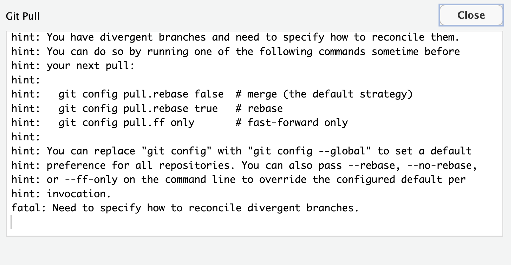

::: callout-tip
## Learning objectives

-   Create a GitHub account and join the course via GitHub Classroom
-   Configure Git identity (user.name, user.email, default branch main)
-   Practice how to set up GitHub Authentication using a Personal Access Token (PAT)
-   Clone the course repo to RStudio
-   Create a branch and open a Pull Request (PR) as the submission mechanism
:::

## Set up global options in Git

Before using Git, you need to tell it who you are, also known as setting the **global options**. You can do this either on the terminal using git command or in the console using the R package `usethis`. For this lesson we will use the `usethis` package. However, you can also find the git commands to reference in the future.

::: callout-note
## You need a GitHub account!

You can use Git on your computer to do your own version control, but if you want to interact with other people (like your instructors), you will use Git together with a Cloud Storage Service, like GitHub.

If you already have a GitHub account, please note your Github username and password.

If you don't have a GitHub account, sign up now!

https://github.com
:::

::: callout-note
## What's the Terminal?

Technically, the Terminal is an interface for the shell, a computer program. To put that simply, we use the Terminal to tell a computer what to do. This is different from the Console in RStudio, which interprets R code and returns a value.

You can access the terminal through RStudio by clicking Tools \> Terminal \> New Terminal.

A Terminal tab should now be open right next to the Console tab.
:::

::: callout-tip
## Don't be afraid to dip your toes in the Terminal

Most of our Git operations will be done in RStudio, but there are some situations where you must work in the Terminal and use command line. It may be daunting to code in the Terminal, but as your comfort increases over time, you might find you prefer it. Either way, it's beneficial to learn *enough* command line and to feel comfortable in the Terminal.
:::

## You'll need to join the GitHub Classroom

Click this link and accept the assignment to create your private repo (repository):

<https://classroom.github.com/a/PFNu-Lt4>

Make sure you accept the invite from your email. If this link is not working, your instructor can fix it for you; go ask for help.

\
Then copy the repo URL for cloning into RStudio; use the URL for *your* github classroom, which should look something like:

https://github.com/SFSUdatasci/import-template-nadelstein

## Put in your GitHub username into RStudio (and your computer)

::: panel-tabset
Note: you need git on your computer for the following commands to work. Also, Rstudio needs to know where git is located.

In RStudio do Tools –\> Global Options –\> Git/SVN

"Git executable" should not be blank, but you can point to it if you know where it lives (search your computer).

If you can't find git on your computer, install it!

https://git-scm.com/install

#### Console

**Step 1:** set the user's global user.name and user.email and define integrate changes from one branch into another branch for all repositories.

```{r}
#| eval: false

usethis::use_git_config(user.name = "my_user_name", # <1>
                        user.email = "my_email@nceas.ucsb.edu", # <2>
                        pull.rebase = "false") # <3>

```

1.  Add your exact same GitHub user name. Case and spelling matters!

2.  Set up your email address associated to you GitHub account.

3.  Setting "merge" as the default strategy to integrate changes from one branch into another branch (for all repos). Check the note at the end of this chapter for more details.

**Step 2:** define the name of the branch that gets created when you make the first commit in a new Git repo

```{r}
#| eval: false

usethis::git_default_branch_configure(name = "main")

```

**Step 3:** check to make sure everything looks correct

```{r}
#| eval: false

usethis::git_sitrep()
```

#### Terminal

**Step 1:** set the user's global user.name and user.email and define merge strategy for all repositories.

``` bash
git config --global user.name "my_user_name"
```

Press enter/return.

Note that **if the code ran successfully, it will look like nothing happened**. We will check at the end to make sure it worked.

Then run:

``` bash
git config --global user.email "my_email@nceas.ucsb.edu"
```

Press enter/return.

Then run:

``` bash
git config --global pull.rebase false
```

**Step 2:** define the name of the branch that gets created when you make the first commit in a new Git repo.

``` bash
git config --global init.defaultBranch main
```

**Step 3:** check to make sure everything looks correct.

The following command return the global options you have set.

``` bash
git config --global --list
```
:::

<br>

::: callout-important
## Case and spelling matters!

When you add your username and email to the global options you **must** use the exact same spelling and case that you used on GitHub otherwise, Git won't be able to sync to your account.
:::

::: callout-note
## Why set the default branch name to `main`?

Previously, the default branch name was `master` and this terminology for Git branches invokes slavery, which motivates us to update our default branch to `main` instead.
:::

## GitHub Authentication

GitHub recently deprecated password authentication for accessing repositories, so we need to set up a secure way to authenticate.

The book [Happy Git and GitHub for the useR](https://happygitwithr.com/index.html) has a wealth of information related to working with Git in R, and these instructions are based off of [Chapter 9 Personal access token for HTTPS](https://happygitwithr.com/https-pat.html).

We will be using a **Personal Access Token (PAT)** in this course. For better security and long term use, we recommend taking the extra steps to set up SSH keys (check out [Chapter 10 Set up Keys for SSH](https://happygitwithr.com/ssh-keys.html)).

::: callout-tip
## Setting up your PAT

1.  Run `usethis::create_github_token()` in the Console.
2.  A new browser window should open up to GitHub, showing all the scopes options. You can review the scopes, but you don't need to worry about which ones to select this time. The previous function automatically pre-selects some recommended scopes. **Go ahead and scroll to the bottom and click "Generate Token"**.
3.  Copy the generated token.
4.  Back in RStudio, run `gitcreds::gitcreds_set()` in the Console.
5.  Paste your PAT when the prompt asks for it.
6.  Last thing, run `usethis::git_sitrep()` in the Console to check your Git configuration and that you've successful stored your PAT. **Note:** look for `Personal access token for 'https://github.com': '<discovered>'`

If you see `<unset>` instead of `<discovered>` means your PAT is not correctly set. You need to troubleshoot.
:::

Congrats! Now you've setup your authentication you should be able to work with GitHub in RStudio.

## Clone your GitHub Classroom repo into RStudio

After authentication:

0.  In GitHub, open your repo and copy the HTTPS URL (maybe it's already in your clipboard).

    It should look something like: https://github.com/SFSUdatasci/import-template-nadelstein

1.  **In RStudio**: File → New Project → Version Control → Git

2.  Paste URL for the GitHub Classroom repo

3.  Choose the directory (folder) where to save on your computer

4.  Click "Create project"

5.  In the Files tab (left panels), click on index.qmd

6.  Click Render, on the navigation bar above the index.qmd file, which confirms local setup if an html opens in a browser.

## Weekly assignment workflow: Branch → Commit → Pull Request

To submit an assignment, you'll use GitHub and this workflow:

-   Create a branch: a00, a01, a02, etc. (Today make a00 as our test!)

    -   In RStudio, look for the Git tab (usually upper right pane)

    -   Click the purple branch icon with two branches

    -   Name it (for example a01 next time)

    -   Make sure the "Sync branch with remote" is checked

    -   Click "Create"

-   Create assignment

    -   If today's test assignment, or the first graded assignment, open assignments/a00.qmd or assignments/a01.qmd

    -   Else, in RStudio, File → New File → Quarto Document (or R Markdown)

    -   Save it as a0\*.qmd in the assignments/ folder

-   Commit your changes with a meaningful message

    -   In the Git tab, check the box next to assignments/a0\*.qmd \[some people are having trouble with this and can only see the a00.html file, so just submit that for now\]

    -   Click "Commit"

    -   Write a commit message (e.g. "Add assignnment a00")

    -   Click "Commit"

-   Push branch to GitHub

    -   Click the green "Push" arrow in the Git tab

-   Open a Pull Request (PR) into main branch

    -   Go to your repository on GitHub in your browser

    -   You'll see a banner about your recent push with a "Compare & pull request" button

    -   Click the button to create the pull request

-   Confirm the GitHub Action render check passes (green)

    -   You might see the GitHub printing lots of lines of code, as its installing R. We are eventually going to fix that...

That's it! RStudio's Git integration makes this more straightforward once you get the hang of it. We'll discuss what these steps really mean next week.

::: callout-note
## Try it out (TL-DR)!

-   Create a branch: a00

-   Edit assignment

    -   For this test, edit the Quarto document named assignments/a00.qmd

    -   Put in some new text or try out some R code

-   Commit your changes with a meaningful message, like "assignment submission test"

-   Push branch to GitHub

-   Open a Pull Request (PR) into main branch (from GitHub browser)

-   Confirm the GitHub Action render check passes (green)
:::

One final technical note: we’ll use merge (not rebase) as the default strategy.

Above we configured our global options for all the repositories you create in your server session to use `pull.rebase = "false"` as the strategy to integrate changes from two branches. With this we are saying to [merge](https://www.atlassian.com/git/tutorials/merging-vs-rebasing) changes (as opposed to rebasing).

It is important to highlight that this configuration can be repo specific. This means, you can configure how you want git to reconciling two branches at a repository level and not "for all repositories". Allowing you to control on how git weaves things in when collaborating with others.

If you don't define `pull.rebase = "false"` when setting the global configurations, you will have to define this for each repository you create. You will likely see the following message after you pull, meaning you have not define how to reconciling two branches in your repository.



To solve this issues you have to run either of the two suggested strategies on the terminal.

``` bash
git config pull.rebase false
```

or

``` bash
git config pull.rebase true
```
