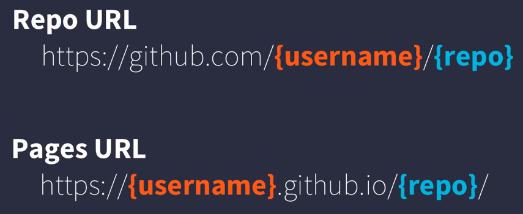
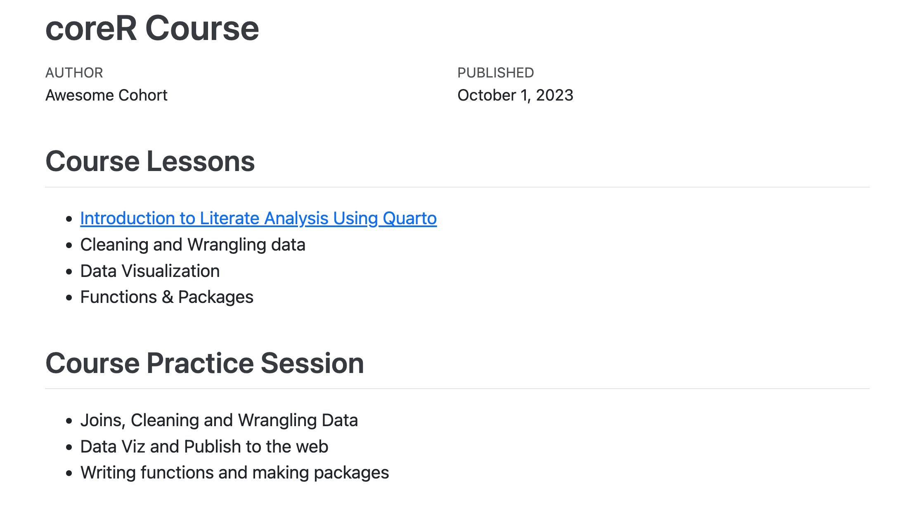

::: callout-tip
## Learning Objectives

-   How to use Git, GitHub (+Pages), and Quarto to publish an analysis to the web
:::

## Introduction

Sharing your work with others in engaging ways is an important part of the scientific process.

So far in this course, we've introduced a small set of powerful tools for doing open science:

-   R and its many packages
-   RStudio
-   Git
-   GitHub
-   Quarto

Quarto, in particular, is amazingly powerful for creating scientific reports but, so far, we haven't tapped its full potential for sharing our work with others.

In this lesson, we're going to take our `import-template-{USERNAME}` GitHub repository and turn it into a beautiful and easy to read web page using the tools listed above.
We will learn to use `git clone` and `git checkout` so that you will be the owner or your repository.

::: callout-note
## Clone your repository, so you can own it

1.  From RStudio's File drop-down menu, select **New Project**.

2.  Choose **Version Control** -\> Git: Clone a Project from a Git repository

3.  In GitHub: Go to their repo (from Classroom) -\> Click Code → HTTPS -\> Copy the URL

4.  Paste the URL when requested in RStudio

5.  Name your repo something different than your assignments repo, owned by your instructors. Unfortunately, your cloned repo is still owned by us...

6. So you have all your branches, in Terminal, type: `git fetch --all`

7. Create your own repository on GitHub (maybe call it portfolio): Click New Repository -\> Choose Public -\> Don't add a .gitignore -\> Copy the new URL

8.  Type in the terminal on RStudio for your cloned project and replace the default https with the URL you copied for the repo you own (portfolio)
- `git remote set-url origin https://github.com/YOUR-USERNAME/YOUR-NEW-REPO.git`
- `git push -u origin main`

9.  Activate GitHub Pages for the `main` branch

    a.  First make your repo **public**: Settings -\> Danger Zone -\> Change repository visibility
    b.  Go to Settings -\> Pages (underneath the Code and Automation section)
    c.  Keep the "Source" as "Deploy from a branch"
    d.  Under "Branch" you'll see a message that says "GitHub Pages is currently disabled". To change this, change the branch from "None" to `main`. Keep the folder as the `root` and then click "Save"
    e.  You should see the message change to "Your GitHub Pages site is currently being built from the `main` branch"

**Note:** `index.html` represents the default file for a web site, and is returned whenever you visit the web site but doesn't specify an explicit file to be returned.
:::

::: callout-note
## Set up homepage for your public GitHub page

1.  Make sure you are in your newly cloned and owned Project

2.  Find and open `index.qmd`.
    If you don't find it, add a new Quarto file at the top level called `index.qmd`

    a.  Go to the RStudio menu File -\> New File -\> Quarto Document
    b.  This will bring up a dialog box. Add the title "GitHub Pages Example", keep the Default Output Format as "HTML", and then click "OK"

3.  Save the Quarto Document you just created.
    Use `index.qmd` as the file name

    a.  Be sure to use the exact case (**lower case "index"**) as different operating systems handle case differently and it can interfere with loading your web page later

4.  Press "Render" and observe the rendered output

    a.  Notice the new file in the same directory `index.html`
    b.  This is our Quarto file rendered as `HTML` (a web page)

5.  Commit your changes (for both `index.qmd` and `index.html`) with a commit message, and `push` to GitHub

    a.  If you have a folder called `index_files`, commit this as well. This folder contains the all the formatting and display settings for your html page.

**Note:** `index.qmd` represents the default file for a web site, and is returned whenever you visit the web site but doesn't specify an explicit file to be returned.
:::

Now, the rendered website version of your repo will show up at a special URL.

GitHub Pages follows a convention like this:

{fig-alt="GitHub Pages URL pattern"}

Note that it changes from **github.com** to **github.io**

-   Go to `https://{username}.github.io/{repo_name}/` (Note the trailing `/`)
-   Observe the awesome rendered output

Now that we've successfully published a web page from an Quarto Document, let's make a change to our Quarto Document and follow the steps to publish the change on the web:

::: callout-note
## Update content in your published page

-   Go back to your `index.qmd`
-   Delete all the content, except the `YAML` frontmatter
-   Type "Hello world" or a different welcoming message
-   Render `index.qmd`
-   Use Git workflow: `Stage (add) -> Commit -> Pull -> Push`
-   Go back to `https://{username}.github.io/{repo_name}/`
:::

Next, we will show how you can link different `qmd`'s rendered into `html` so you can easily share different parts of your work.

## Assignment a09

::: callout
Now you'll create a table of contents with the lessons of this course on the main page, and link some of the files we have work on so far.

-   Go back to the RStudio server and to your `index.qmd` file

-   Create a table of contents with the names of the main technical lessons of this course, like so:

```         
## Course Lessons

- Introduction to Literate Analysis Using Quarto 
- Tidy Data
- Cleaning and Wrangling data
- Data Visualization

```

- Your list can contain only the html that you want to share, or a list of all the lessons

- You must share at a minimum two assignments

-   Make sure you have the `html` versions of your `intro-to-qmd.qmd` and `data-cleaning.qmd` files.
    If you only see the `qmd` version, you need to "Render" your files first

-   In your `index.qmd` let's add the links to the `html` files we want to show on our webpage.
    Do you remember the Markdown syntax to create a link?

<details>

<summary>Markdown syntax to create a link:</summary>

-   `[Text you want to hyperlink](link)`
    -   Example: `[Data wrangling and cleaning](scripts/data-wrangling-cleaning.html)`

</details>

-   Render `index.qmd`

-   Use Git workflow: `Stage (add) -> Commit -> Pull -> Push`

Now when you visit your web site, you'll see the table of contents, and can navigate to the others file you linked.
:::

::: callout
You need to commit and push all the `*.qmd`, `*.html`, and `*_files/` directories to GitHub that you want to link on your table of contents homepage. 

GitHub pages will host your website ONLY from your `main` branch (or whichever branch you select). Thus you need to move your assignments from other branches into your main branch. 

You can `merge` the branches, or just copy (`checkout`) the files. We recommend that you `checkout` the files. Let's say that you want to share the Geospatial Vector Analysis assignment. 

Navigate to the terminal and type (example for a08, Geospatial Vector Analysis):

 - `git checkout main`  If you get any errors, fix them!
 - `git checkout a08 -- assignments/a08.qmd assignments/a08.html assignments/a08_files/ `
 - `git add . `
 - `git commit -m "Add page and supporting assets from branch a08"`
 
 If you get errors, it might be because 1) you did not check out the main branch 2) your a08 files were not in the directory `assignments` or they were named something else 3) you have some other git error, which you need to fix. 
 
 Once all the files for your assignment are in the `main` branch, check that your GitHub pages table of contents link actually works.
 
 Copy the URL to your Porfolio table of contents to Canvas, to submit your assignment! Congrats you're done. 
::: 

Quarto web pages are a great way to share work in progress with your colleagues. However, if you don't want your work to be public after this course is over, you can stop hosting your GitHub page after grades have been posted by changing your repo to Private (from Public).


Here we showed an example with the materials we have created in this course.
However, you can use these same steps to share the different files and progress of a project you've been working on.
To do so simply requires thinking through your presentation so that it highlights the workflow to be reviewed.
You can include multiple pages and build a simple web site and make your work accessible to people who aren't set up to open your project in R.
Your site could look something like this:


